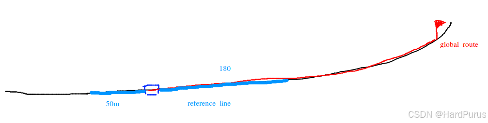
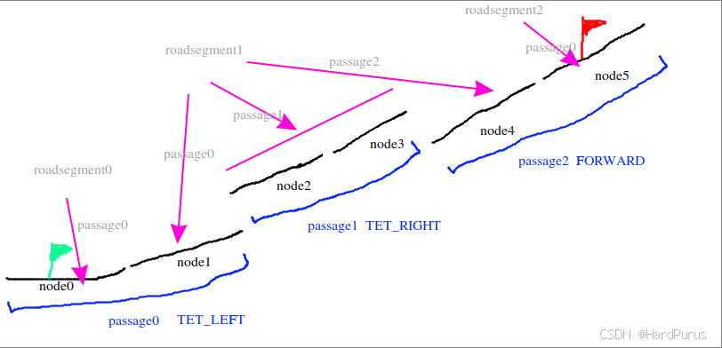
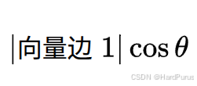
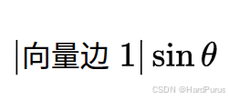
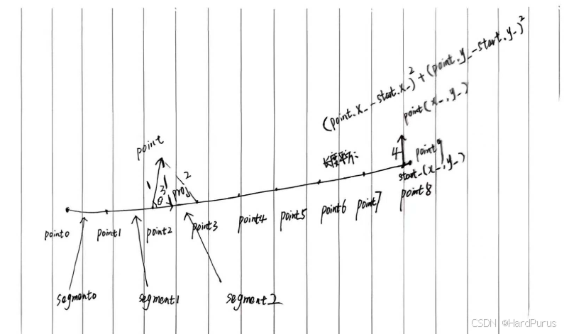
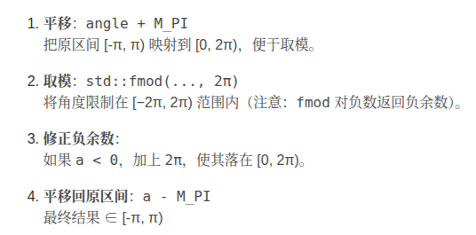
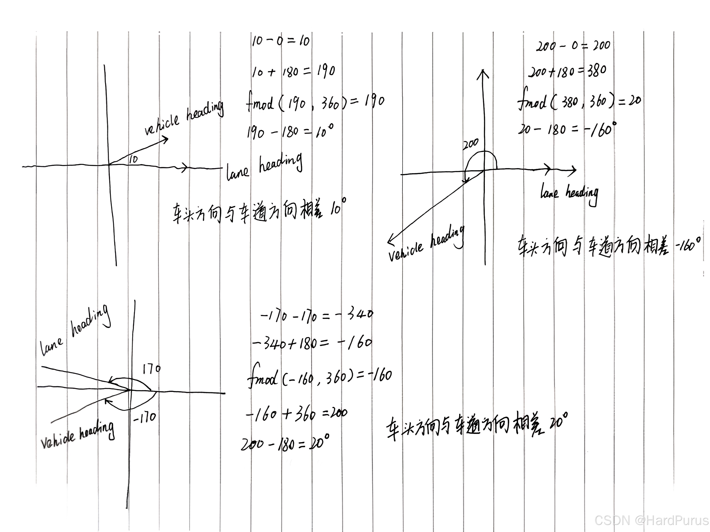

# Planning 模块 (1) - 参考线的生成

## 1. 前言与背景

上一篇 [routing模块(5)-全局路线的生成](https://github.com/AELe/Apollo-PNC-algorithm-analysis/blob/main/routing%E6%A8%A1%E5%9D%97\(5\)-%E5%85%A8%E5%B1%80%E8%B7%AF%E7%BA%BF%E7%9A%84%E7%94%9F%E6%88%90.md) 文章已经解释了全局路线计算的流程，并且也介绍了 planning 接收的逻辑。

从这篇开始，将介绍参考线的生成，并且从本篇开始，尽量忽略流程相关代码解析，只专注算法部分，目的就是让初学者快速理解轨迹规划的基本流程。

---

## 2. 参考线生成概述

### 2.1 基本概念

首先，我们应该清楚，参考线是**局部的**，它是基于全局路线并结合自车当前位置，生成的自车前后一段距离的粗糙轨迹。

### 2.2 核心函数

参考线生成主要涉及以下核心函数：

1. **CreateRouteSegments 函数** - 创建道路段
2. **GetRouteSegments 函数** - 获取道路段
3. **GetNearestPointFromRouting 函数** - 获取最近点
4. **UpdatePlanningCommand 函数** - 更新规划命令
5. **GetProjection 函数** - 计算投影距离

---

## 3. GetRouteSegments 函数

### 3.1 函数定义

```cpp
bool LaneFollowMap::GetRouteSegments(
    const VehicleState& vehicle_state,
    std::list<hdmap::RouteSegments>* const route_segments) {
  double look_forward_distance =
      LookForwardDistance(vehicle_state.linear_velocity());
  double look_backward_distance = FLAGS_look_backward_distance;
  return GetRouteSegments(vehicle_state, look_backward_distance,
                          look_forward_distance, route_segments);
}
```

### 3.2 参数说明

- **`vehicle_state`**：自车当前的车辆状态数据
- **`route_segments`**：我们想要获取的数据出参，这一章会介绍它所代表的具体含义

### 3.3 函数作用

该函数的主要作用是获取自车前后一段距离的参考线道路段。

---

## 4. 前视距离计算

### 4.1 LookForwardDistance 函数

主要是根据当前车速计算我们要生成自车前方多少米的参考线。

```cpp
double PncMapBase::LookForwardDistance(const double velocity) {
  auto forward_distance = velocity * FLAGS_look_forward_time_sec;

  return forward_distance > FLAGS_look_forward_short_distance
             ? FLAGS_look_forward_long_distance
             : FLAGS_look_forward_short_distance;
}
```

### 4.2 参数配置

- **`FLAGS_look_forward_time_sec`**：默认是 8s
- **`FLAGS_look_forward_short_distance`**：默认是 180m
- **`FLAGS_look_forward_long_distance`**：默认是 250m

### 4.3 后视距离配置

- **`FLAGS_look_backward_distance`**：默认是 50m

### 4.4 可视化说明



*图1：lane结构示意图 - 展示自车前后参考线生成范围*

---

## 5. GetRouteSegments 详细函数

### 5.1 函数定义

```cpp
bool LaneFollowMap::GetRouteSegments(
    const VehicleState& vehicle_state,
    std::list<hdmap::RouteSegments>* const route_segments)
```

### 5.2 参数说明

- **`vehicle_state`**：自车当前的车辆状态数据
- **`backward_length`**：自车后方需要生成参考线的长度
- **`forward_length`**：自车前方需要生成参考线的长度
- **`route_segments`**：出参

---

## 6. 最近点匹配

### 6.1 GetNearestPointFromRouting 函数

```cpp
bool LaneFollowMap::GetNearestPointFromRouting(
    const common::VehicleState& state, hdmap::LaneWaypoint* waypoint)
```

### 6.2 参数说明

- **`vehicle_state`**：自车当前的车辆状态数据
- **`waypoint`**：是自车当前位置，在全局路线上所匹配到的点的数据信息

### 6.3 问题背景

全局路线是基于道路中心线计算出来的，自车一般是以后轴中心为坐标原点，所以自车所停的位置后轴中心，大多数都是不在全局路线上的，所以我们需要在全局路线上找到一个点，把这个点作为自车的当前位置。

---

## 7. UpdatePlanningCommand 函数

### 7.1 函数定义

```cpp
bool LaneFollowMap::UpdatePlanningCommand(
    const planning::PlanningCommand& command) {
  if (!CanProcess(command)) {
    AERROR << "Command cannot be processed by LaneFollowMap!";
    return false;
  }
  if (!PncMapBase::UpdatePlanningCommand(command)) {
    return false;
  }
  const auto& routing = command.lane_follow_command();
  range_lane_ids_.clear();
  route_indices_.clear();
  all_lane_ids_.clear();
  for (int road_index = 0; road_index < routing.road_size(); ++road_index) {
    const auto& road_segment = routing.road(road_index);
    for (int passage_index = 0; passage_index < road_segment.passage_size();
         ++passage_index) {
      const auto& passage = road_segment.passage(passage_index);
      for (int lane_index = 0; lane_index < passage.segment_size();
           ++lane_index) {
        all_lane_ids_.insert(passage.segment(lane_index).id());
```

### 7.2 数据提取

**`all_lane_ids_`**：就是下面每一个节点的 lane id，它是在 `UpdatePlanningCommand` 函数中构建的。

**文件位置：** `modules/planning/pnc_map/lane_follow_map/lane_follow_map.cc`

### 7.3 可视化说明



*图2：lane结构示意图 - 展示全局路线中的lane结构*

---

## 8. 车道信息获取

### 8.1 获取有效车道

```cpp
  for (auto lane_id : all_lane_ids_) {
    hdmap::Id id = hdmap::MakeMapId(lane_id);
    auto lane = hdmap_->GetLaneById(id);
    if (nullptr != lane) {
      valid_lanes.emplace_back(lane);
    }
  }
```

### 8.2 数据源说明

在 `GetNearestPointFromRouting` 中，获取到全局路线上的所有 lane id，然后通过 lane id 获取到 `base_map.bin` 中的 map 地图中的 id，从而再通过 map id 获取 lane 信息。

**两种数据源的区别：**

1. **通过 `routing_map.bin` 文件获取到的 lane 信息**：只包括车道级的信息数据
2. **通过 map 获取到的车道信息**：还会包括跟当前车道相关的一些数据信息，比如信号灯、让行标志、stop 标志等

这样 `valid_lanes` 中存的就是全局路线中所有车道的 map 级别的 lane 信息。

---

## 9. GetProjection 函数

### 9.1 函数作用

它是 `LaneInfo` 的成员函数，主要是根据给定的当前自车位置，计算出自车在当前车道上投影点的纵向和横向距离。

### 9.2 车道结构回顾

首先回忆一下 `routing_map.txt` 中，一条车道其实是由点组成的，两个点构成一个 segment，而一条车道会有很多个点，并且构成很多个 segments。

### 9.3 最近 segment 查找

```cpp
  for (int i = 0; i < seg_num; ++i) {
    const double distance = segments_[i].DistanceSquareTo(point);
    if (distance < min_dist) {
      min_index = i;
      min_dist = distance;
    }
  }
```

上面逻辑是在查找自车位置到一条车道上的哪个 segment 距离最短。

### 9.4 距离计算方式

距离的计算方式在 `DistanceSquareTo` 函数中：

- 如果 segment 很短，那距离就是自车到 segment 末端的距离
- 否则就是计算边1，在 segment 的单位向量方向上的有向投影距离 `proj`
  - 如果 `proj` 小于等于 0，距离就是边1的长度
  - 如果 `proj` 大于等于 segment 的长度，那距离就是边2的长度
  - 否则就是边3的长度

**边3**是垂直于 segment 单位向量的直线长度。

---

## 10. 向量几何计算

### 10.1 向量计算基础

```cpp
const double x0 = point.x() - start_.x();
const double y0 = point.y() - start_.y();
```

这是在求**边1**，由 `point2` 指向 `point` 的向量。

### 10.2 点积计算

```cpp
const double proj = x0 * unit_direction_.x() + y0 * unit_direction_.y();
```

这是边1所表示的向量与 segment 单位向量的**点积（内积）**的代数表示，表示有向投影距离。

**几何表示：**


*图3：向量点积示意图 - 展示向量投影计算*

因为 segment 单位向量的模长为 1，所以最后几何表示为：



*图4：向量投影示意图 - 展示投影距离计算*

### 10.3 叉积计算

```cpp
return Square(x0 * unit_direction_.y() - y0 * unit_direction_.x());
```

上面就是在计算边1所表示的向量与 segment 单位向量的**叉积（外积）**的代数表示。

**几何表示：**



*图5：向量叉积示意图 - 展示垂直距离计算*

表示自车到 segment 单位向量的距离的平方，注意 `DistanceSquareTo` 获取到的距离都是没有开方的，正常计算模长是需要开方的。

### 10.4 数学知识回顾

如果对向量不是很熟悉的同学可以再去复习一下向量相关的知识：

- 二维点积
- 叉积
- 投影
- 向量的模
- 向量的方向角
- 方向余弦



*图6：向量基础知识 - 展示向量相关概念*

---

## 11. 投影距离计算

### 11.1 距离计算

```cpp
min_dist = std::sqrt(min_dist);
const auto &nearest_seg = segments_[min_index];
const auto prod = nearest_seg.ProductOntoUnit(point);
const auto proj = nearest_seg.ProjectOntoUnit(point);
```

获取到自车到 segment 最小距离的平方后，进行开方得到最小距离，然后分三种情况计算自车在当前车道上的纵向距离和横向距离。

### 11.2 情况一：第一个 segment

如果当前车道离自车最近的 segment 是当前车道的第一个 segment：

```cpp
if (min_index == 0) {
  *accumulate_s = std::min(proj, nearest_seg.length());
  if (proj < 0) {
    *lateral = prod;
  } else {
    *lateral = (prod > 0.0 ? 1 : -1) * min_dist;
  }
}
```

**纵向距离：** segment 起点指向自车位置的向量在 segment 单位向量方向上的投影长度，但是不能超过 segment 自身的长度。

**横向距离：** 分两种情况

1. **第一种：** segment 起点指向自车位置的向量的投影点在当前 segment 起点的左侧，横向距离设置为自车位置到 segment 的垂直距离
2. **第二种：** segment 起点指向自车位置的向量的投影点在当前 segment 上，横向距离使用 `prod` 来判断自车在 segment 的左边还是右边，`prod` 大于 0 在左侧，否则在右侧，然后距离大小使用最小距离 `min_dist`

**注意：** `min_dist` 和 `prod` 的区别是 `min_dist` 是大小没有方向，`prod` 是带方向的。并且这里投影在 segment 的起点和终点的横向距离选择策略是不同的，起点选择是垂直距离，但终点选择的则是自车到终点的直线距离。

### 11.3 情况二：最后一个 segment

如果当前车道离自车最近的 segment 是当前车道的最后一个 segment：

```cpp
else if (min_index == seg_num - 1) {
  *accumulate_s = accumulated_s_[min_index] + std::max(0.0, proj);
  if (proj > 0) {
    *lateral = prod;
  } else {
    *lateral = (prod > 0.0 ? 1 : -1) * min_dist;
  }
}
```

**纵向距离：** 就是最后一个 segment 之前的所有 segment 的累积长度加上自车在最后一个 segment 上的投影距离。

**横向距离：** 分两种情况

1. **第一种**是投影点在当前 segment 上或终点以外，则横向距离直接使用垂直距离
2. **第二种**是投影点在 segment 起点的左侧或正好是起点，则横向距离使用 `min_dist`，符号用 `prod` 来判断

### 11.4 情况三：中间 segment

如果当前车道离自车最近的 segment 是在非第一个和最后一个 segment 上：

```cpp
else {
  *accumulate_s = accumulated_s_[min_index] +
                  std::max(0.0, std::min(proj, nearest_seg.length()));
  *lateral = (prod > 0.0 ? 1 : -1) * min_dist;
}
```

**纵向距离：** 最近 segment 之前所有 segment 的累积距离加上投影距离。

**横向距离：** 直接使用 `min_dist`，方向由 `prod` 正负来判断。

---

## 12. 角度差计算

### 12.1 获取投影距离

通过 `GetProjection` 获取自车在某一条车道的纵向距离 `s` 和横向距离 `l`：

```cpp
if (!lane->GetProjection({point.x(), point.y()}, &s, &l)) {
  continue;
}
```

### 12.2 计算角度差

然后，获取车道的角度，与当前自车的航向角的角度差：

```cpp
double lane_heading = lane->Heading(s);
if (std::fabs(common::math::AngleDiff(lane_heading, state.heading())) >
    M_PI_2 * 1.5) {
  continue;
}
```

### 12.3 角度差阈值

如果车辆朝向与车道朝向之间的夹角差超过 `270° / 2 = 135°`，则跳过这个 lane（认为不可能是正确方向）。

**因为：**
- 车辆朝向不能和车道方向差太大，否则这个车道不合理。
- 角度差 > 135° 就不认为这是一个可以行驶的方向。

---

## 13. 角度归一化函数

### 13.1 AngleDiff 函数

```cpp
double AngleDiff(const double from, const double to) {
  return NormalizeAngle(to - from);
}
```

### 13.2 NormalizeAngle 函数

```cpp
double NormalizeAngle(const double angle) {
  double a = std::fmod(angle + M_PI, 2.0 * M_PI);
  if (a < 0.0) {
    a += (2.0 * M_PI);
  }
  return a - M_PI;
}
```

**`NormalizeAngle`**：把任意角度归一化到 `[-π, π)`。

### 13.3 可视化说明



*图7：角度归一化示意图 - 展示角度归一化过程*

### 13.4 角度差示例

下表中逆时针为正，顺时针为负：

| from | to | 差值 to-from | Normalize 后 | 意义 |
|------|----|-------------|-------------|------|
| 0° | 10° | +10° | +10° | 车头偏右 10° |
| 0° | 200° | +200° | -160° | 实际最短夹角是 -160°（向左） |
| 170° | -170° | -340° | +20° | 实际夹角就是 20° |



*图8：角度差计算示意图 - 展示角度差计算示例*

所以 `NormalizeAngle` 的作用就是把角度差限定在 `[-π, π)`。

---

## 14. 最近点选择

### 14.1 遍历有效车道

```cpp
for (const auto& lane : valid_lanes) {
  if (!lane->GetProjection({point.x(), point.y()}, &s, &l)) {
    continue;
  }
  // ... 角度差检查 ...
  valid_way_points.emplace_back();
  auto& last = valid_way_points.back();
  last.lane = lane;
  last.s = s;
  last.l = l;
}
```

这段就是遍历全局路线上的所有符合条件（车头方向与车道方向角度差小于阈值）的 lane，并找到每条 lane 中离自车位置最近的 segment，并获取到自车在这条 lane 上的投影点的纵向距离和横向距离，存储到 `valid_way_points` 中。

### 14.2 选择最近点

```cpp
for (size_t i = 0; i < valid_way_points.size(); i++) {
  lane_heading = valid_way_points[i].lane->Heading(valid_way_points[i].s);
  if (std::abs(common::math::AngleDiff(lane_heading, vehicle_heading)) >
      M_PI_2 * 1.5) {
    continue;
  }
  if (std::fabs(valid_way_points[i].l) < distance) {
    distance = std::fabs(valid_way_points[i].l);
    closest_index = i;
  }
}
if (closest_index == -1) {
  AERROR << "Can not find nearest waypoint. vehicle heading:"
         << vehicle_heading << "lane heading:" << lane_heading;
  return false;
}
waypoint->lane = valid_way_points[closest_index].lane;
waypoint->s = valid_way_points[closest_index].s;
waypoint->l = valid_way_points[closest_index].l;
```

然后在遍历 `valid_way_points` 获取到横向距离最小的那个投影位置，就是 `GetNearestPointFromRouting` 函数要获取的 `waypoint`，主要数据是：

1. **哪条 lane**
2. **投影点在这条 lane 上的纵向距离**
3. **自车到这条 lane 上的横向距离**

---

## 15. 总结

### 15.1 核心流程

本文详细介绍了 Planning 模块中参考线生成的第一部分，主要包括：

1. **参考线概念**：局部粗糙轨迹，基于全局路线和自车位置生成
2. **距离计算**：前视距离和后视距离的计算方法
3. **最近点匹配**：在全局路线上找到与自车位置最接近的点
4. **投影计算**：计算自车在车道上的纵向和横向投影距离
5. **角度检查**：确保车辆朝向与车道方向的一致性
6. **向量几何**：点积、叉积在距离计算中的应用

### 15.2 技术要点

- **参考线是局部的**：只生成自车前后一段距离的轨迹
- **距离自适应**：前视距离根据车速动态调整
- **精确匹配**：通过向量几何计算找到最接近的投影点
- **方向一致性**：通过角度差检查排除不合理车道
- **数据源融合**：结合 routing 数据和 map 数据获取完整车道信息

### 15.3 后续内容

这是参考线生成的第一部分，后续将介绍如何基于这些基础数据生成完整的参考线，包括车道连接、平滑处理、曲率计算等内容。