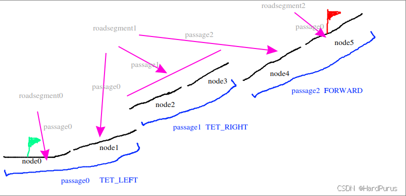
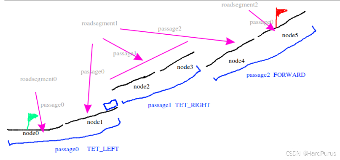
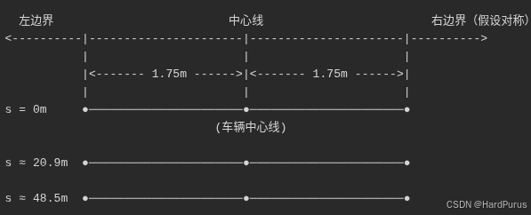
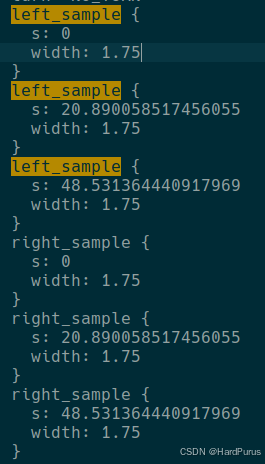
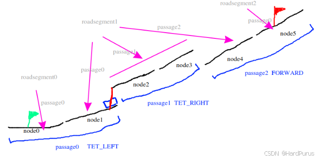

# Planning 模块 (2) - 参考线的生成

## 1. 前言与背景

本文继续分析 Planning 模块中参考线的生成，重点关注 `GetWaypointIndex` 函数、`GetNeighborPassages` 函数和 `CanDriveFrom` 函数。这些函数负责处理自车位置匹配、换道逻辑和车道可达性检查。

---

## 2. GetWaypointIndex 函数

### 2.1 SearchForwardWaypointIndex 函数

```cpp
int LaneFollowMap::SearchForwardWaypointIndex(
    int start, const hdmap::LaneWaypoint& waypoint) const {
  int i = std::max(start, 0);
  while (i < static_cast<int>(route_indices_.size()) &&
         !hdmap::RouteSegments::WithinLaneSegment(route_indices_[i].segment,
                                                  waypoint)) {
    ++i;
  }
  return i;
}
```

### 2.2 route_indices_ 数据结构

`route_indices_` 的类型是 `std::vector<RouteIndex>`：

```cpp
struct RouteIndex {
  apollo::hdmap::LaneSegment segment;
  std::array<int, 3> index;
};
```

### 2.3 可视化说明



*图1：lane结构示意图 - 展示route_indices_的数据结构*

**`route_indices_` 的具体内容：**

- `route_indices_[0].segment` = lane0
- `route_indices_[0].index` = {roadsegment0, passage0, lane0}
- `route_indices_[1].segment` = lane1
- `route_indices_[1].index` = {roadsegment1, passage0, lane1}
- `route_indices_[2].segment` = lane2
- `route_indices_[2].index` = {roadsegment1, passage1, lane2}
- `route_indices_[3].segment` = lane3
- `route_indices_[3].index` = {roadsegment1, passage1, lane3}
- `route_indices_[4].segment` = lane4
- `route_indices_[4].index` = {roadsegment1, passage2, lane4}
- `route_indices_[5].segment` = lane5
- `route_indices_[5].index` = {roadsegment2, passage0, lane5}

### 2.4 函数作用

`SearchForwardWaypointIndex` 函数的参数说明：

- **第一个参数**：表示当前自车位置在全局路线上的匹配点在 `route_indices_` 中的索引，初始化时为 -1
- **第二个参数**：是通过上一篇 [planning模块(1)-参考线的生成](https://github.com/AELe/Apollo-PNC-algorithm-analysis/blob/main/planning%E6%A8%A1%E5%9D%97\(1\)-%E5%8F%82%E8%80%83%E7%BA%BF%E7%9A%84%E7%94%9F%E6%88%90.md) 中介绍的 `GetNearestPointFromRouting` 函数获取到的自车位置在全局路线上所对应的 `waypoint` 数据

**函数作用**：从前往后搜索 `route_indices_`，看自车位置在全局路线上所对应的 `waypoint` 是否能和 `route_indices_` 中的哪个元素匹配上，然后返回其索引。

### 2.5 SearchBackwardWaypointIndex 函数

`SearchBackwardWaypointIndex` 函数是从后向前遍历 `route_indices_` 搜索，主要是为了容错。

```cpp
if (forward_index == adc_route_index_ ||
    forward_index == adc_route_index_ + 1) {
  return forward_index;
}
```

**逻辑说明：**

1. 如果搜索到的索引在当前 `adc_route_index_` 索引附近，说明搜索到的 `forward_index` 是合理的，就直接返回 `forward_index`
2. 如果不是在当前 `adc_route_index_` 索引附近，并且如果向后搜索到的索引在当前 `adc_route_index_` 附近，那就返回 `backward_index` 更合适
3. 如果向后搜索不到，那就只能返回离当前自车位置比较远的索引 `forward_index`

---

## 3. UpdateNextRoutingWaypointIndex 函数

### 3.1 routing_waypoint_index_ 数据结构

```cpp
std::vector<WaypointIndex> routing_waypoint_index_;
struct WaypointIndex {
  apollo::hdmap::LaneWaypoint waypoint;
  int index;
  WaypointIndex(const apollo::hdmap::LaneWaypoint &waypoint, int index)
      : waypoint(waypoint), index(index) {}
};
```

### 3.2 数据构建

`routing_waypoint_index_` 表示的是算路请求指令中传入的 `waypoint` 在 `route_indices_` 中的索引等相关信息，`routing_waypoint_index_` 是在 `UpdatePlanningCommand` 构建的。

**文件位置：** `modules/planning/pnc_map/lane_follow_map/lane_follow_map.cc`

```cpp
routing_waypoint_index_.clear();
const auto& request_waypoints = routing.routing_request().waypoint();
if (request_waypoints.empty()) {
  AERROR << "Invalid routing: no request waypoints.";
  return false;
}
int i = 0;
for (size_t j = 0; j < route_indices_.size(); ++j) {
  while (i < request_waypoints.size() &&
         hdmap::RouteSegments::WithinLaneSegment(route_indices_[j].segment,
                                                 request_waypoints.Get(i))) {
    routing_waypoint_index_.emplace_back(
        hdmap::LaneWaypoint(route_indices_[j].segment.lane,
                            request_waypoints.Get(i).s()),
        j);
    ++i;
  }
}
```

### 3.3 next_routing_waypoint_index_ 更新逻辑

`next_routing_waypoint_index_` 表示下一个自车要开到的 `waypoint` 的索引。

#### 3.3.1 倒车情况处理

```cpp
while (next_routing_waypoint_index_ != 0 &&
       next_routing_waypoint_index_ < routing_waypoint_index_.size() &&
       routing_waypoint_index_[next_routing_waypoint_index_].index >
           cur_index) {
  --next_routing_waypoint_index_;
}
```

**逻辑说明：** 如果当前 `next_routing_waypoint_index_` 所指向的 `waypoint` 在 `route_indices_` 索引大于当前自车在 `route_indices_` 匹配到的索引，说明在倒车，所以 `next_routing_waypoint_index_` 要减小。

```cpp
while (next_routing_waypoint_index_ != 0 &&
       next_routing_waypoint_index_ < routing_waypoint_index_.size() &&
       routing_waypoint_index_[next_routing_waypoint_index_].index ==
           cur_index &&
       adc_waypoint_.s <
           routing_waypoint_index_[next_routing_waypoint_index_].waypoint.s) {
  --next_routing_waypoint_index_;
}
```

**逻辑说明：** 发现当前自车 `waypoint` 匹配到的索引和当前 `next_routing_waypoint_index_` 的索引在一个车道上，并且自车的纵向距离小于当前 `next_routing_waypoint_index_` 所表示的 `waypoint` 的纵向距离，说明也是在倒车，`next_routing_waypoint_index_` 要减小。

#### 3.3.2 前行情况处理

```cpp
while (next_routing_waypoint_index_ < routing_waypoint_index_.size() &&
       routing_waypoint_index_[next_routing_waypoint_index_].index <
           cur_index) {
  ++next_routing_waypoint_index_;
}
while (next_routing_waypoint_index_ < routing_waypoint_index_.size() &&
       cur_index ==
           routing_waypoint_index_[next_routing_waypoint_index_].index &&
       adc_waypoint_.s >=
           routing_waypoint_index_[next_routing_waypoint_index_].waypoint.s) {
  ++next_routing_waypoint_index_;
}
```

**逻辑说明：** 上面逻辑类似，是在前行，所以 `next_routing_waypoint_index_` 要增加。

---

## 4. UpdateRoutingRange 函数

### 4.1 函数定义

```cpp
void LaneFollowMap::UpdateRoutingRange(int adc_index) {
  // Track routing range.
  range_lane_ids_.clear();
  range_start_ = std::max(0, adc_index - 1);
  range_end_ = range_start_;
  while (range_end_ < static_cast<int>(route_indices_.size())) {
    const auto& lane_id = route_indices_[range_end_].segment.lane->id().id();
    if (range_lane_ids_.count(lane_id) != 0) {
      break;
    }
    range_lane_ids_.insert(lane_id);
    ++range_end_;
  }
}
```

### 4.2 函数作用

传入的参数是当前自车 `waypoint` 的索引，根据当前自车 `waypoint` 的索引，把还没走到的 `lane_id` 存入 `range_lane_ids_` 中，走过的车道就被删掉了。

### 4.3 终点判断

```cpp
if (next_routing_waypoint_index_ == routing_waypoint_index_.size() - 1) {
  stop_for_destination_ = true;
}
```

**逻辑说明：** 当 `next_routing_waypoint_index_ == routing_waypoint_index_.size() - 1`，证明下一个要到达的 `waypoint` 是终点了。

**到此 `UpdateVehicleState` 函数就分析完了。**

---

## 5. GetNeighborPassages 函数

### 5.1 函数定义

```cpp
std::vector<int> LaneFollowMap::GetNeighborPassages(
    const routing::RoadSegment& road, int start_passage)
```

### 5.2 参数说明

- **`road`**：当前自车位置匹配点所在的 `roadsegment` 索引
- **`start_passage`**：当前自车位置匹配点所在的 `roadsegment` 中的所在 `passage` 索引

### 5.3 可视化说明


*图2：lane结构示意图1 - 展示roadsegment和passage结构*


*图3：lane结构示意图2 - 展示change_lane_type构建方式*

### 5.4 重要注意事项

需要注意一下 `roadsegment` 中 `passage` 的 `change_lane_type` 和 `ExtractBasicPassages` 函数中 `passage` 的 `change_lane_type` 不同。

上面图示蓝色部分是 `passage` 的 `change_lane_type` 的构建方式，图标中是 `roadsegment` 中的 `change_lane_type` 的构建方式。

**具体示例：**

- `roadsegment0 passage0 node0` → `FORWARD`
- `roadsegment1 passage0 node1` → `LEFT`
- `roadsegment1 passage1 node2 node3` → `RIGHT`
- `roadsegment1 passage2 node4` → `FORWARD`
- `roadsegment2 passage0 node5` → `FORWARD`

### 5.5 函数逻辑

`GetNeighborPassages` 函数主要是针对换道的情况：

1. **直行情况**：如果当前自车位置在全局路线上所匹配到的位置是上图的 `node0`，那么因为它在 `roadsegment` 中的 `passage` 的 `change_lane_type` 是 `FORWARD` 类型，所以会直接返回 `node0` 所在 `passage` 的索引。

2. **换道情况**：如果当前自车位置在全局路线上所匹配到的位置是上图的 `node1`，那么因为它在 `roadsegment` 中的 `passage` 的 `change_lane_type` 不是 `FORWARD`，就会继续执行下面的逻辑。

3. **同一车道检查**：如果当前 `next_routing_waypoint_index_` 所表示的 `waypoint` 也与自车位置在全局路线上所匹配到的位置在同一个车道，同样直接返回当前自车所在 `passage` 的索引。

4. **换道处理**：如果 `change_lane_type` 是 `routing::LEFT` 或 `routing::RIGHT`，那就会从 map 拓扑图中获取到所有当前车道的左右换道邻边的 id 存入 `neighbor_lanes` 中。

5. **匹配查找**：然后在当前 `roadsegment` 中遍历所有 `passage` 中的车道，看是否有与 `neighbor_lanes` 中匹配的车道，如果存在就把匹配的车道所在的 `passage id` 存起来返回。

### 5.6 具体示例

比如：如果当前自车位置在全局路线上所匹配到的位置是上图的 `node1`，那么它所在的 `passage` 的 `change_lane_type` 是 `routing::LEFT`，那么就会在 map 的拓扑图中获取到所有它的左侧换道邻边存入 `neighbor_lanes` 中，然后在当前 `roadsegment1` 中的 `passage` 中去查找 `neighbor_lanes` 中是否有 id 相同的车道，比如 `node2`，那么就会把 `node2` 所在的 `passage1` 的索引存入 `result` 中返回。

**注意：** 这里返回的 `result` 是包含自车所在 `passage` 的，如果有符合条件的换道 `passage`，`result` 中也会包含。

**这就是 `GetNeighborPassages` 函数所做的事情。**

---

## 6. PassageToSegments 处理

### 6.1 代码片段

```cpp
auto drive_passages = GetNeighborPassages(road, passage_index);
AINFO << "Neighbor passages: " << drive_passages.size();
for (const int index : drive_passages) {
  const auto& passage = road.passage(index);
  hdmap::RouteSegments segments;
  if (!PassageToSegments(passage, &segments)) {
    ADEBUG << "Failed to convert passage to lane segments.";
    continue;
  }
```

### 6.2 可视化说明



*图4：lane结构示意图 - 展示换道位置示例*

### 6.3 逻辑说明

假如车的当前位置如上图，在即将换道的位置，那么通过 `GetNeighborPassages` 获取到 `drive_passages` 就是 `roadsegment1` 的 `passage0` 和 `roadsegment1` 的 `passage1`。

然后遍历 `drive_passages` 分别执行下面逻辑。

### 6.4 PassageToSegments 函数

```cpp
const PointENU nearest_point =
    index == passage_index
        ? adc_waypoint_.lane->GetSmoothPoint(adc_waypoint_.s)
        : PointFactory::ToPointENU(adc_state_);
```

**`GetSmoothPoint` 函数：** 还记得一条 lane 是由很多个点组成的吧，`GetSmoothPoint` 的函数就是根据当前自车所对应的 `waypoint` 的纵向距离得到在车道上 point 的坐标。

**逻辑说明：**
- 如果 `index` 是当前自车所在匹配的 `passage`，那 `nearest_point` 就通过 `GetSmoothPoint` 去找平滑点
- 否则就使用当前来自 location 模块的自车位置坐标

```cpp
segments.GetProjection(nearest_point, &sl, &segment_waypoint)
```

获取到最近点在当前 `passage` 的所有车道中横向距离最小的位置作为 `waypoint` 位置。

---

## 7. CanDriveFrom 函数

### 7.1 函数调用条件

```cpp
if (index != passage_index) {
  if (!segments.CanDriveFrom(adc_waypoint_)) {
    ADEBUG << "You cannot drive from current waypoint to passage: "
           << index;
    continue;
  }
}
```

**注意：** 只有当前遍历的 `index` 不是自车所在的 `passage` 时，`CanDriveFrom` 函数才会被调用，也就意味着只有存在换道的情况时 `CanDriveFrom` 函数才会被调用。

### 7.2 参数说明

还记得吗？`adc_waypoint_` 是我们通过 [planning模块(1)-参考线的生成](https://github.com/AELe/Apollo-PNC-algorithm-analysis/blob/main/planning%E6%A8%A1%E5%9D%97\(1\)-%E5%8F%82%E8%80%83%E7%BA%BF%E7%9A%84%E7%94%9F%E6%88%90.md) `GetNearestPointFromRouting` 函数获取到的。

### 7.3 IsWaypointOnSegment 检查

```cpp
if (IsWaypointOnSegment(waypoint)) {
  return true;
}
```

根据上面图示，当前自车的 `adc_waypoint_` 是在 `node1` 上，如果 `index` 是 `roadsegment1` 的 `passage1`，`IsWaypointOnSegment(waypoint)` 是 `false`。

### 7.4 投影点获取

```cpp
auto point = waypoint.lane->GetSmoothPoint(waypoint.s);

...

LaneWaypoint segment_waypoint;
common::SLPoint route_sl;
bool has_projection = GetProjection(point, &route_sl, &segment_waypoint);
if (!has_projection) {
  AERROR << "No projection from waypoint: " << waypoint.DebugString();
  return false;
}
static constexpr double kMaxLaneWidth = 10.0;
if (std::fabs(route_sl.l()) > 2 * kMaxLaneWidth) {
  return false;
}
```

当 `index` 是 `roadsegment1` 的 `passage1` 时会继续向下执行。

**逻辑说明：** 根据自车 `waypoint` 的纵向距离获取平滑点，然后通过平滑点获取在 `roadsegment1` 的 `passage1` 上横向距离最小的投影点 `waypoint`，如果横向距离大于 20m 认为无法变道。

### 7.5 角度差检查

```cpp
double waypoint_heading = waypoint.lane->Heading(waypoint.s);
double segment_heading = segment_waypoint.lane->Heading(segment_waypoint.s);
double heading_diff =
    common::math::AngleDiff(waypoint_heading, segment_heading);
if (std::fabs(heading_diff) > M_PI / 2) {
  ADEBUG << "Angle diff too large:" << heading_diff;
  return false;
}
```

**逻辑说明：** 如果当前自车所在车道与目标车道（变道过去的那条车道）的车道方向角度差大于 180°，则认为无法变道。

### 7.6 车道宽度获取

```cpp
double waypoint_left_width = 0.0;
double waypoint_right_width = 0.0;
waypoint.lane->GetWidth(waypoint.s, &waypoint_left_width,
                        &waypoint_right_width);
double segment_left_width = 0.0;
double segment_right_width = 0.0;
segment_waypoint.lane->GetWidth(segment_waypoint.s, &segment_left_width,
                                &segment_right_width);
```

获取自车所在车道的左右空间宽度，获取目标车道左右空间宽度，比如：1.75m。

### 7.7 可视化说明



*图5：lane结构示意图1 - 展示车道宽度获取*



*图6：lane结构示意图2 - 展示base_map.txt中的宽度数据*

### 7.8 距离计算和判断

```cpp
auto segment_projected_point =
    segment_waypoint.lane->GetSmoothPoint(segment_waypoint.s);
double dist = common::util::DistanceXY(point, segment_projected_point);
const double kLaneSeparationDistance = 0.3;
if (route_sl.l() < 0) {  // waypoint at right side
  if (dist >
      waypoint_left_width + segment_right_width + kLaneSeparationDistance) {
    AERROR << "waypoint is too far to reach: " << dist;
    return false;
  }
} else {  // waypoint at left side
  if (dist >
      waypoint_right_width + segment_left_width + kLaneSeparationDistance) {
    AERROR << "waypoint is too far to reach: " << dist;
    return false;
  }
}
```

### 7.9 逻辑说明

获取目标车道自车投影点的平滑点，然后计算自车所在车道上的平滑点与目标车道投影点之间的距离，如下图红色线：



*图7：lane结构示意图 - 展示距离计算*

- `route_sl.l() < 0` 表示自车在目标车道右侧，否则自车在目标车道左侧
- 如果自车在目标车道右侧，那么如果 `dist` 大于当前车道的左侧空间加上目标车道的右侧空间，则无法变道
- 如果自车在目标车道左侧，那么如果 `dist` 大于当前车道的右侧空间加上目标车道的左侧空间，则无法变道

**这样 `CanDriveFrom` 函数就分析完了。**

---

## 8. 总结

### 8.1 核心内容回顾

本文详细介绍了 Planning 模块中参考线生成的第二部分，主要包括：

1. **`GetWaypointIndex` 函数** - 自车位置在全局路线上的索引匹配
2. **`UpdateNextRoutingWaypointIndex` 函数** - 下一个目标点的索引更新
3. **`UpdateRoutingRange` 函数** - 路由范围更新和终点判断
4. **`GetNeighborPassages` 函数** - 获取相邻通道，处理换道逻辑
5. **`CanDriveFrom` 函数** - 检查车道可达性，确保安全换道

### 8.2 技术要点

- **位置匹配**：通过 `route_indices_` 数据结构将自车位置与全局路线关联
- **换道逻辑**：根据 `change_lane_type` 判断是否需要换道，并找到可换道的相邻通道
- **可达性检查**：通过角度差、车道宽度、距离等多重条件确保换道安全
- **动态更新**：根据自车运动状态动态更新目标点和路由范围

### 8.3 系统设计思想

1. **容错设计**：通过前后双向搜索提高位置匹配的鲁棒性
2. **安全第一**：多重条件检查确保换道操作的安全性
3. **实时性**：动态更新机制适应车辆运动状态变化
4. **模块化**：每个函数职责明确，便于维护和调试

### 8.4 后续内容

这是参考线生成的第二部分，后续将介绍如何基于这些匹配和检查结果生成完整的参考线，包括车道连接、平滑处理、曲率计算等内容，最终形成可供控制模块使用的局部轨迹。