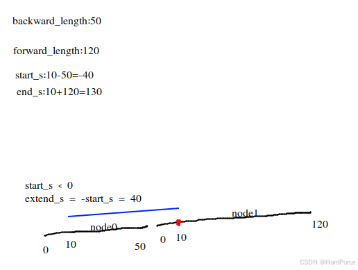
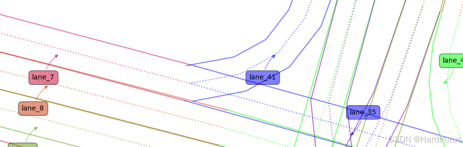
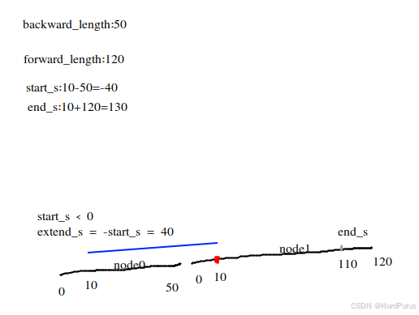
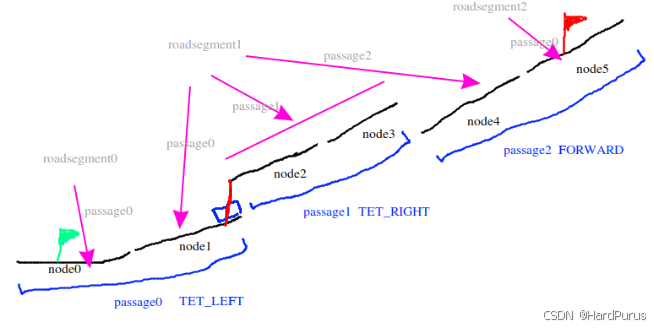

# Planning 模块 (3) - 参考线的生成

## 1. 前言与背景

接着上一篇 [planning模块(2)-参考线的生成](https://github.com/AELe/Apollo-PNC-algorithm-analysis/blob/main/planning%E6%A8%A1%E5%9D%97\(2\)-%E5%8F%82%E8%80%83%E7%BA%BF%E7%9A%84%E7%94%9F%E6%88%90.md) 我们继续解释 `GetRouteSegments` 函数。上一篇已经解释了 `CanDriveFrom` 函数，它是在判断从 `GetNeighborPassages` 函数获取到的 `drive_passages`，是否可以从当前自车位置开到 `drive_passages` 中所要切换的车道上。

---

## 2. GetRouteSegments 函数继续分析

### 2.1 代码片段回顾

```cpp
!segments.CanDriveFrom(adc_waypoint_)
const auto last_waypoint = segments.LastWaypoint();
if (!ExtendSegments(segments, sl.s() - backward_length,
                    sl.s() + forward_length, &route_segments->back())) {
  AERROR << "Failed to extend segments with s=" << sl.s()
         << ", backward: " << backward_length
         << ", forward: " << forward_length;
  return false;
}
```

### 2.2 ExtendSegments 函数介绍

我们接下来介绍 `ExtendSegments` 函数。首先通过 `GetNeighborPassages` 获取到的 `drive_passages` 里面应该有两个，如果当前自车位置如下：


*图1：lane结构示意图 - 展示自车位置和drive_passages*

`drive_passages` 包含了 `roadsegment1` 中的 `passage0` 和 `passage1`。

**当 `index` 是 `passage0` 时：**

```cpp
const auto last_waypoint = segments.LastWaypoint();
```

获取到的 `last_waypoint` 就是 `node1` 的相关车道信息。

```cpp
ExtendSegments(segments, sl.s() - backward_length,
               sl.s() + forward_length, &route_segments->back())
```

假如从配置中获取到的 `backward_length: 50` 和 `forward_length: 120`。

---

## 3. ExtendSegments 函数详解

### 3.1 向后扩展逻辑

```cpp
if (start_s < 0) {
  const auto& first_segment = *segments.begin();
  auto lane = first_segment.lane;
  double s = first_segment.start_s;
  double extend_s = -start_s;
  std::vector<hdmap::LaneSegment> extended_lane_segments;
  while (extend_s > kRouteEpsilon) {
    if (s <= kRouteEpsilon) {
      lane = GetRoutePredecessor(lane);
      if (lane == nullptr ||
          unique_lanes.find(lane->id().id()) != unique_lanes.end()) {
        break;
      }
      s = lane->total_length();
    } else {
      const double length = std::min(s, extend_s);
      extended_lane_segments.emplace_back(lane, s - length, s);
      extend_s -= length;
      s -= length;
      unique_lanes.insert(lane->id().id());
    }
  }
  truncated_segments->insert(truncated_segments->begin(),
                             extended_lane_segments.rbegin(),
                             extended_lane_segments.rend());
}
```

### 3.2 可视化说明



*图2：lane结构示意图 - 展示向后扩展逻辑*

对于上面的代码的逻辑，用图示的例子来说明，红色位置是当前自车所匹配到的在参考路线上的位置。

### 3.3 逻辑分析

由于 `node1` 节点从自车位置向后的距离只有 10m 不足 50m，所以需要通过 `GetRoutePredecessor` 函数从 map 拓扑图中获取到 `node1` 的驶入邻边，比如获取到的 lane 是 `node0`。

**需要注意：** `GetRoutePredecessor` 获取到的驶入邻边是非换道的驶入邻边，不包含换道驶入的边。

比如 `lane_7` 可以从 `lane_41` 和 `lane_35` 两条非换道车道驶入：



*图3：lane结构示意图 - 展示非换道驶入邻边*

### 3.4 具体计算过程

那么此时 `s = first_segment.start_s = 0`，因为是 `node1` 的 `start_s`。

`extend_s` 是 40。

现在进入 while 循环，由于 `node1` 从自车位置 10m 处向后的距离不足 50m，所以需要通过 `GetRoutePredecessor` 函数获取 `node1` 的驶入邻边 `node0`，它的长度是 50，所以此时 `s` 为 50。

继续 while 循环，由于此时的 `s` 为 50，所以会走进 else 的逻辑中：

- `length = std::min(50, 40) = 40`
- `extended_lane_segments.emplace_back(node0, 50 - 40 = 10, 50)`
- `extend_s = 40 - 40 = 0`
- `s = 50 - 40 = 10`

因为此时 `extend_s` 为 0，所以 while 循环不再继续执行，此时 `truncated_segments` 使用 `extended_lane_segments` 赋值。

---

## 4. 主段处理逻辑

### 4.1 代码实现

```cpp
bool found_loop = false;
double router_s = 0;
for (const auto& lane_segment : segments) {
  const double adjusted_start_s = std::max(
      start_s - router_s + lane_segment.start_s, lane_segment.start_s);
  const double adjusted_end_s =
      std::min(end_s - router_s + lane_segment.start_s, lane_segment.end_s);
  if (adjusted_start_s < adjusted_end_s) {
    if (!truncated_segments->empty() &&
        truncated_segments->back().lane->id().id() ==
            lane_segment.lane->id().id()) {
      truncated_segments->back().end_s = adjusted_end_s;
    } else if (unique_lanes.find(lane_segment.lane->id().id()) ==
               unique_lanes.end()) {
      truncated_segments->emplace_back(lane_segment.lane, adjusted_start_s,
                                       adjusted_end_s);
      unique_lanes.insert(lane_segment.lane->id().id());
    } else {
      found_loop = true;
      break;
    }
  }
  router_s += (lane_segment.end_s - lane_segment.start_s);
  if (router_s > end_s) {
    break;
  }
}
if (found_loop) {
  return true;
}
```

### 4.2 可视化说明



*图4：lane结构示意图1 - 展示主段处理逻辑*


*图5：lane结构示意图2 - 展示调整后的参考线*

### 4.3 逻辑分析

接下来继续分析上面的代码逻辑，因为当前遍历的 `index` 是自车所在 `passage`，所以对应图示是 `roadsegment1 passage0`，所以 `segments` 包含 `node1` 车道。

**计算过程：**

- `router_s = 0`
- `start_s = -40`
- `lane_segment.start_s = 0`（此时的 `lane_segment` 是 `node1`）
- `lane_segment.end_s = 110`
- `adjusted_start_s = std::max(-40 - 0 + 0, 0) = 0`
- `adjusted_end_s = std::min(130 - 0 + 0, 110) = 110`

因为此时 `truncated_segments->back()` 存的车道是 `node0` 和当前车道 `node1` 不是一条车道，并且 `unique_lanes` 只有 `node0`，所以将 `node1` 加入 `truncated_segments`。

**`truncated_segments` 目前包含：**

1. `(node0, 10, 50)`
2. `(node1, 0, 110)`

---

## 5. 向前扩展逻辑

### 5.1 代码实现

```cpp
if (router_s < end_s && !truncated_segments->empty()) {
  auto& back = truncated_segments->back();
  if (back.lane->total_length() > back.end_s) {
    double origin_end_s = back.end_s;
    back.end_s =
        std::min(back.end_s + end_s - router_s, back.lane->total_length());
    router_s += back.end_s - origin_end_s;
  }
}
auto last_lane = segments.back().lane;
while (router_s < end_s - kRouteEpsilon) {
  last_lane = GetRouteSuccessor(last_lane);
  if (last_lane == nullptr ||
      unique_lanes.find(last_lane->id().id()) != unique_lanes.end()) {
    break;
  }
  const double length = std::min(end_s - router_s, last_lane->total_length());
  truncated_segments->emplace_back(last_lane, 0, length);
  unique_lanes.insert(last_lane->id().id());
  router_s += length;
}
```

### 5.2 逻辑分析

继续看上面的逻辑：

目前 `router_s = 110`，`end_s = 130`，`router_s < end_s` 并且 `truncated_segments` 不为空。

`auto& back = truncated_segments->back()` 获取到的是 `(node1, 0, 110)`。

`back.lane->total_length()` 的长度是 120，`back.end_s` 是 110。

**计算过程：**

- `origin_end_s = 110`
- `back.end_s = std::min(110 + 130 - 110, 120) = 120`

在这里把 `node1` 可行驶区间的 `end_s` 修改为了 120。

`router_s = 110 + 120 - 110 = 120`

`auto last_lane = segments.back().lane;` 获取到是 `(node1, 0, 120)`。

### 5.3 向前扩展处理

此时 `router_s` 为 120，`end_s` 为 130，`router_s < end_s` 符合 while 循环条件，说明此时自车前方的参考线长度还没有达到我们要求的 130m，但是此时 `node1` 这条车道的长度已经不够了，所以需要通过 `GetRouteSuccessor` 函数获取到 `node1` 所有驶出的非换道邻边。

**重要说明：** 因为是非换道邻边，所以通过 `GetRouteSuccessor` 函数获取的车道为空，而不是 `node2`，`node2` 是换道边，所以 while 循环会终止。

### 5.4 最终结果

此时 `truncated_segments` 中包含：

1. `(node0, 10, 50)`
2. `(node1, 0, 120)`

---

## 6. 属性设置

### 6.1 代码实现

```cpp
if (route_segments->back().IsWaypointOnSegment(last_waypoint)) {
  route_segments->back().SetRouteEndWaypoint(last_waypoint);
}
route_segments->back().SetCanExit(passage.can_exit());
route_segments->back().SetNextAction(passage.change_lane_type());
const std::string route_segment_id = absl::StrCat(road_index, "_", index);
route_segments->back().SetId(route_segment_id);
route_segments->back().SetStopForDestination(stop_for_destination_);
if (index == passage_index) {
  route_segments->back().SetIsOnSegment(true);
  route_segments->back().SetPreviousAction(routing::FORWARD);
} else if (sl.l() > 0) {
  route_segments->back().SetPreviousAction(routing::RIGHT);
} else {
  route_segments->back().SetPreviousAction(routing::LEFT);
}
```

### 6.2 逻辑说明

上面代码逻辑是设置一些属性。

上面是 `index` 为当前自车所在的 `passage`，按照下图就是 `passage0`，当 `index` 为 `passage1` 时的处理逻辑。

与 `index` 为 `passage0` 时的处理逻辑类似，只不过参考线是以换道边上的自车投影点扩展的，并且扩展的是换道边的驶入驶出邻边。



*图6：lane结构示意图 - 展示换道边扩展参考线*

### 6.3 最终结果

如果按照上图，最后 `route_segments` 的 `size` 为 2：

1. 一个是当前车道前后的扩展参考线
2. 一个是换道边投影点的前后扩展参考线

---

## 7. UpdateRouteSegmentsLaneIds 函数

### 7.1 函数定义

```cpp
void LaneFollowMap::UpdateRouteSegmentsLaneIds(
    const std::list<hdmap::RouteSegments>* route_segments) {
  route_segments_lane_ids_.clear();
  for (auto& route_seg : *route_segments) {
    for (auto& lane_seg : route_seg) {
      if (nullptr == lane_seg.lane) {
        continue;
      }
      route_segments_lane_ids_.insert(lane_seg.lane->id().id());
    }
  }
}
```

### 7.2 函数作用

将有效的 lane id 存入 `route_segments_lane_ids_` 中。

**到此 `GetRouteSegments` 函数就介绍完了。**

---

## 8. PrioritizeChangeLane 函数

### 8.1 函数定义

```cpp
void ReferenceLineProvider::PrioritizeChangeLane(
    std::list<hdmap::RouteSegments>* route_segments) {
  CHECK_NOTNULL(route_segments);
  auto iter = route_segments->begin();
  while (iter != route_segments->end()) {
    if (!iter->IsOnSegment()) {
      route_segments->splice(route_segments->begin(), *route_segments, iter);
      break;
    }
    ++iter;
  }
}
```

### 8.2 逻辑说明

`iter->IsOnSegment()` 这个函数获取到的值是在上面设置一些属性那里设置的，只有 `route_segment` 是自车所在车道的扩展参考线时，才会被设置为 `true`。

也就是说 `PrioritizeChangeLane` 函数的逻辑是针对换道边的扩展参考线的，它的作用是把换道边的扩展参考线的 `route_segment` 移动到 `route_segments` 链表的最前面。

**策略说明：** 这里的策略是换道的扩展参考线优先级更高，这个后面我们在决策的部分会看到。

**至此，`CreateRouteSegments` 函数就介绍完了。**

---

## 9. 总结

### 9.1 核心内容回顾

本文详细介绍了 Planning 模块中参考线生成的第三部分，主要包括：

1. **`ExtendSegments` 函数** - 参考线前后扩展的核心逻辑
2. **向后扩展** - 当自车后方参考线长度不足时，通过 `GetRoutePredecessor` 获取前驱车道
3. **向前扩展** - 当自车前方参考线长度不足时，通过 `GetRouteSuccessor` 获取后继车道
4. **属性设置** - 设置参考线的各种属性，包括换道类型、ID、终点判断等
5. **`UpdateRouteSegmentsLaneIds` 函数** - 更新有效车道ID集合
6. **`PrioritizeChangeLane` 函数** - 调整换道参考线的优先级

### 9.2 技术要点

- **非换道邻边**：`GetRoutePredecessor` 和 `GetRouteSuccessor` 只获取非换道的驶入/驶出邻边
- **长度不足处理**：当参考线长度不足时，通过拓扑图扩展相邻车道
- **唯一性检查**：通过 `unique_lanes` 集合避免车道重复和循环
- **换道优先级**：换道参考线具有更高的优先级，便于后续决策处理

### 9.3 系统设计思想

1. **完整性保证**：确保生成的参考线长度满足前后距离要求
2. **拓扑连接性**：通过地图拓扑图保证参考线的连续性
3. **安全性考虑**：只考虑非换道邻边，避免在参考线生成阶段处理复杂换道逻辑
4. **优先级策略**：换道参考线优先级更高，为后续决策模块提供便利

### 9.4 后续内容

这是参考线生成的第三部分，已经完成了 `CreateRouteSegments` 函数的完整分析。后续将介绍如何基于这些生成的参考线段进行平滑处理、曲率计算，最终形成可供控制模块使用的平滑参考线。