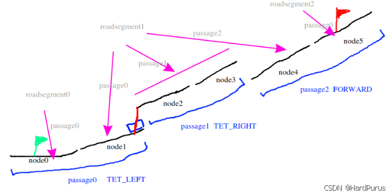
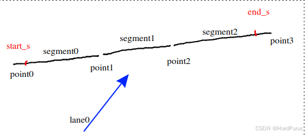
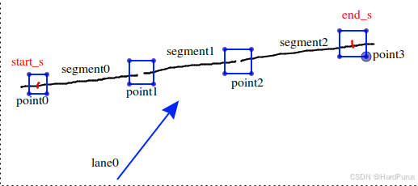
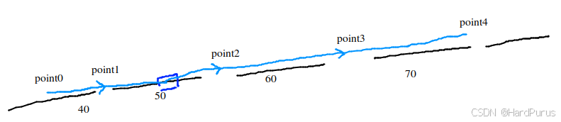
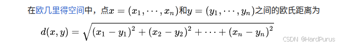
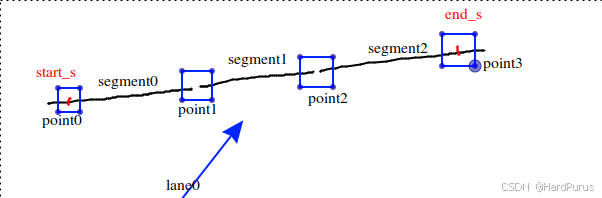
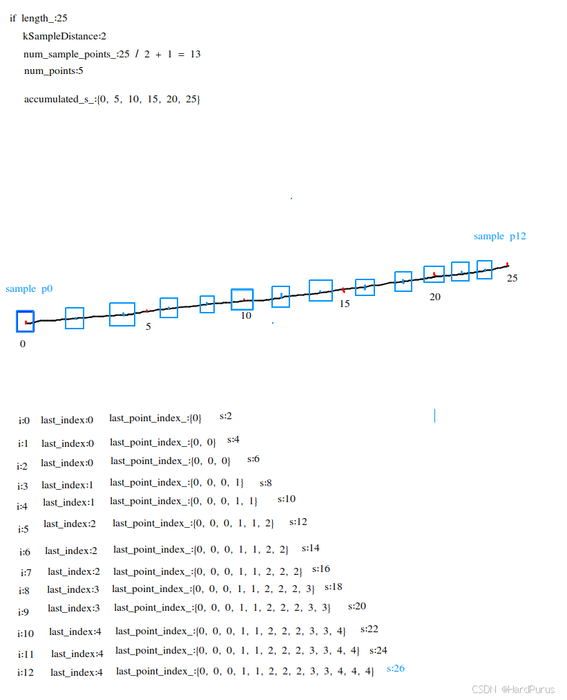
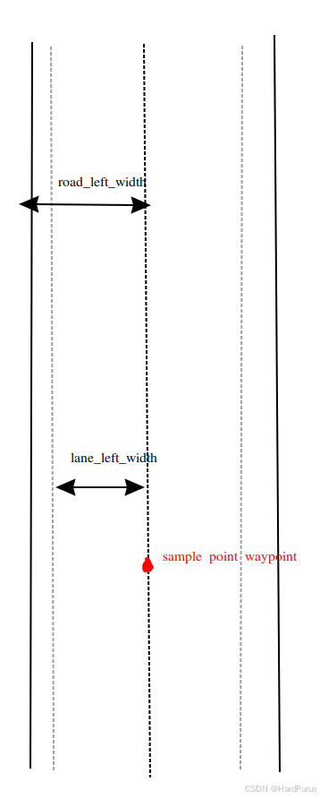

# Planning 模块 (4) - 参考线的平滑

## 1. 前言与背景

上一篇 [planning模块(3)-参考线的生成](https://github.com/AELe/Apollo-PNC-algorithm-analysis/blob/main/routing%E6%A8%A1%E5%9D%97(3)-%E5%85%A8%E5%B1%80%E8%B7%AF%E7%BA%BF%E7%9A%84%E7%94%9F%E6%88%90.md) 我们已经介绍了基于全局路线参考线的生成过程，本篇将介绍的是参考线的平滑，主要是使用二次规划进行平滑。

---

## 2. 参考线平滑概述

### 2.1 扩展参考线结构

通过 `CreateRouteSegments` 函数获取到的 `segments` 中包含两条扩展后的参考线：

1. **第一条**：自车所在当前车道前后的参考线
2. **第二条**：自车在换道边投影点前后的参考线

### 2.2 SmoothRouteSegment 函数

```cpp
hdmap::Path path(segments);
```

---

## 3. Path 构造函数

### 3.1 构造函数定义

```cpp
Path::Path(const std::vector<LaneSegment>& segments)
    : lane_segments_(segments) {
  for (const auto& segment : lane_segments_) {
    const auto points = MapPathPoint::GetPointsFromLane(
        segment.lane, segment.start_s, segment.end_s);
    path_points_.insert(path_points_.end(), points.begin(), points.end());
  }
  MapPathPoint::RemoveDuplicates(&path_points_);
  CHECK_GE(path_points_.size(), 2U);
  Init();
}
```

### 3.2 可视化说明



*图1：lane结构示意图 - 展示扩展参考线结构*

---

## 4. GetPointsFromLane 函数

### 4.1 函数作用

`GetPointsFromLane` 函数的作用是获取当前扩展参考线上所有车道的采样点的坐标或路径 point 点的坐标，构造成 `MapPathPoint` 格式的数据存入 `points` 中。

### 4.2 可视化说明



*图2：lane结构示意图 - 展示车道采样点获取*

### 4.3 参数说明

假设有以下参数：

- `lane->points().size()`：如果按照图示，此时 size 是 4
- `accumulate_s`：0
- `start_s`：假设是 10
- `end_s`：假设是 170
- 假设：`segment0 length:50`，`segment1 length:60`，`segment2 length:70`

### 4.4 处理流程

#### 4.4.1 第一次循环 (i = 0)

```cpp
if (i < lane->segments().size()) {
  const auto& segment = lane->segments()[i];
  const double next_accumulate_s = accumulate_s + segment.length();
}
```

- `segment = segment0`
- `next_accumulate_s = 0 + 50 = 50`

```cpp
if (start_s > accumulate_s && start_s < next_accumulate_s) {
  points.emplace_back(segment.start() + segment.unit_direction() *
                                            (start_s - accumulate_s),
                      lane->headings()[i], LaneWaypoint(lane, start_s));
}
```

- `point0`：上图 start_s 位置的坐标值（采样点），`lane->headings()[0]`，`LaneWaypoint(lane0, 10)`
- `accumulate_s = next_accumulate_s = 50`

#### 4.4.2 第二次循环 (i = 1)

```cpp
if (accumulate_s >= start_s && accumulate_s <= end_s) {
  points.emplace_back(lane->points()[i], lane->headings()[i],
                      LaneWaypoint(lane, accumulate_s));
}
```

- `point1`：point1 的坐标值，`lane->headings()[1]`，`LaneWaypoint(lane0, 50)`
- `segment = segment1`
- `next_accumulate_s = 50 + 60 = 110`
- `accumulate_s = next_accumulate_s = 110`

#### 4.4.3 第三次循环 (i = 2)

- `point2`：point2 的坐标值，`lane->headings()[2]`，`LaneWaypoint(lane0, 110)`
- `segment = segment2`
- `next_accumulate_s = 110 + 70 = 180`

```cpp
if (end_s > accumulate_s && end_s < next_accumulate_s) {
  points.emplace_back(segment.start() + segment.unit_direction() *
                                            (end_s - accumulate_s),
                      lane->headings()[i], LaneWaypoint(lane, end_s));
}
```

- `point3`：上图 end_s 位置的坐标值（采样点），`lane->headings()[2]`，`LaneWaypoint(lane0, 170)`
- `accumulate_s = next_accumulate_s = 180`

### 4.5 最终结果

此时 `accumulate_s > end_s` 退出 for 循环，最后获取到的 `points` 包含：

1. **point0**：上图 start_s 位置的坐标值（采样点），`lane->headings()[0]`，`LaneWaypoint(lane0, 10)`
2. **point1**：point1 的坐标值，`lane->headings()[1]`，`LaneWaypoint(lane0, 50)`
3. **point2**：point2 的坐标值，`lane->headings()[2]`，`LaneWaypoint(lane0, 110)`
4. **point3**：上图 end_s 位置的坐标值（采样点），`lane->headings()[2]`，`LaneWaypoint(lane0, 170)`

### 4.6 可视化说明



*图3：lane结构示意图 - 展示获取到的采样点*

也就是上图蓝色框中的点。

---

## 5. RemoveDuplicates 函数

### 5.1 函数作用

`RemoveDuplicates` 的作用是比较 `path_points_` 中的每两个点的距离是否大于设置的阈值：

- 如果大于设置的阈值，则认为是两个点
- 否则认为是一个点，并把当前的 `path_point` 的 `lane_waypoints` 设置为索引大的那一个元素的 `lane_waypoints`

---

## 6. Init 函数

### 6.1 InitPoints 函数

#### 6.1.1 可视化说明



*图4：lane结构示意图 - 展示路径点结构*

假设 `num_points_` 现在的 size 为 5，是自车当前所在车道前后扩展的参考线，分别如上图。

#### 6.1.2 初始化参数

- 初始时 `accumulated_s_`：0
- `i`：0
- `segments_`：`(point0, point1)`

#### 6.1.3 方向计算

```cpp
heading = path_points_[i + 1] - path_points_[i];
```

- `heading`：point0 指向 point1 的向量的代数表示（坐标表示）
- `heading_length`：是 point0 和 point1 的欧几里德距离

#### 6.1.4 可视化说明



*图5：lane结构示意图 - 展示方向向量计算*

假设 `s = 40`

```cpp
if (heading_length > 0.0) {
  heading /= heading_length;
}
```

这里表示 point0 指向 point1 方向上的单位向量的代数表示（坐标）。

#### 6.1.5 数据结构

继续 for 循环，直到不符合条件：

- **`segments_`**：存的就是 point 之间的一段
- **`unit_directions_`**：存的就是每一个 segment 方向上的单位向量的坐标
- **`accumulated_s_`**：存的是每一个 point 的纵向距离

#### 6.1.6 长度和采样点计算

```cpp
length_ = s;
num_sample_points_ = static_cast<int>(length_ / kSampleDistance) + 1;
num_segments_ = num_points_ - 1;
```

- **`length_`**：是第一个 point 到最后一个 point 的总长度
- **`num_sample_points_`**：是采样点的个数，`kSampleDistance` 默认是 0.25
- **`num_segments_`**：segment 的个数

---

## 7. InitLaneSegments 函数

### 7.1 FindLaneSegment 函数

```cpp
bool FindLaneSegment(const MapPathPoint& p1, const MapPathPoint& p2,
                     LaneSegment* const lane_segment) {
  for (const auto& wp1 : p1.lane_waypoints()) {
    if (nullptr == wp1.lane) {
      continue;
    }
    for (const auto& wp2 : p2.lane_waypoints()) {
      if (nullptr == wp2.lane) {
        continue;
      }
      if (wp1.lane->id().id() == wp2.lane->id().id() && wp1.s < wp2.s) {
        *lane_segment = LaneSegment(wp1.lane, wp1.s, wp2.s);
        return true;
      }
    }
  }
  return false;
}
```

### 7.2 可视化说明


*图6：lane结构示意图 - 展示车道段查找*

### 7.3 函数作用

`FindLaneSegment` 函数的作用是通过 `path_points_` 中 point 的 id 和 s 纵向距离，通过判断 point id（表示一条车道）来将每两个 point 构造成一个 `LaneSegment` 格式的数据。

```cpp
if (lane_segments_.empty()) {
  for (int i = 0; i + 1 < num_points_; ++i) {
    LaneSegment lane_segment;
    if (FindLaneSegment(path_points_[i], path_points_[i + 1],
                        &lane_segment)) {
      lane_segments_.push_back(lane_segment);
    }
  }
}
```

### 7.4 LaneSegment::Join 函数

`Join` 的作用是将上面一段一段的 `LaneSegment` 构造为以一条 lane 为一个 segment 的数据。

比如上面图示，通过 `FindLaneSegment` 函数获取到的 `lane_segments_` 就是 4 段，然后通过 `Join` 函数合并成一条车道的 segment。

### 7.5 累积长度计算

```cpp
lane_accumulated_s_.resize(lane_segments_.size());
lane_accumulated_s_[0] = lane_segments_[0].Length();
for (std::size_t i = 1; i < lane_segments_.size(); ++i) {
  lane_accumulated_s_[i] =
      lane_accumulated_s_[i - 1] + lane_segments_[i].Length();
}
```

**`lane_accumulated_s_`**：存储的是扩展后的参考线上的每条车道的累积长度。

---

## 8. InitPointIndex 函数

### 8.1 函数定义

```cpp
void Path::InitPointIndex() {
  last_point_index_.clear();
  last_point_index_.reserve(num_sample_points_);
  double s = 0.0;
  int last_index = 0;
  for (int i = 0; i < num_sample_points_; ++i) {
    while (last_index + 1 < num_points_ &&
           accumulated_s_[last_index + 1] <= s) {
      ++last_index;
    }
    last_point_index_.push_back(last_index);
    s += kSampleDistance;
  }
  CHECK_EQ(last_point_index_.size(), static_cast<size_t>(num_sample_points_));
}
```

### 8.2 可视化说明



*图7：lane结构示意图 - 展示采样点索引*



*图8：lane结构示意图 - 展示路径点索引关系*

### 8.3 函数作用

我们可以看到 `last_point_index_` 表示的就是路径上采样点的最近路径点索引。

比如第一个采样点/第二个采样点/第三个采样点，是在第一个路径点和第二个路径点之间。

---

## 9. InitWidth 函数

### 9.1 宽度计算逻辑

```cpp
while (segment_end_s < sample_s && !is_reach_to_end) {
  const auto& cur_point = path_points_[path_point_index];
  cur_waypoint = &(cur_point.lane_waypoints()[0]);
  CHECK_NOTNULL(cur_waypoint->lane);
  segment_start_s = accumulated_s_[path_point_index];
  segment_end_s = segment_start_s + segments_[path_point_index].length();
  if (++path_point_index >= num_points_) {
    is_reach_to_end = true;
  }
}
```

- **`segment_start_s`**：当前 segment 的可行驶区域起点，以整条扩展参考线为坐标系
- **`segment_end_s`**：当前 segment 的可行驶区域结束点，以整条扩展参考线为坐标系

### 9.2 坐标转换

```cpp
waypoint_s = cur_waypoint->s + sample_s - segment_start_s;
```

### 9.3 宽度获取

```cpp
cur_waypoint->lane->GetWidth(waypoint_s, &left_width, &right_width);
lane_left_width_.push_back(left_width - cur_waypoint->l);
lane_right_width_.push_back(right_width + cur_waypoint->l);
cur_waypoint->lane->GetRoadWidth(waypoint_s, &left_width, &right_width);
road_left_width_.push_back(left_width - cur_waypoint->l);
road_right_width_.push_back(right_width + cur_waypoint->l);
```

### 9.4 可视化说明



*图9：lane结构示意图 - 展示车道和道路宽度*

假设当前采样点的位置如下红色位置，并且 `l` 为 0：

- **`lane_left_width_`**：行驶的车道左侧的宽度
- **`road_left_width_`**：马路牙子

---

## 10. InitOverlaps 函数

### 10.1 GetAllOverlaps 函数

```cpp
// 遍历路径的所有车道段
double s = 0.0;  // 当前在整体路径中的弧长
for (const auto& lane_segment : lane_segments_) {
    // 获取该车道的所有重叠
    for (const auto& overlap : GetOverlaps_from_lane(*(lane_segment.lane))) {
        // 检查重叠是否在当前车道段内
        if (lane_overlap_info.start_s() <= lane_segment.end_s &&
            lane_overlap_info.end_s() >= lane_segment.start_s) {
            
            // 转换坐标：从车道局部坐标 → 路径全局坐标
            const double ref_s = s - lane_segment.start_s;
            const double adjusted_start_s =
                std::max(lane_overlap_info.start_s(), lane_segment.start_s) + ref_s;
            const double adjusted_end_s =
                std::min(lane_overlap_info.end_s(), lane_segment.end_s) + ref_s;
            
            // 记录重叠（排除自身车道的ID）
            for (const auto& object : overlap->overlap().object()) {
                if (object.id().id() != lane_segment.lane->id().id()) {
                    overlaps_by_id[object.id().id()].emplace_back(adjusted_start_s,
                                                                  adjusted_end_s);
                }
            }
        }
    }
    s += lane_segment.end_s - lane_segment.start_s;  // 更新路径弧长
}
```

### 10.2 重叠合并处理

```cpp
for (auto& overlaps_one_object : overlaps_by_id) {
  const std::string& object_id = overlaps_one_object.first;
  auto& segments = overlaps_one_object.second;
  std::sort(segments.begin(), segments.end());

  const double kMinOverlapDistanceGap = 1.5;  // in meters.
  for (const auto& segment : segments) {
    if (!overlaps->empty() && overlaps->back().object_id == object_id &&
        segment.first - overlaps->back().end_s <= kMinOverlapDistanceGap) {
      overlaps->back().end_s =
          std::max(overlaps->back().end_s, segment.second);
    } else {
      overlaps->emplace_back(object_id, segment.first, segment.second);
    }
  }
}
```

上面是合并 `overlaps` 中存在重叠的部分。

### 10.3 排序处理

```cpp
std::sort(overlaps->begin(), overlaps->end(),
          [](const PathOverlap& overlap1, const PathOverlap& overlap2) {
            return overlap1.start_s < overlap2.start_s;
          });
```

重叠部分按起始点从小到大排序。

**这样 `Init` 函数就全部分析完了。**

---

## 11. 总结

### 11.1 核心内容回顾

本文详细介绍了 Planning 模块中参考线平滑的第四部分，主要包括：

1. **`Path` 构造函数** - 初始化路径数据结构
2. **`GetPointsFromLane` 函数** - 获取车道采样点
3. **`RemoveDuplicates` 函数** - 去除重复点
4. **`InitPoints` 函数** - 初始化路径点和方向
5. **`InitLaneSegments` 函数** - 初始化车道段
6. **`InitPointIndex` 函数** - 初始化采样点索引
7. **`InitWidth` 函数** - 计算车道和道路宽度
8. **`InitOverlaps` 函数** - 处理重叠区域

### 11.2 技术要点

- **采样点获取**：根据车道段长度和起止位置精确获取采样点
- **方向计算**：计算每个 segment 的单位方向向量
- **车道段合并**：将相邻的相同车道段合并为完整的车道段
- **宽度计算**：区分车道宽度和道路宽度（包含马路牙子）
- **重叠处理**：合并相邻的重叠区域，避免重复处理

### 11.3 数据结构设计

1. **`path_points_`**：存储所有路径点的坐标、航向角和车道信息
2. **`segments_`**：存储点之间的段信息
3. **`unit_directions_`**：存储每个段的单位方向向量
4. **`accumulated_s_`**：存储每个点的累积纵向距离
5. **`lane_segments_`**：存储车道段信息
6. **`lane_accumulated_s_`**：存储车道累积长度
7. **`last_point_index_`**：存储采样点的最近路径点索引
8. **宽度相关数组**：存储车道和道路的左右宽度

### 11.4 后续内容

这是参考线平滑的第一部分，主要介绍了路径数据的初始化过程。后续将介绍如何基于这些初始化数据进行二次规划平滑处理，生成最终可供控制模块使用的平滑参考线。