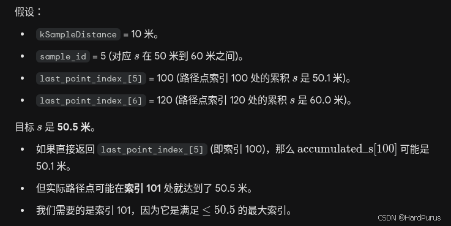
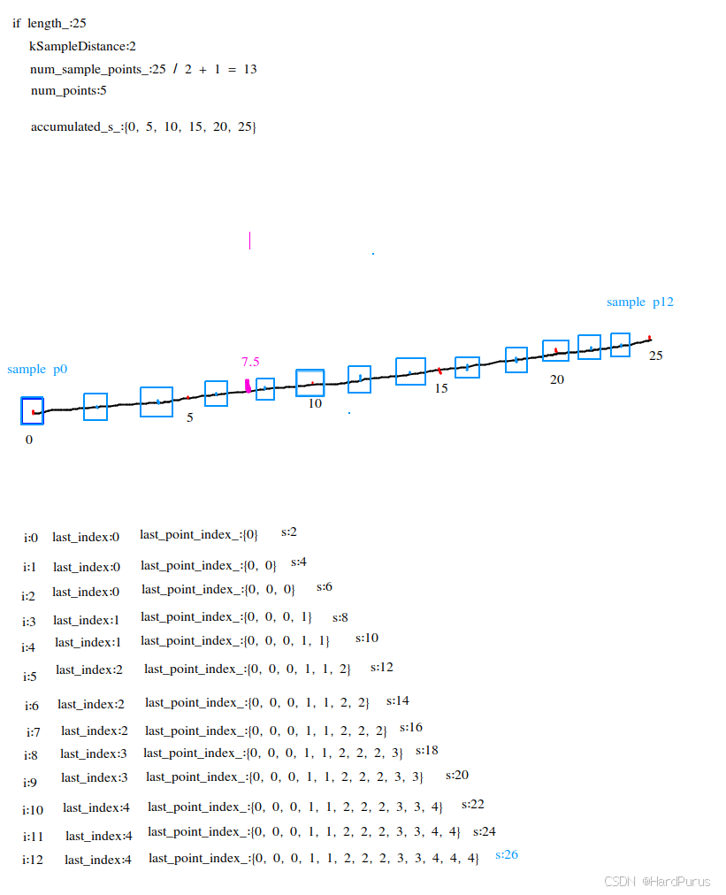
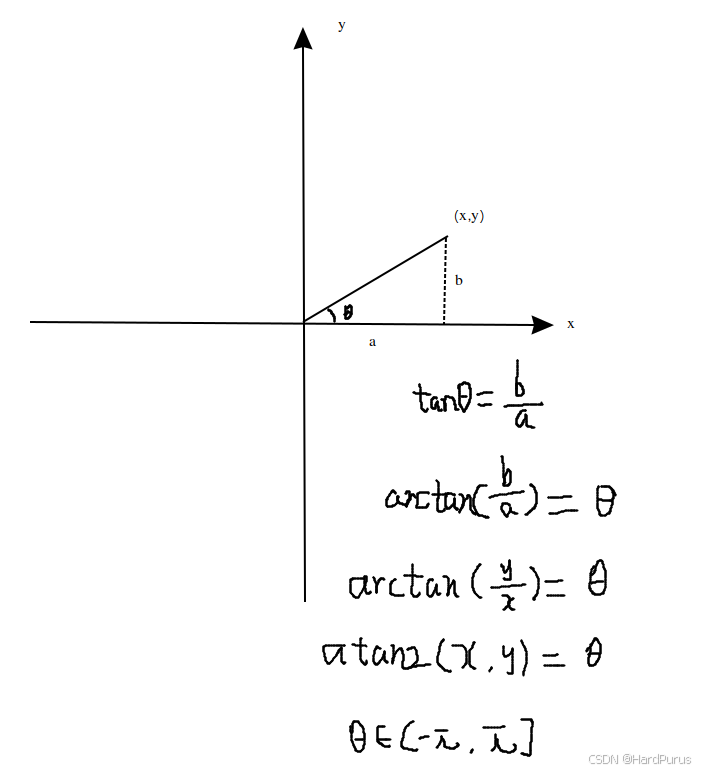
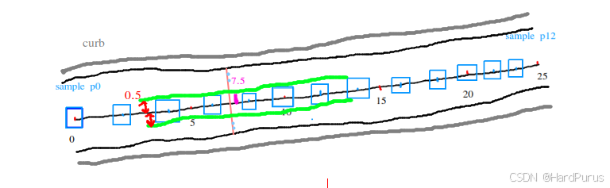

# Planning 模块 (5) - 参考线的平滑

## 1. 前言与背景

上一篇 [planning模块(4)-参考线的平滑](https://github.com/AELe/Apollo-PNC-algorithm-analysis/blob/main/planning%E6%A8%A1%E5%9D%97\(4\)-%E5%8F%82%E8%80%83%E7%BA%BF%E7%9A%84%E5%B9%B3%E6%BB%91.md) 已经介绍了创建 path 的过程，本篇将继续介绍参考线的平滑处理。

---

## 2. SmoothRouteSegment 函数

### 2.1 函数定义

```cpp
bool ReferenceLineProvider::SmoothRouteSegment(const RouteSegments& segments,
                                               ReferenceLine* reference_line) {
  hdmap::Path path(segments);
  return SmoothReferenceLine(ReferenceLine(path), reference_line);
}
```

### 2.2 函数作用

该函数接收扩展后的参考线段，创建 Path 对象，然后调用 `SmoothReferenceLine` 函数进行平滑处理。

---

## 3. SmoothReferenceLine 函数

### 3.1 GetAnchorPoints 函数

```cpp
void ReferenceLineProvider::GetAnchorPoints(
    const ReferenceLine& reference_line,
    std::vector<AnchorPoint>* anchor_points) const {
  CHECK_NOTNULL(anchor_points);
  const double interval = smoother_config_.max_constraint_interval();
  int num_of_anchors =
      std::max(2, static_cast<int>(reference_line.Length() / interval + 0.5));
  std::vector<double> anchor_s;
  common::util::uniform_slice(0.0, reference_line.Length(), num_of_anchors - 1,
                              &anchor_s);
```

### 3.2 uniform_slice 函数

```cpp
void uniform_slice(const T start, const T end, uint32_t num,
                   std::vector<T>* sliced) {
  if (!sliced || num == 0) {
    return;
  }
  const T delta = (end - start) / num;
  sliced->resize(num + 1);
  T s = start;
  for (uint32_t i = 0; i < num; ++i, s += delta) {
    sliced->at(i) = s;
  }
  sliced->at(num) = end;
}
```

### 3.3 采样间隔说明

主要是每间隔 0.25 米进行采样，然后获取到所有采样点在参考线上的纵向距离存入 `anchor_s` 中。

**`max_constraint_interval`** 来自配置文件：
- 文件位置：`modules/planning/planning_component/conf/discrete_points_smoother_config.pb.txt`
- 默认值：0.25m

---

## 4. GetAnchorPoint 函数

### 4.1 锚点构建逻辑

```cpp
for (const double s : anchor_s) {
  AnchorPoint anchor = GetAnchorPoint(reference_line, s);
  anchor_points->emplace_back(anchor);
}
```

上面逻辑就是为所有采样点构建锚点信息。

### 4.2 GetReferencePoint 函数

#### 4.2.1 GetIndexFromS 函数

这个函数的作用是返回给定位置 `s` 所对应的路径点的索引，以及该路径点到 `s` 这个点的距离。这个函数中 `last_point_index_` 与上一篇 [planning模块(4)-参考线的平滑](https://github.com/AELe/Apollo-PNC-algorithm-analysis/blob/main/planning%E6%A8%A1%E5%9D%97\(4\)-%E5%8F%82%E8%80%83%E7%BA%BF%E7%9A%84%E5%B9%B3%E6%BB%91.md) 中介绍的 `InitPointIndex` 函数相关。

```cpp
const int sample_id = static_cast<int>(s / kSampleDistance);
const int next_sample_id = sample_id + 1;

int low = last_point_index_[sample_id];
int high = (next_sample_id < num_sample_points_
                ? std::min(num_points_, last_point_index_[next_sample_id] + 1)
                : num_points_);
```

#### 4.2.2 数据结构说明

- **`last_point_index_`**：是采样点与相关路径点的索引关系表
- **`low`**：二分查找的起始索引
- **`high`**：二分查找的终止索引

### 4.3 可视化说明



*图1：lane结构示意图 - 展示采样点索引关系*

下面的逻辑是上一篇 `InitPointIndex` 函数的处理逻辑：



*图2：lane结构示意图 - 展示InitPointIndex函数处理逻辑*

### 4.4 二分查找示例

假设 `s` 为 7.5：

- `sample_id = 7.5 / 2 = 3`
- `next_sample_id = 3 + 1 = 4`
- `low = last_point_index_[sample_id] = last_point_index_[3] = 1`
- `high = 4 < 13 ? std::min(5, last_point_index_[4] + 1) : 5 = 2`

```cpp
while (low + 1 < high) {
  const int mid = (low + high) >> 1;
  if (accumulated_s_[mid] <= s) {
    low = mid;
  } else {
    high = mid;
  }
}
return {low, s - accumulated_s_[low]};
```

由于不满足 while 循环条件，`return {1, 7.5 - 5 = 2.5}`

表示位置 `s` 对应的路径点索引是 1，路径点到 `s` 的距离是 2.5m。上面的逻辑就是通过二分查找去查找位置 `s` 对应的路径点索引是什么。

### 4.5 参考点插值

```cpp
auto interpolate_index = map_path_.GetIndexFromS(s);

size_t index = interpolate_index.id;
size_t next_index = index + 1;
if (next_index >= reference_points_.size()) {
  next_index = reference_points_.size() - 1;
}

const auto& p0 = reference_points_[index];
const auto& p1 = reference_points_[next_index];

const double s0 = accumulated_s[index];
const double s1 = accumulated_s[next_index];
```

#### 4.5.1 数据结构说明

- **`p0/p1`**：当前扩展参考线上 point/下一个 point 对应的 `ReferencePoint` 信息
- **`s0/s1`**：当前扩展参考线上 point/下一个 point 的纵向距离

#### 4.5.2 平滑点获取

```cpp
auto map_path_point = map_path_.GetSmoothPoint(index);

const MapPathPoint& ref_point = path_points_[index.id];
```

根据索引获取到参考路径点。

```cpp
const Vec2d delta = unit_directions_[index.id] * index.offset;
MapPathPoint point({ref_point.x() + delta.x(), ref_point.y() + delta.y()},
                   ref_point.heading());
```

获取到当前 `s` 位置采样点的坐标值，并为此点构建 `MapPathPoint`。

### 4.6 车道信息处理

```cpp
if (index.id < num_segments_ && !ref_point.lane_waypoints().empty()) {
  const LaneSegment& lane_segment = lane_segments_to_next_point_[index.id];
  auto ref_lane_waypoint = ref_point.lane_waypoints()[0];
  if (lane_segment.lane != nullptr) {
    for (const auto& lane_waypoint : ref_point.lane_waypoints()) {
      if (lane_waypoint.lane->id().id() == lane_segment.lane->id().id()) {
        ref_lane_waypoint = lane_waypoint;
        break;
      }
    }
    point.add_lane_waypoint(
        LaneWaypoint(lane_segment.lane, lane_segment.start_s + index.offset,
                     ref_lane_waypoint.l));
  }
}
if (point.lane_waypoints().empty() && !ref_point.lane_waypoints().empty()) {
  point.add_lane_waypoint(ref_point.lane_waypoints()[0]);
}
```

#### 4.6.1 逻辑说明

上面逻辑主要是获取车道信息：

1. **车道匹配**：当采样点相关的路径点索引所在的车道 id 与参考路径点的车道 id 相同，通过参考点新构建的平滑点就使用参考路径点的车道信息
2. **后备处理**：如果没有满足 if 的条件，导致平滑点 `point` 没有车道信息（`point.lane_waypoints().empty()`），但参考点 `ref_point` 有车道信息（`ref_point.lane_waypoints()` 不为空），则将参考点的第一个车道信息添加到平滑点中

### 4.7 方向角计算

```cpp
map_path_point.set_heading(map_path_.unit_directions()[index.id].Angle());
```

计算当前索引所表示的路径点的 segment 方向上的单位向量的方向角。`unit_directions` 是在上一篇 [planning模块(4)-参考线的平滑](https://github.com/AELe/Apollo-PNC-algorithm-analysis/blob/main/planning%E6%A8%A1%E5%9D%97\(4\)-%E5%8F%82%E8%80%83%E7%BA%BF%E7%9A%84%E5%B9%B3%E6%BB%91.md) `InitPoints` 函数中介绍的。

```cpp
double Vec2d::Angle() const { return std::atan2(y_, x_); }
```

### 4.8 可视化说明



*图3：lane结构示意图 - 展示方向角计算*

### 4.9 曲率和曲率导数计算

```cpp
const double kappa = common::math::lerp(p0.kappa(), s0, p1.kappa(), s1, s);
const double dkappa = common::math::lerp(p0.dkappa(), s0, p1.dkappa(), s1, s);
```

通过线性插值，计算采样点位置的曲率和曲率导数。

```cpp
T lerp(const T &x0, const double t0, const T &x1, const double t1,
       const double t) {
  if (std::abs(t1 - t0) <= 1.0e-6) {
    AERROR << "input time difference is too small";
    return x0;
  }
  const double r = (t - t0) / (t1 - t0);
  const T x = x0 + r * (x1 - x0);
  return x;
}
```

就是按 `s` 在 `s0` 和 `s1` 之间的距离比例，去计算曲率和曲率的导数。

```cpp
return ReferencePoint(map_path_point, kappa, dkappa);
```

最后返回通过采样点构建的 `ReferencePoint`。

**到这 `GetReferencePoint` 函数就介绍完了。**

---

## 5. 路沿避让逻辑

### 5.1 车辆宽度获取

```cpp
const double adc_width =
      VehicleConfigHelper::GetConfig().vehicle_param().width();
```

从配置文件 `modules/common/data/vehicle_param.pb.txt` 获取车辆的宽度，这个配置文件中存储了车辆自车的一些数据。

### 5.2 垂直方向向量

```cpp
const Vec2d left_vec =
      Vec2d::CreateUnitVec2d(ref_point.heading() + M_PI / 2.0);
```

获取参考路径点切线垂直方向（逆时针）上的单位向量坐标。

### 5.3 车道宽度获取

```cpp
auto waypoint = ref_point.lane_waypoints().front();
double left_width = 0.0;
double right_width = 0.0;
waypoint.lane->GetWidth(waypoint.s, &left_width, &right_width);
const double kEpislon = 1e-8;
double effective_width = 0.0;

// shrink width by vehicle width, curb
double safe_lane_width = left_width + right_width;
safe_lane_width -= adc_width;
bool is_lane_width_safe = true;

if (safe_lane_width < kEpislon) {
  ADEBUG << "lane width [" << left_width + right_width << "] "
         << "is smaller than adc width [" << adc_width << "]";
  effective_width = kEpislon;
  is_lane_width_safe = false;
}
```

### 5.4 路沿避让处理

```cpp
double center_shift = 0.0;
if (hdmap::RightBoundaryType(waypoint) == hdmap::LaneBoundaryType::CURB) {
  safe_lane_width -= smoother_config_.curb_shift();
  if (safe_lane_width < kEpislon) {
    ADEBUG << "lane width smaller than adc width and right curb shift";
    effective_width = kEpislon;
    is_lane_width_safe = false;
  } else {
    center_shift += 0.5 * smoother_config_.curb_shift();
  }
}
if (hdmap::LeftBoundaryType(waypoint) == hdmap::LaneBoundaryType::CURB) {
  safe_lane_width -= smoother_config_.curb_shift();
  if (safe_lane_width < kEpislon) {
    ADEBUG << "lane width smaller than adc width and left curb shift";
    effective_width = kEpislon;
    is_lane_width_safe = false;
  } else {
    center_shift -= 0.5 * smoother_config_.curb_shift();
  }
}
```

#### 5.4.1 逻辑说明

上面是路沿（马路牙子）避让逻辑，普通的车道线（虚线）压一点没关系，但路沿是物理障碍，必须保留安全距离。

**右侧是路沿：**

1. 从安全宽度中扣除 `curb_shift`
2. `curb_shift` 是从 `modules/planning/planning_component/conf/discrete_points_smoother_config.pb.txt` 文件中获取到的配置项，默认是 0.2
3. 中心点左移量：`center_shift += 0.5 * curb_shift`
4. **解释**：因为右边可行驶区域变窄了，所以该区域的"中心"需要向左移动，才能保证驾驶安全

**左侧是路沿：**

1. 从安全宽度中扣除 `curb_shift`
2. 中心点右移量：`center_shift -= 0.5 * curb_shift`
3. **解释**：因为左边可行驶区域变窄了，所以该区域的"中心"需要向右移动，才能保证驾驶安全

### 5.5 缓冲区域处理

```cpp
const double buffered_width =
    safe_lane_width - 2.0 * smoother_config_.lateral_buffer();
safe_lane_width =
    buffered_width < kEpislon ? safe_lane_width : buffered_width;
```

除了避让路沿，还需要在剩余空间两头各预留一个 `lateral_buffer`。`lateral_buffer` 也是从 `modules/planning/planning_component/conf/discrete_points_smoother_config.pb.txt` 文件中获取的，默认是 0.2。

如果预留缓冲后还有空间，就用缩减后的宽度；如果空间不够了，就尽量维持原状，不再强行缩减。

### 5.6 有效宽度计算

```cpp
if (is_lane_width_safe) {
  effective_width = 0.5 * safe_lane_width;
}

ref_point += left_vec * center_shift;
anchor.path_point = ref_point.ToPathPoint(s);
anchor.lateral_bound = common::math::Clamp(
    effective_width, smoother_config_.min_lateral_boundary_bound(),
    smoother_config_.max_lateral_boundary_bound());
```

#### 5.6.1 逻辑说明

- **`anchor.lateral_bound`**：通常定义的是从中心点向左或向右的最大允许距离而不是总宽度，所以 `effective_width` 取一半
- **中心点调整**：利用之前计算的 `center_shift`，沿着横向向量 `left_vec` 移动原始参考点，这确保了锚点位于新的、避让了路沿后的安全区域的中心
- **`left_vec`** 是垂直于原始参考路径点切线方向上的单位向量坐标，乘以 `center_shift` 表示偏移量
- **`ref_point += left_vec * center_shift`**：如果 `center_shift` 为正，向左侧偏移一点；如果 `center_shift` 为负，则向右偏移一点，最后得到新锚点的坐标
- **范围限制**：最后将 `effective_width` 有效范围控制在 `min_lateral_boundary_bound`（默认 0.1）和 `max_lateral_boundary_bound`（默认 0.5）阈值之间

### 5.7 可视化说明



*图4：lane结构示意图 - 展示锚点信息*

这也就意味着一个锚点的信息中比较重要信息是：**调整后锚点坐标**和**左右有效行驶范围**。

**这样 `GetAnchorPoint` 函数就分析完了。**

---

## 6. 锚点约束设置

### 6.1 锚点构建

```cpp
for (const double s : anchor_s) {
  AnchorPoint anchor = GetAnchorPoint(reference_line, s);
  anchor_points->emplace_back(anchor);
}
anchor_points->front().longitudinal_bound = 1e-6;
anchor_points->front().lateral_bound = 1e-6;
anchor_points->front().enforced = true;
anchor_points->back().longitudinal_bound = 1e-6;
anchor_points->back().lateral_bound = 1e-6;
anchor_points->back().enforced = true;
```

### 6.2 逻辑说明

上面逻辑会为每个采样点，都构建一个锚点数据，然后把所有锚点数据存入 `anchor_points` 中，并且对生成的锚点列表的第一个点（起点）和最后一个点（终点）应用严格的、近乎固定的约束。

这样可以确保平滑后的路径的首尾位置高度精确，使车不会在起点和终点出现晃动的情况。

---

## 7. 平滑器配置

### 7.1 平滑器设置

```cpp
smoother_->SetAnchorPoints(anchor_points);
```

将获取到的锚点（注意这里是一条扩展参考线上的所有采样后的锚点）设置到参考线平滑器中。

### 7.2 配置说明

这里默认使用的是 `discrete_points_smoother` 平滑器，平滑器的配置在 `modules/planning/planning_component/conf/planning.conf` 文件中：

```
--smoother_config_filename=modules/planning/planning_component/conf/discrete_points_smoother_config.pb.txt
```

---

## 8. 总结

### 8.1 核心内容回顾

本文详细介绍了 Planning 模块中参考线平滑的第五部分，主要包括：

1. **`SmoothRouteSegment` 函数** - 参考线平滑的入口函数
2. **`GetAnchorPoints` 函数** - 获取锚点集合
3. **`uniform_slice` 函数** - 均匀采样处理
4. **`GetAnchorPoint` 函数** - 获取单个锚点信息
5. **`GetReferencePoint` 函数** - 获取参考点信息
6. **`GetIndexFromS` 函数** - 通过纵向距离获取索引
7. **路沿避让逻辑** - 处理马路牙子等物理障碍
8. **锚点约束设置** - 设置起点和终点的严格约束
9. **平滑器配置** - 离散点平滑器配置

### 8.2 技术要点

- **均匀采样**：每 0.25 米采样一次，确保平滑精度
- **二分查找**：通过二分查找快速定位路径点索引
- **线性插值**：计算曲率和曲率导数
- **路沿避让**：区分普通车道线和物理路沿，确保安全距离
- **缓冲区域**：预留横向缓冲空间，提高行驶安全性
- **严格约束**：起点和终点应用近乎固定的约束，确保位置精确

### 8.3 系统设计思想

1. **安全性优先**：通过路沿避让和缓冲区域确保行驶安全
2. **精度保证**：均匀采样和严格约束确保平滑精度
3. **效率优化**：二分查找提高索引定位效率
4. **灵活性**：通过配置文件调整采样间隔、缓冲大小等参数
5. **模块化**：每个函数职责明确，便于维护和调试

### 8.4 后续内容

这是参考线平滑的第二部分，主要介绍了锚点获取和路沿避让逻辑。后续将介绍离散点平滑器的具体实现，包括二次规划优化、约束条件设置、平滑处理等核心算法。