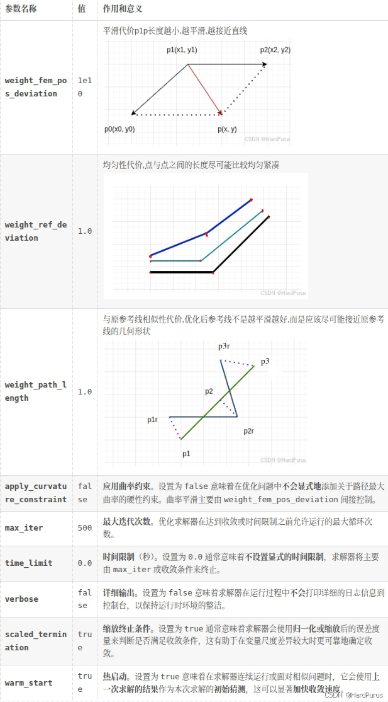
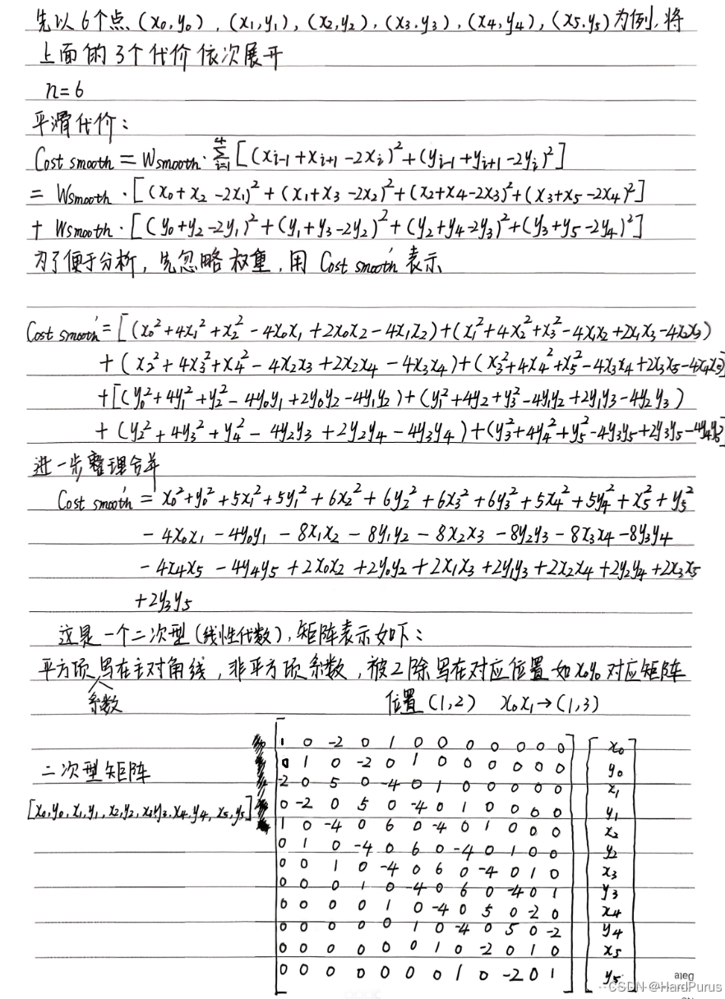
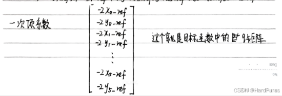

# planning模块(6)-参考线的平滑(二次规划)

[planning模块(5)-参考线的平滑](https://blog.csdn.net/qq_23613819/article/details/155504404?spm=1001.2014.3001.5501)上一篇已经介绍了采样点生成锚点数据的过程,并且将所有采样点生成的锚点数据设置到了平滑器中.接下来继续介绍使用二次规划平滑参考线的算法过程.

```cpp
  if (!smoother_->Smooth(raw_reference_line, reference_line)) {
    AERROR << "Failed to smooth reference line with anchor points";
    return false;
  }
```

```cpp
  for (const auto& anchor_point : anchor_points_) {
    raw_point2d.emplace_back(anchor_point.path_point.x(),
                             anchor_point.path_point.y());
    anchorpoints_lateralbound.emplace_back(anchor_point.lateral_bound);
  }

  // fix front and back points to avoid end states deviate from the center of
  // road
  anchorpoints_lateralbound.front() = 0.0;
  anchorpoints_lateralbound.back() = 0.0;
```

从锚点数据中提取坐标存入raw_point2d,提取横向边界存入anchorpoints_lateralbound,将起点和终点的横向边界设置为0,防止车在起点和终点位置偏离车道中心线.

---

## 1. 坐标归一化处理

### 1.1 NormalizePoints函数

这里坐标(x, y)是全局坐标也就是我们熟悉的笛卡尔坐标,当坐标值非常大时，涉及这些大数字的数值优化（例如，求解二次规划 QP）或浮点运算可能会遇到精度损失或数值溢出的问题,通过将所有点平移到以起点为原点的局部坐标系，坐标值被大大减小（通常在几十到几百的范围内），从而显著提高了后续计算的数值稳定性

```cpp
void DiscretePointsReferenceLineSmoother::NormalizePoints(
    std::vector<std::pair<double, double>>* xy_points) {
  zero_x_ = xy_points->front().first;
  zero_y_ = xy_points->front().second;
  std::for_each(xy_points->begin(), xy_points->end(),
                [this](std::pair<double, double>& point) {
                  auto curr_x = point.first;
                  auto curr_y = point.second;
                  std::pair<double, double> xy(curr_x - zero_x_,
                                               curr_y - zero_y_);
                  point = std::move(xy);
                });
}
```

经过此操作后，向量中的第一个点的坐标将始终是(0.0, 0.0), 然后xy_points中的其它坐标以起点为坐标原点进行平移,最后xy_points中所有点的坐标都从以全局坐标为原点的坐标归一化为了以起点为原点的坐标.

```cpp
const auto& smoothing_method = config_.discrete_points().smoothing_method();
```

此配置来自modules/planning/planning_component/conf/discrete_points_smoother_config.pb.txt

默认使用的是FEM_POS_DEVIATION_SMOOTHING,CosThetaSmooth和FemPosSmooth方法的区别在于平滑代价的计算方式,这里主要介绍FemPosSmooth方法

---

## 2. FEM位置偏差平滑算法

### 2.1 FemPosSmooth函数

有限元法（Finite Element Method）的位置偏差平滑器,这个平滑器的目标是找到一条平滑、贴合参考线且长度合理的路径

```cpp
bool DiscretePointsReferenceLineSmoother::FemPosSmooth(
    const std::vector<std::pair<double, double>>& raw_point2d,
    const std::vector<double>& bounds,
    std::vector<std::pair<double, double>>* ptr_smoothed_point2d) {
  const auto& fem_pos_config =
      config_.discrete_points().fem_pos_deviation_smoothing();
```

fem_pos_config配置来自文件:modules/planning/planning_component/conf/discrete_points_smoother_config.pb.txt

```cpp
  fem_pos_deviation_smoothing {
    weight_fem_pos_deviation: 1e10
    weight_ref_deviation: 1.0
    weight_path_length: 1.0
    apply_curvature_constraint: false
    max_iter: 500
    time_limit: 0.0
    verbose: false
    scaled_termination: true
    warm_start: true
  }
```



```cpp
std::vector<double> box_bounds = bounds;
  const double box_ratio = 1.0 / std::sqrt(2.0);
  for (auto& bound : box_bounds) {
    bound *= box_ratio;
  }
```

fem pos smoother: 指的是有限元法位置偏差平滑器（Finite Element Method Position Deviation Smoother），这是一个用于生成高度平滑路径或参考线的优化算法

平滑器内部对路径点的位置使用的约束形式是矩形边界约束,在二维空间中，如果对x和y坐标分别施加独立约束，即 |x| <= $B_{x}$且|y| <= $B_{y}$，这定义了一个矩形区域。这个约束等价于使用 L1 范数约束的扩展形式


这里说一下,每个锚点的横向边界box_bounds为什么都要乘以$\frac{1}{\sqrt{2}}$

在锚点附近,我们希望优化后的参考点满足:
$(x - x_{r})^{2} + (y - y_{r})^{2}\le$ bound
也就是说优化后的参考点要在以原锚点坐标$(x_{r}, y_{r})$为圆心,box_bounds为半径的圆上,这是一个圆形约束,也是二范数约束


但这里求解二次规划问题的OSQP求解器只能处理线性约束$Ax\le$ b不支持二次项,因此不能直接表达圆形,于是必须退而求其次,把圆形用一个内切正方形来逼近

$|x - x_{r}|\le$ bound $\times$$\frac{1}{\sqrt{2}}$, $|y - y_{r}|\le$ bound $\times$$\frac{1}{\sqrt{2}}$,这样的约束才可以使用OSQP进行求解

然后说一下$\frac{1}{\sqrt{2}}$是哪来的


$|a|$表示的是 bound $\times$$\frac{1}{\sqrt{2}}$近似为一个正方形约束.这样就可以使用OSQP求解器进行求解了.

---

## 3. 二次规划求解过程

### 3.1 Solve函数

```cpp
  std::vector<double> opt_x;
  std::vector<double> opt_y;
  bool status = smoother.Solve(raw_point2d, box_bounds, &opt_x, &opt_y);
```

raw_point2d:锚点
box_bounds:调整后的横向边界
opt_x/opt_y:优化后的参考点坐标

```cpp
bool FemPosDeviationSmoother::Solve(
    const std::vector<std::pair<double, double>>& raw_point2d,
    const std::vector<double>& bounds, std::vector<double>* opt_x,
    std::vector<double>* opt_y,
    std::vector<std::vector<common::math::Vec2d>> point_box) {
  if (config_.apply_curvature_constraint()) {
    if (config_.use_sqp()) {
      return SqpWithOsqp(raw_point2d, bounds, opt_x, opt_y, point_box);
    } else {
      return NlpWithIpopt(raw_point2d, bounds, opt_x, opt_y);
    }
  } else {
    return QpWithOsqp(raw_point2d, bounds, opt_x, opt_y);
  }
  return true;
}
```

apply_curvature_constraint配置项来自文件:modules/planning/planning_component/conf/discrete_points_smoother_config.pb.txt
默认为false,这里只讲QpWithOsqp方法

### 3.2 QpWithOsqp函数

```cpp
 FemPosDeviationOsqpInterface solver;

  solver.set_weight_fem_pos_deviation(config_.weight_fem_pos_deviation());
  solver.set_weight_path_length(config_.weight_path_length());
  solver.set_weight_ref_deviation(config_.weight_ref_deviation());

  solver.set_max_iter(config_.max_iter());
  solver.set_time_limit(config_.time_limit());
  solver.set_verbose(config_.verbose());
  solver.set_scaled_termination(config_.scaled_termination());
  solver.set_warm_start(config_.warm_start());

  solver.set_ref_points(raw_point2d);
  solver.set_bounds_around_refs(bounds);
```

主要就是设置我们之前讲的配置参数,最后两个是原始锚点坐标和每个锚点的横向边界

**modules/planning/planning_base/math/discretized_points_smoothing/fem_pos_deviation_osqp_interface.cc**

接下来,就需要先不看代码了,需要先了解一下二次规划问题

### 3.3 二次规划理论


接下来我们介绍,参考线是如何通过二次规划进行平滑的





我们接下来来分析一下对应的代码流程

```cpp
  num_of_points_ = static_cast<int>(ref_points_.size());
  num_of_variables_ = num_of_points_ * 2;
  num_of_constraints_ = num_of_variables_;
```

num_of_points_:锚点个数,平滑前所有点的个数
num_of_variables_:所有点坐标x,y的总数
num_of_constraints_:所有点坐标x,y的约束

### 3.4 CalculateKernel函数 - P矩阵

```cpp
CalculateKernel(&P_data, &P_indices, &P_indptr);
```

**modules/planning/planning_base/math/discretized_points_smoothing/fem_pos_deviation_osqp_interface.cc**

```cpp
void FemPosDeviationOsqpInterface::CalculateKernel(
    std::vector<c_float>* P_data, std::vector<c_int>* P_indices,
    std::vector<c_int>* P_indptr)
  std::vector<std::vector<std::pair<c_int, c_float>>> columns;
  columns.resize(num_of_variables_);
  int col_num = 0;

  for (int col = 0; col < 2; ++col) {
    columns[col].emplace_back(col, weight_fem_pos_deviation_ +
                                       weight_path_length_ +
                                       weight_ref_deviation_);
    ++col_num;
  }
```

如果有6个点,那么num_of_variables_是12(包括每个点的x,y),那么columns的size就是12,并且columns代表的就是P矩阵,并且columns[col][row]按列,行进行存储的.
而上面逻辑是在为columns[0][0]和columns[1][1]赋值为$W_{1} + W_{2} + W_{3}$

因为根据我们上面计算出来的简化的P矩阵如下,但其实每一项都是$2\times2$的矩阵
$X = \begin{bmatrix}
  W_{1}&0 \\
  0&W_{1}
\end{bmatrix}$, $Y = \begin{bmatrix}
  W_{2}&0 \\
  0&W_{2}
\end{bmatrix}$,$Z = \begin{bmatrix}
  W_{3}&0 \\
  0&W_{3}
\end{bmatrix}$


如果写全的话,就是如下$12\times12$的矩阵


下面逻辑,每一个for循环的逻辑,就对应着上面不同颜色部分的矩阵值的填充,这里需要注意一下columns是按照列,行,columns[2][0]表示的是上图第2列第0行,并且columns存的是P矩阵上三角的所有非零值.这里只举了6个点,更多个点逻辑是相似的.

```cpp
for (int col = 0; col < 2; ++col) {
    columns[col].emplace_back(col, weight_fem_pos_deviation_ +
                                       weight_path_length_ +
                                       weight_ref_deviation_);
    ++col_num;
  }

  for (int col = 2; col < 4; ++col) {
    columns[col].emplace_back(
        col - 2, -2.0 * weight_fem_pos_deviation_ - weight_path_length_);
    columns[col].emplace_back(col, 5.0 * weight_fem_pos_deviation_ +
                                       2.0 * weight_path_length_ +
                                       weight_ref_deviation_);
    ++col_num;
  }

  int second_point_from_last_index = num_of_points_ - 2;
  for (int point_index = 2; point_index < second_point_from_last_index;
       ++point_index) {
    int col_index = point_index * 2;
    for (int col = 0; col < 2; ++col) {
      col_index += col;
      columns[col_index].emplace_back(col_index - 4, weight_fem_pos_deviation_);
      columns[col_index].emplace_back(
          col_index - 2,
          -4.0 * weight_fem_pos_deviation_ - weight_path_length_);
      columns[col_index].emplace_back(
          col_index, 6.0 * weight_fem_pos_deviation_ +
                         2.0 * weight_path_length_ + weight_ref_deviation_);
      ++col_num;
    }
  }

  int second_point_col_from_last_col = num_of_variables_ - 4;
  int last_point_col_from_last_col = num_of_variables_ - 2;
  for (int col = second_point_col_from_last_col;
       col < last_point_col_from_last_col; ++col) {
    columns[col].emplace_back(col - 4, weight_fem_pos_deviation_);
    columns[col].emplace_back(
        col - 2, -4.0 * weight_fem_pos_deviation_ - weight_path_length_);
    columns[col].emplace_back(col, 5.0 * weight_fem_pos_deviation_ +
                                       2.0 * weight_path_length_ +
                                       weight_ref_deviation_);
    ++col_num;
  }

  for (int col = last_point_col_from_last_col; col < num_of_variables_; ++col) {
    columns[col].emplace_back(col - 4, weight_fem_pos_deviation_);
    columns[col].emplace_back(
        col - 2, -2.0 * weight_fem_pos_deviation_ - weight_path_length_);
    columns[col].emplace_back(col, weight_fem_pos_deviation_ +
                                       weight_path_length_ +
                                       weight_ref_deviation_);
    ++col_num;
  }
```

```cpp
  int ind_p = 0;
  for (int i = 0; i < col_num; ++i) {
    P_indptr->push_back(ind_p);
    for (const auto& row_data_pair : columns[i]) {
      // Rescale by 2.0 as the quadratic term in osqp default qp problem setup
      // is set as (1/2) * x' * P * x
      P_data->push_back(row_data_pair.second * 2.0);
      P_indices->push_back(row_data_pair.first);
      ++ind_p;
    }
  }
  P_indptr->push_back(ind_p);
```

**P_indptr**:每一列非零元素在P_data中的起始索引,比如
第一列有两个非零元素
第二列有两非零元素
第三列有三个非零元素
那么P_data中的元素有7个索引分别是[0, 1, 2, 3, 4, 5, 6]
因为第一列有两个元素,所以第一列在P_data中非零元素是从索引0开始的,
因为第一列有两个元素,所以第二列在P_data中非零元素是从索引2开始的,
因为第一列有两个元素,第二列有两个元素,所以第三列在P_data中非零元素是从索引4开始的
所以,P_indptr的含义就是相当于0, 2, 4, 7

**P_data**:表示每一列的非零元素权重,这里说一下为什么乘以2.P_data存的非零数值,是我们想要对对应的点设置的权重值,但是OSQP求解器在求解的时候会自动乘以一个$\frac{1}{2}$,因为二次规划的二次项是$\frac{1}{2}X^{T}PX$,这样我们想要的权重就会变为原来的$\frac{1}{2}$,这样就不是我们想要的权重值了,所以在这里要先乘以2,这样OSQP在求解的时候乘以一个$\frac{1}{2}$,权重值依旧是我们想要设置的权重值.

**P_indices**:存入非零元素对应的行数

这样CalculateKernel函数就分析完了

```cpp
  // Calculate affine constraints
  std::vector<c_float> A_data;
  std::vector<c_int> A_indices;
  std::vector<c_int> A_indptr;
  std::vector<c_float> lower_bounds;
  std::vector<c_float> upper_bounds;
  CalculateAffineConstraint(&A_data, &A_indices, &A_indptr, &lower_bounds,
                            &upper_bounds);
```

### 3.5 CalculateAffineConstraint函数 - A矩阵

```cpp
  int ind_A = 0;
  for (int i = 0; i < num_of_variables_; ++i) {
    A_data->push_back(1.0);
    A_indices->push_back(i);
    A_indptr->push_back(ind_A);
    ++ind_A;
  }
  A_indptr->push_back(ind_A);
```

**A_data**:每一列的非零元素都设置为1,因为我们设计的约束如下


**A_indices**:非零元素的行索引
**A_indptr**:每一列非零元素在P_data中的起始索引

```cpp
  for (int i = 0; i < num_of_points_; ++i) {
    const auto& ref_point_xy = ref_points_[i];
    upper_bounds->push_back(ref_point_xy.first + bounds_around_refs_[i]);
    upper_bounds->push_back(ref_point_xy.second + bounds_around_refs_[i]);
    lower_bounds->push_back(ref_point_xy.first - bounds_around_refs_[i]);
    lower_bounds->push_back(ref_point_xy.second - bounds_around_refs_[i]);
  }
```

为每个点设置边界

### 3.6 CalculateOffset函数 - q矩阵

```cpp
  std::vector<c_float> q;
  CalculateOffset(&q);
void FemPosDeviationOsqpInterface::CalculateOffset(std::vector<c_float>* q) {
  for (int i = 0; i < num_of_points_; ++i) {
    const auto& ref_point_xy = ref_points_[i];
    q->push_back(-2.0 * weight_ref_deviation_ * ref_point_xy.first);
    q->push_back(-2.0 * weight_ref_deviation_ * ref_point_xy.second);
  }
}
```



这是我们上面计算的没有乘以相似性代价权重的结果

### 3.7 SetPrimalWarmStart函数

```cpp
  std::vector<c_float> primal_warm_start;
  SetPrimalWarmStart(&primal_warm_start);
  void FemPosDeviationOsqpInterface::SetPrimalWarmStart(
    std::vector<c_float>* primal_warm_start) {
  CHECK_EQ(ref_points_.size(), static_cast<size_t>(num_of_points_));
  for (const auto& ref_point_xy : ref_points_) {
    primal_warm_start->push_back(ref_point_xy.first);
    primal_warm_start->push_back(ref_point_xy.second);
  }
}
```

为 OSQP 求解器的原始变量 X 的初值 (primal warm start) 填入初始解

---

## 4. OSQP求解器配置与使用

### 4.1 OptimizeWithOsqp函数

```cpp
  bool res = OptimizeWithOsqp(num_of_variables_, lower_bounds.size(), &P_data,
                              &P_indices, &P_indptr, &A_data, &A_indices,
                              &A_indptr, &lower_bounds, &upper_bounds, &q,
                              &primal_warm_start, data, &work, settings);
bool FemPosDeviationOsqpInterface::OptimizeWithOsqp(
    const size_t kernel_dim, const size_t num_affine_constraint,
    std::vector<c_float>* P_data, std::vector<c_int>* P_indices,
    std::vector<c_int>* P_indptr, std::vector<c_float>* A_data,
    std::vector<c_int>* A_indices, std::vector<c_int>* A_indptr,
    std::vector<c_float>* lower_bounds, std::vector<c_float>* upper_bounds,
    std::vector<c_float>* q, std::vector<c_float>* primal_warm_start,
    OSQPData* data, OSQPWorkspace** work, OSQPSettings* settings)
```

**kernel_dim**:优化变量维度
**num_affine_constraint**:约束数量
**P_data** / **P_indices** / **P_indptr**:是 CSC 稀疏矩阵格式,P矩阵
**A_data** / **A_indices** / **A_indptr**:A矩阵
**lower_bounds** / **upper_bounds**:约束的上下界
**q**: q矩阵
**primal_warm_start**: 初始解

```cpp
*work = osqp_setup(data, settings);
```

osqp_setup 会创建 OSQP 内部 workspace

包含优化问题的数据、分配内存、初始化迭代器等

注意，workspace 是求解器内部对象，存储**最终结果**

```cpp
osqp_warm_start_x(*work, primal_warm_start->data());
```

将之前生成的 primal_warm_start 作为原始变量初值

可以加速收敛、减少迭代次数

对路径优化问题尤其有用（因为原始参考点本身就是不错的初始解）

```cpp
osqp_solve(*work);
```

调用求解器,OSQP 迭代求解二次规划问题,内部会返回 x（最优解）和 y（对偶变量/拉格朗日乘子）

```cpp
auto status = (*work)->info->status_val;
```

<0 → 错误
1 / 2 → 求解成功（1=solved, 2=solved_inaccurate）
其他 → 未收敛或失败

```cpp
  x_.resize(num_of_points_);
  y_.resize(num_of_points_);
  for (int i = 0; i < num_of_points_; ++i) {
    int index = i * 2;
    x_.at(i) = work->solution->x[index];
    y_.at(i) = work->solution->x[index + 1];
  }
```

然后将获取到的优化后的x,y存入solver的成员变量x_,y_中

```cpp
  *opt_x = solver.opt_x();
  *opt_y = solver.opt_y();
```

然后在QpWithOsqp函数中,赋值给输出参数,这样就得到了优化后的点的坐标.