# Planning 模块 (6) - 参考线的平滑（二次规划）

## 1. 前言与背景

[planning模块(5)-参考线的平滑](https://blog.csdn.net/qq_23613819/article/details/155504404?spm=1001.2014.3001.5501) 上一篇已经介绍了采样点生成锚点数据的过程，并且将所有采样点生成的锚点数据设置到了平滑器中。接下来继续介绍使用二次规划平滑参考线的算法过程。

---

## 2. 平滑器调用

### 2.1 平滑器调用代码

```cpp
if (!smoother_->Smooth(raw_reference_line, reference_line)) {
  AERROR << "Failed to smooth reference line with anchor points";
  return false;
}
```

### 2.2 锚点数据处理

```cpp
for (const auto& anchor_point : anchor_points_) {
  raw_point2d.emplace_back(anchor_point.path_point.x(),
                           anchor_point.path_point.y());
  anchorpoints_lateralbound.emplace_back(anchor_point.lateral_bound);
}

// fix front and back points to avoid end states deviate from the center of road
anchorpoints_lateralbound.front() = 0.0;
anchorpoints_lateralbound.back() = 0.0;
```

### 2.3 数据处理说明

- **`raw_point2d`**：从锚点数据中提取坐标存入
- **`anchorpoints_lateralbound`**：提取横向边界存入
- **起点和终点处理**：将起点和终点的横向边界设置为 0，防止车在起点和终点位置偏离车道中心线

---

## 3. NormalizePoints 函数

### 3.1 坐标归一化目的

这里坐标 (x, y) 是全局坐标也就是我们熟悉的笛卡尔坐标，当坐标值非常大时，涉及这些大数字的数值优化（例如，求解二次规划 QP）或浮点运算可能会遇到精度损失或数值溢出的问题。

通过将所有点平移到以起点为原点的局部坐标系，坐标值被大大减小（通常在几十到几百的范围内），从而显著提高了后续计算的数值稳定性。

### 3.2 函数实现

```cpp
void DiscretePointsReferenceLineSmoother::NormalizePoints(
    std::vector<std::pair<double, double>>* xy_points) {
  zero_x_ = xy_points->front().first;
  zero_y_ = xy_points->front().second;
  std::for_each(xy_points->begin(), xy_points->end(),
                [this](std::pair<double, double>& point) {
                  auto curr_x = point.first;
                  auto curr_y = point.second;
                  std::pair<double, double> xy(curr_x - zero_x_,
                                               curr_y - zero_y_);
                  point = std::move(xy);
                });
}
```

### 3.3 归一化效果

经过此操作后：

1. 向量中的第一个点的坐标将始终是 `(0.0, 0.0)`
2. `xy_points` 中的其它坐标以起点为坐标原点进行平移
3. 最后 `xy_points` 中所有点的坐标都从以全局坐标为原点的坐标归一化为了以起点为原点的坐标

---

## 4. 平滑方法选择

### 4.1 配置获取

```cpp
const auto& smoothing_method = config_.discrete_points().smoothing_method();
```

此配置来自 `modules/planning/planning_component/conf/discrete_points_smoother_config.pb.txt`

### 4.2 可用方法

默认使用的是 `FEM_POS_DEVIATION_SMOOTHING`。

**`CosThetaSmooth` 和 `FemPosSmooth` 方法的区别**：在于平滑代价的计算方式，这里主要介绍 `FemPosSmooth` 方法。

---

## 5. FemPosSmooth 函数

### 5.1 函数定义

```cpp
bool DiscretePointsReferenceLineSmoother::FemPosSmooth(
    const std::vector<std::pair<double, double>>& raw_point2d,
    const std::vector<double>& bounds,
    std::vector<std::pair<double, double>>* ptr_smoothed_point2d) {
  const auto& fem_pos_config =
      config_.discrete_points().fem_pos_deviation_smoothing();
```

### 5.2 有限元法位置偏差平滑器

有限元法（Finite Element Method）的位置偏差平滑器，这个平滑器的目标是找到一条平滑、贴合参考线且长度合理的路径。

### 5.3 配置文件

`fem_pos_config` 配置来自文件：`modules/planning/planning_component/conf/discrete_points_smoother_config.pb.txt`

```cpp
fem_pos_deviation_smoothing {
  weight_fem_pos_deviation: 1e10
  weight_ref_deviation: 1.0
  weight_path_length: 1.0
  apply_curvature_constraint: false
  max_iter: 500
  time_limit: 0.0
  verbose: false
  scaled_termination: true
  warm_start: true
}
```

### 5.4 边界调整

```cpp
std::vector<double> box_bounds = bounds;
const double box_ratio = 1.0 / std::sqrt(2.0);
for (auto& bound : box_bounds) {
  bound *= box_ratio;
}
```

### 5.5 可视化说明

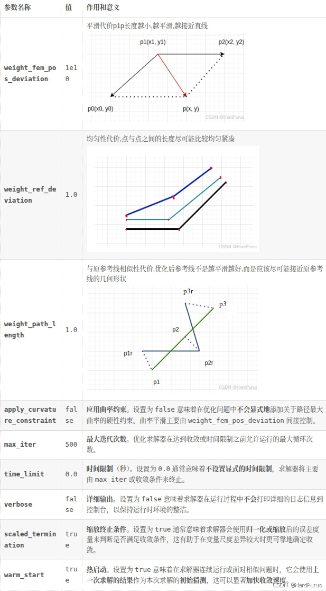

*图1：FEM位置偏差平滑器 - 展示有限元法位置偏差平滑器概念*

---

## 6. 约束形式转换

### 6.1 矩形边界约束

平滑器内部对路径点的位置使用的约束形式是矩形边界约束。在二维空间中，如果对 x 和 y 坐标分别施加独立约束，即 `|x| <= Bₓ` 且 `|y| <= Bᵧ`，这定义了一个矩形区域。这个约束等价于使用 L1 范数约束的扩展形式。

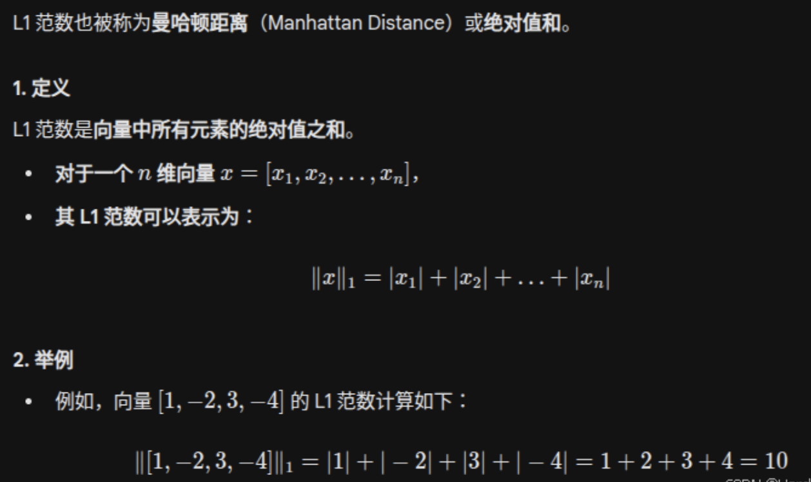

*图2：矩形边界约束 - 展示矩形边界约束形式*

### 6.2 圆形约束与正方形逼近

这里说一下，每个锚点的横向边界 `box_bounds` 为什么都要乘以 `1/√2`。

在锚点附近，我们希望优化后的参考点满足：
`(x - xᵣ)² + (y - yᵣ)² ≤ bound`

也就是说优化后的参考点要在以原锚点坐标 `(xᵣ, yᵣ)` 为圆心，`box_bounds` 为半径的圆上，这是一个圆形约束，也是二范数约束。

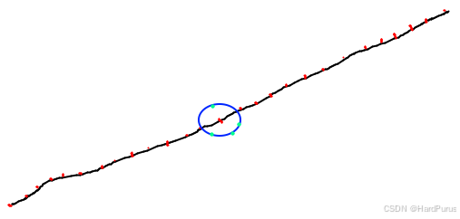

*图3：圆形约束 - 展示圆形约束形式*

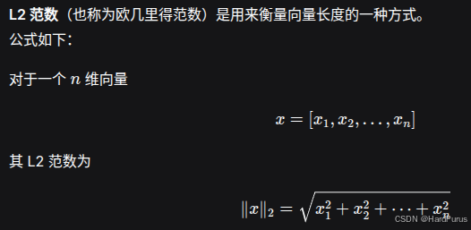

*图4：圆形约束示意图 - 展示圆形约束的几何意义*

### 6.3 OSQP求解器限制

但这里求解二次规划问题的 OSQP 求解器只能处理线性约束 `Ax ≤ b`，不支持二次项，因此不能直接表达圆形。于是必须退而求其次，把圆形用一个内切正方形来逼近：

`|x - xᵣ| ≤ bound × 1/√2`, `|y - yᵣ| ≤ bound × 1/√2`

这样的约束才可以使用 OSQP 进行求解。

### 6.4 缩放系数推导

然后说一下 `1/√2` 是哪来的。

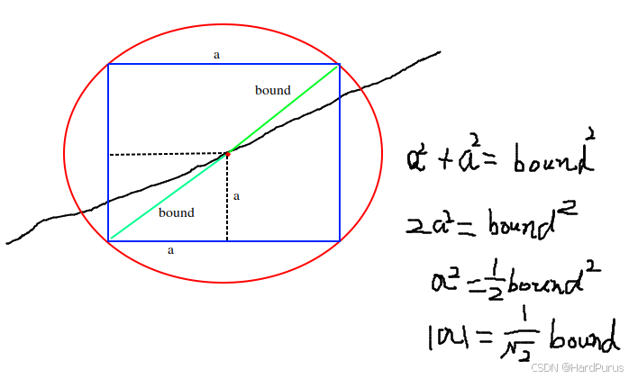

*图5：缩放系数推导 - 展示1/√2系数的几何推导*

`|a|` 表示的是 `bound × 1/√2`，近似为一个正方形约束。这样就可以使用 OSQP 求解器进行求解了。

---

## 7. Solve 函数

### 7.1 函数调用

```cpp
std::vector<double> opt_x;
std::vector<double> opt_y;
bool status = smoother.Solve(raw_point2d, box_bounds, &opt_x, &opt_y);
```

**参数说明：**

- **`raw_point2d`**：锚点
- **`box_bounds`**：调整后的横向边界
- **`opt_x`/`opt_y`**：优化后的参考点坐标

### 7.2 求解方法选择

```cpp
bool FemPosDeviationSmoother::Solve(
    const std::vector<std::pair<double, double>>& raw_point2d,
    const std::vector<double>& bounds, std::vector<double>* opt_x,
    std::vector<double>* opt_y,
    std::vector<std::vector<common::math::Vec2d>> point_box) {
  if (config_.apply_curvature_constraint()) {
    if (config_.use_sqp()) {
      return SqpWithOsqp(raw_point2d, bounds, opt_x, opt_y, point_box);
    } else {
      return NlpWithIpopt(raw_point2d, bounds, opt_x, opt_y);
    }
  } else {
    return QpWithOsqp(raw_point2d, bounds, opt_x, opt_y);
  }
  return true;
}
```

**`apply_curvature_constraint`** 配置项来自文件：`modules/planning/planning_component/conf/discrete_points_smoother_config.pb.txt`，默认为 `false`，这里只讲 `QpWithOsqp` 方法。

---

## 8. QpWithOsqp 函数

### 8.1 求解器配置

```cpp
FemPosDeviationOsqpInterface solver;

solver.set_weight_fem_pos_deviation(config_.weight_fem_pos_deviation());
solver.set_weight_path_length(config_.weight_path_length());
solver.set_weight_ref_deviation(config_.weight_ref_deviation());

solver.set_max_iter(config_.max_iter());
solver.set_time_limit(config_.time_limit());
solver.set_verbose(config_.verbose());
solver.set_scaled_termination(config_.scaled_termination());
solver.set_warm_start(config_.warm_start());

solver.set_ref_points(raw_point2d);
solver.set_bounds_around_refs(bounds);
```

### 8.2 配置说明

主要就是设置我们之前讲的配置参数，最后两个是原始锚点坐标和每个锚点的横向边界。

---

## 9. 二次规划问题基础

### 9.1 二次规划概念

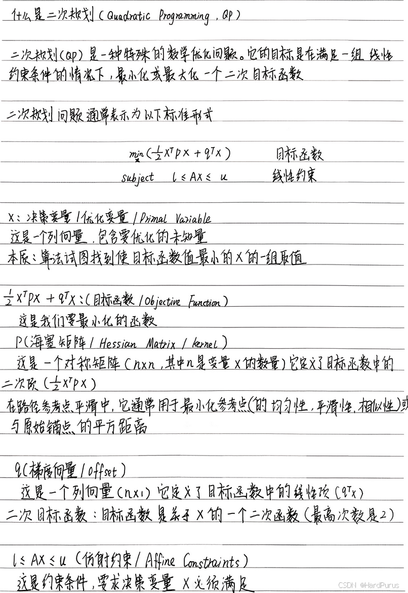

*图6：二次规划概念 - 展示二次规划基本概念*


*图7：二次规划概念2 - 展示二次规划基本概念*

### 9.2 参考线平滑问题建模

接下来我们介绍，参考线是如何通过二次规划进行平滑的。

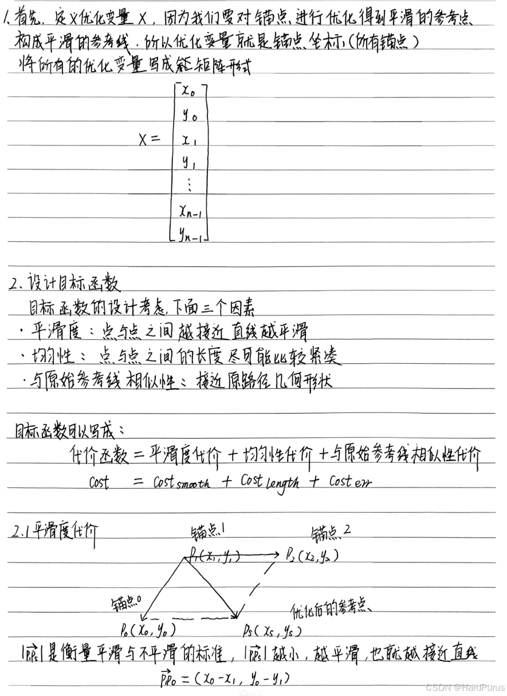

*图8：参考线平滑问题 - 展示参考线平滑的优化问题*

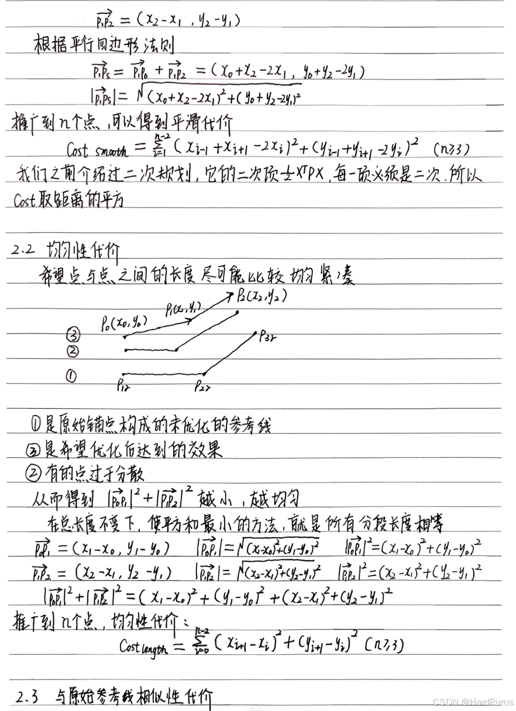

*图9：目标函数设计 - 展示目标函数的三个组成部分*

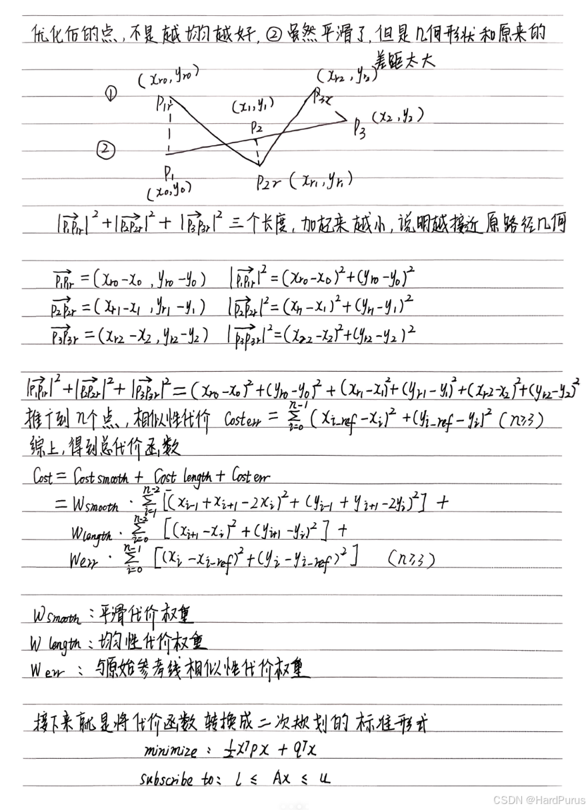

*图10：数学表达1 - 展示目标函数的数学表达*

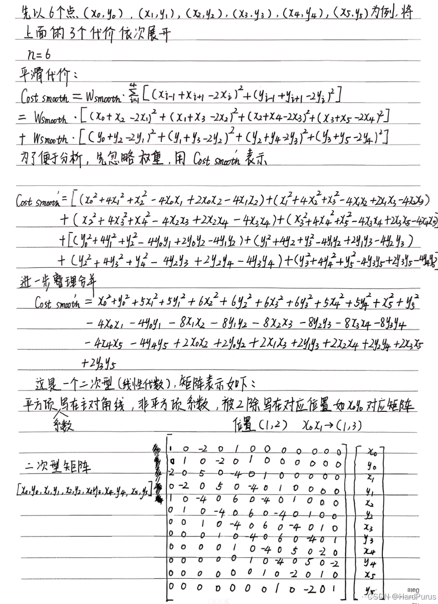

*图11：数学表达2 - 展示约束条件的数学表达*

### 9.3 矩阵形式

将上述目标函数和约束条件转化为二次规划的标准矩阵形式：

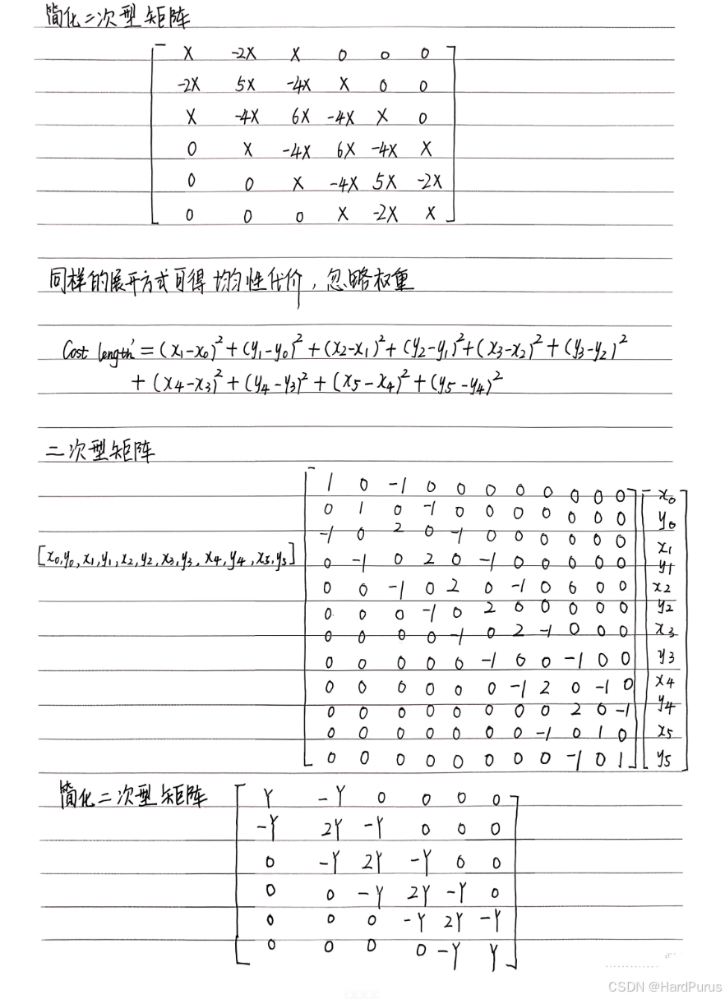

*图12：矩阵形式1 - 展示二次规划问题的矩阵形式*

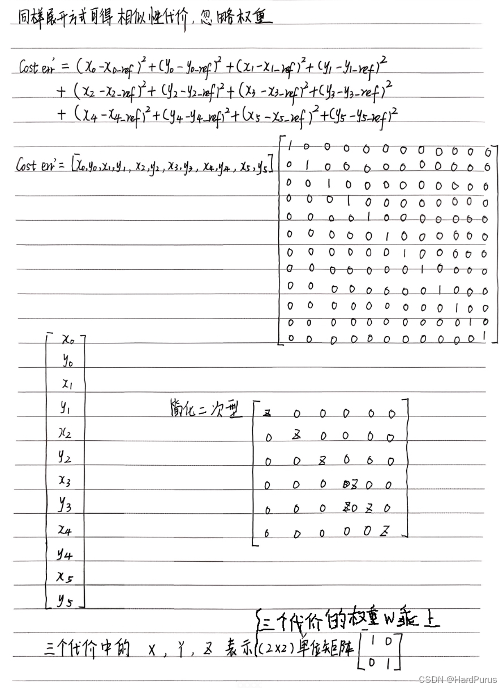

*图13：矩阵形式2 - 展示二次规划问题的矩阵形式*

---

## 10. 代码实现分析

我们接下来来分析一下对应的代码流程。

### 10.1 变量和约束数量计算

```cpp
num_of_points_ = static_cast<int>(ref_points_.size());
num_of_variables_ = num_of_points_ * 2;
num_of_constraints_ = num_of_variables_;
```

**参数说明：**

- **`num_of_points_`**：锚点个数，平滑前所有点的个数
- **`num_of_variables_`**：所有点坐标 x, y 的总数
- **`num_of_constraints_`**：所有点坐标 x, y 的约束

---

## 11. CalculateKernel 函数（P矩阵）

### 11.1 函数调用

```cpp
CalculateKernel(&P_data, &P_indices, &P_indptr);
```

**文件位置：** `modules/planning/planning_base/math/discretized_points_smoothing/fem_pos_deviation_osqp_interface.cc`

### 11.2 矩阵初始化

```cpp
void FemPosDeviationOsqpInterface::CalculateKernel(
    std::vector<c_float>* P_data, std::vector<c_int>* P_indices,
    std::vector<c_int>* P_indptr)
  std::vector<std::vector<std::pair<c_int, c_float>>> columns;
  columns.resize(num_of_variables_);
  int col_num = 0;

  for (int col = 0; col < 2; ++col) {
    columns[col].emplace_back(col, weight_fem_pos_deviation_ +
                                       weight_path_length_ +
                                       weight_ref_deviation_);
    ++col_num;
  }
```

### 11.3 矩阵结构说明

如果有 6 个点，那么 `num_of_variables_` 是 12（包括每个点的 x, y），那么 `columns` 的 size 就是 12，并且 `columns` 代表的就是 P 矩阵，并且 `columns[col][row]` 按列、行进行存储的。

而上面逻辑是在为 `columns[0][0]` 和 `columns[1][1]` 赋值为 `W₁ + W₂ + W₃`。

### 11.4 简化P矩阵

根据我们上面计算出来的简化的 P 矩阵如下，但其实每一项都是 2×2 的矩阵：

```
X = [ W₁  0 ]   Y = [ W₂  0 ]   Z = [ W₃  0 ]
    [ 0  W₁ ]       [ 0  W₂ ]       [ 0  W₃ ]
```

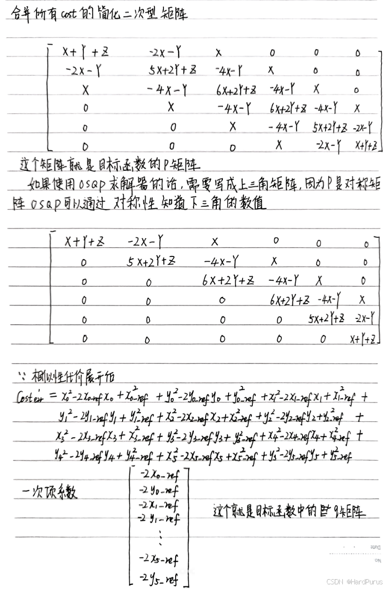

*图14：简化P矩阵 - 展示简化的P矩阵结构*

### 11.5 完整P矩阵

如果写全的话，就是如下 12×12 的矩阵：

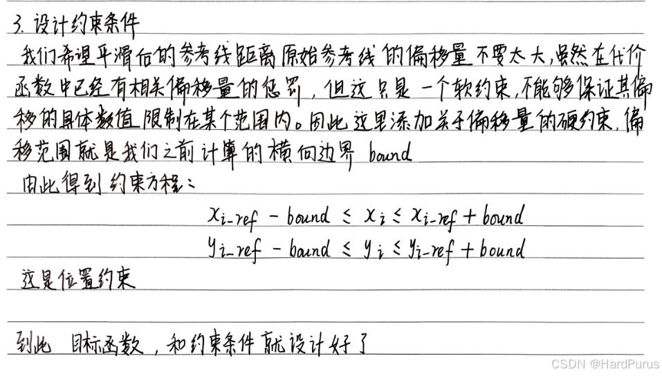

*图15：完整P矩阵 - 展示完整的12×12 P矩阵结构*

### 11.6 矩阵填充逻辑

下面逻辑，每一个 for 循环的逻辑，就对应着上面不同颜色部分的矩阵值的填充。这里需要注意一下 `columns` 是按照列、行，`columns[2][0]` 表示的是上图第 2 列第 0 行，并且 `columns` 存的是 P 矩阵上三角的所有非零值。这里只举了 6 个点，更多个点逻辑是相似的。

```cpp
for (int col = 0; col < 2; ++col) {
    columns[col].emplace_back(col, weight_fem_pos_deviation_ +
                                       weight_path_length_ +
                                       weight_ref_deviation_);
    ++col_num;
  }

  for (int col = 2; col < 4; ++col) {
    columns[col].emplace_back(
        col - 2, -2.0 * weight_fem_pos_deviation_ - weight_path_length_);
    columns[col].emplace_back(col, 5.0 * weight_fem_pos_deviation_ +
                                       2.0 * weight_path_length_ +
                                       weight_ref_deviation_);
    ++col_num;
  }

  int second_point_from_last_index = num_of_points_ - 2;
  for (int point_index = 2; point_index < second_point_from_last_index;
       ++point_index) {
    int col_index = point_index * 2;
    for (int col = 0; col < 2; ++col) {
      col_index += col;
      columns[col_index].emplace_back(col_index - 4, weight_fem_pos_deviation_);
      columns[col_index].emplace_back(
          col_index - 2,
          -4.0 * weight_fem_pos_deviation_ - weight_path_length_);
      columns[col_index].emplace_back(
          col_index, 6.0 * weight_fem_pos_deviation_ +
                         2.0 * weight_path_length_ + weight_ref_deviation_);
      ++col_num;
    }
  }

  int second_point_col_from_last_col = num_of_variables_ - 4;
  int last_point_col_from_last_col = num_of_variables_ - 2;
  for (int col = second_point_col_from_last_col;
       col < last_point_col_from_last_col; ++col) {
    columns[col].emplace_back(col - 4, weight_fem_pos_deviation_);
    columns[col].emplace_back(
        col - 2, -4.0 * weight_fem_pos_deviation_ - weight_path_length_);
    columns[col].emplace_back(col, 5.0 * weight_fem_pos_deviation_ +
                                       2.0 * weight_path_length_ +
                                       weight_ref_deviation_);
    ++col_num;
  }

  for (int col = last_point_col_from_last_col; col < num_of_variables_; ++col) {
    columns[col].emplace_back(col - 4, weight_fem_pos_deviation_);
    columns[col].emplace_back(
        col - 2, -2.0 * weight_fem_pos_deviation_ - weight_path_length_);
    columns[col].emplace_back(col, weight_fem_pos_deviation_ +
                                       weight_path_length_ +
                                       weight_ref_deviation_);
    ++col_num;
  }
```

### 11.7 稀疏矩阵格式转换

```cpp
int ind_p = 0;
for (int i = 0; i < col_num; ++i) {
  P_indptr->push_back(ind_p);
  for (const auto& row_data_pair : columns[i]) {
    // Rescale by 2.0 as the quadratic term in osqp default qp problem setup
    // is set as (1/2) * x' * P * x
    P_data->push_back(row_data_pair.second * 2.0);
    P_indices->push_back(row_data_pair.first);
    ++ind_p;
  }
}
P_indptr->push_back(ind_p);
```

### 11.8 稀疏矩阵格式说明

- **`P_indptr`**：每一列非零元素在 `P_data` 中的起始索引
- **`P_data`**：表示每一列的非零元素权重
- **`P_indices`**：存入非零元素对应的行数

**示例说明：**

- 第一列有两个非零元素
- 第二列有两个非零元素
- 第三列有三个非零元素

那么 `P_data` 中的元素有 7 个索引分别是 `[0, 1, 2, 3, 4, 5, 6]`：

- 因为第一列有两个元素，所以第一列在 `P_data` 中非零元素是从索引 0 开始的
- 因为第一列有两个元素，所以第二列在 `P_data` 中非零元素是从索引 2 开始的
- 因为第一列有两个元素，第二列有两个元素，所以第三列在 `P_data` 中非零元素是从索引 4 开始的

所以，`P_indptr` 的含义就是相当于 `0, 2, 4, 7`。

### 11.9 权重缩放说明

`P_data` 存的非零数值，是我们想要对对应的点设置的权重值，但是 OSQP 求解器在求解的时候会自动乘以一个 `1/2`，因为二次规划的二次项是 `(1/2)xᵀPx`，这样我们想要的权重就会变为原来的 `1/2`，这样就不是我们想要的权重值了。所以在这里要先乘以 2，这样 OSQP 在求解的时候乘以一个 `1/2`，权重值依旧是我们想要设置的权重值。

**这样 `CalculateKernel` 函数就分析完了。**

---

## 12. CalculateAffineConstraint 函数（A矩阵）

### 12.1 函数调用

```cpp
// Calculate affine constraints
std::vector<c_float> A_data;
std::vector<c_int> A_indices;
std::vector<c_int> A_indptr;
std::vector<c_float> lower_bounds;
std::vector<c_float> upper_bounds;
CalculateAffineConstraint(&A_data, &A_indices, &A_indptr, &lower_bounds,
                          &upper_bounds);
```

### 12.2 A矩阵构建

```cpp
int ind_A = 0;
for (int i = 0; i < num_of_variables_; ++i) {
  A_data->push_back(1.0);
  A_indices->push_back(i);
  A_indptr->push_back(ind_A);
  ++ind_A;
}
A_indptr->push_back(ind_A);
```

### 12.3 参数说明

- **`A_data`**：每一列的非零元素都设置为 1，因为我们设计的约束如下
- **`A_indices`**：非零元素的行索引
- **`A_indptr`**：每一列非零元素在 `P_data` 中的起始索引

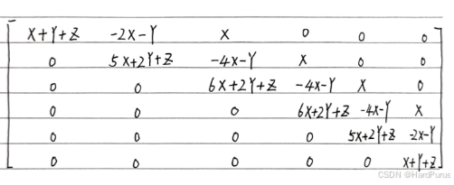

*图16：A矩阵结构 - 展示A矩阵的稀疏结构*

### 12.4 边界设置

```cpp
for (int i = 0; i < num_of_points_; ++i) {
  const auto& ref_point_xy = ref_points_[i];
  upper_bounds->push_back(ref_point_xy.first + bounds_around_refs_[i]);
  upper_bounds->push_back(ref_point_xy.second + bounds_around_refs_[i]);
  lower_bounds->push_back(ref_point_xy.first - bounds_around_refs_[i]);
  lower_bounds->push_back(ref_point_xy.second - bounds_around_refs_[i]);
}
```

为每个点设置边界。

---

## 13. CalculateOffset 函数（q矩阵）

### 13.1 函数定义

```cpp
std::vector<c_float> q;
CalculateOffset(&q);

void FemPosDeviationOsqpInterface::CalculateOffset(std::vector<c_float>* q) {
  for (int i = 0; i < num_of_points_; ++i) {
    const auto& ref_point_xy = ref_points_[i];
    q->push_back(-2.0 * weight_ref_deviation_ * ref_point_xy.first);
    q->push_back(-2.0 * weight_ref_deviation_ * ref_point_xy.second);
  }
}
```

### 13.2 q矩阵说明

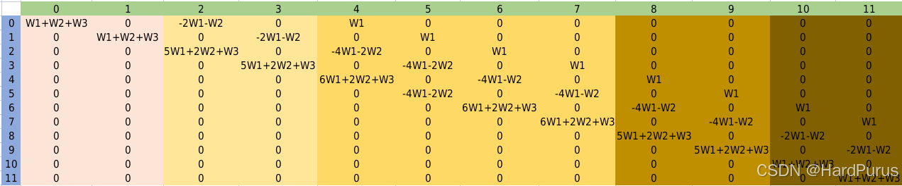

*图17：q矩阵计算 - 展示q矩阵的计算公式*

这是我们上面计算的没有乘以相似性代价权重的结果。

---

## 14. SetPrimalWarmStart 函数

### 14.1 函数定义

```cpp
std::vector<c_float> primal_warm_start;
SetPrimalWarmStart(&primal_warm_start);

void FemPosDeviationOsqpInterface::SetPrimalWarmStart(
    std::vector<c_float>* primal_warm_start) {
  CHECK_EQ(ref_points_.size(), static_cast<size_t>(num_of_points_));
  for (const auto& ref_point_xy : ref_points_) {
    primal_warm_start->push_back(ref_point_xy.first);
    primal_warm_start->push_back(ref_point_xy.second);
  }
}
```

### 14.2 热启动说明

为 OSQP 求解器的原始变量 X 的初值（primal warm start）填入初始解。

---

## 15. OptimizeWithOsqp 函数

### 15.1 函数定义

```cpp
bool res = OptimizeWithOsqp(num_of_variables_, lower_bounds.size(), &P_data,
                            &P_indices, &P_indptr, &A_data, &A_indices,
                            &A_indptr, &lower_bounds, &upper_bounds, &q,
                            &primal_warm_start, data, &work, settings);

bool FemPosDeviationOsqpInterface::OptimizeWithOsqp(
    const size_t kernel_dim, const size_t num_affine_constraint,
    std::vector<c_float>* P_data, std::vector<c_int>* P_indices,
    std::vector<c_int>* P_indptr, std::vector<c_float>* A_data,
    std::vector<c_int>* A_indices, std::vector<c_int>* A_indptr,
    std::vector<c_float>* lower_bounds, std::vector<c_float>* upper_bounds,
    std::vector<c_float>* q, std::vector<c_float>* primal_warm_start,
    OSQPData* data, OSQPWorkspace** work, OSQPSettings* settings)
```

### 15.2 参数说明

- **`kernel_dim`**：优化变量维度
- **`num_affine_constraint`**：约束数量
- **`P_data` / `P_indices` / `P_indptr`**：是 CSC 稀疏矩阵格式，P矩阵
- **`A_data` / `A_indices` / `A_indptr`**：A矩阵
- **`lower_bounds` / `upper_bounds`**：约束的上下界
- **`q`**：q矩阵
- **`primal_warm_start`**：初始解

### 15.3 求解器设置

```cpp
*work = osqp_setup(data, settings);
```

`osqp_setup` 会创建 OSQP 内部 workspace，包含优化问题的数据、分配内存、初始化迭代器等。注意，workspace 是求解器内部对象，存储**最终结果**。

### 15.4 热启动

```cpp
osqp_warm_start_x(*work, primal_warm_start->data());
```

将之前生成的 `primal_warm_start` 作为原始变量初值，可以加速收敛、减少迭代次数。对路径优化问题尤其有用（因为原始参考点本身就是不错的初始解）。

### 15.5 求解

```cpp
osqp_solve(*work);
```

调用求解器，OSQP 迭代求解二次规划问题，内部会返回 x（最优解）和 y（对偶变量/拉格朗日乘子）。

### 15.6 状态检查

```cpp
auto status = (*work)->info->status_val;
```

- `< 0` → 错误
- `1 / 2` → 求解成功（1=solved, 2=solved_inaccurate）
- 其他 → 未收敛或失败

### 15.7 结果提取

```cpp
x_.resize(num_of_points_);
y_.resize(num_of_points_);
for (int i = 0; i < num_of_points_; ++i) {
  int index = i * 2;
  x_.at(i) = work->solution->x[index];
  y_.at(i) = work->solution->x[index + 1];
}
```

然后将获取到的优化后的 x, y 存入 solver 的成员变量 `x_`, `y_` 中。

### 15.8 结果返回

```cpp
*opt_x = solver.opt_x();
*opt_y = solver.opt_y();
```

然后在 `QpWithOsqp` 函数中，赋值给输出参数，这样就得到了优化后的点的坐标。

---

## 16. 总结

### 16.1 核心内容回顾

本文详细介绍了 Planning 模块中参考线平滑的二次规划算法，主要包括：

1. **锚点数据处理**：坐标提取和归一化处理
2. **FemPosSmooth函数**：有限元法位置偏差平滑器
3. **约束形式转换**：圆形约束到正方形约束的近似
4. **二次规划建模**：目标函数和约束条件的数学表达
5. **P矩阵计算**：二次项系数矩阵的稀疏表示
6. **A矩阵和q矩阵**：约束矩阵和线性项系数
7. **OSQP求解器**：二次规划问题的求解过程
8. **结果提取**：优化后坐标的获取

### 16.2 技术要点

- **数值稳定性**：通过坐标归一化提高计算精度
- **约束近似**：将圆形约束近似为正方形约束以适应线性求解器
- **稀疏矩阵**：使用CSC格式高效存储大型稀疏矩阵
- **热启动**：利用原始参考点作为初始解加速收敛
- **权重平衡**：平滑性、贴合性和长度合理性的权衡

### 16.3 算法优势

1. **高效性**：利用OSQP求解器高效求解二次规划问题
2. **稳定性**：通过数值技巧保证算法稳定性
3. **灵活性**：通过权重参数调整平滑效果
4. **实用性**：生成的参考线满足自动驾驶的实际需求

### 16.4 后续内容

这是参考线平滑的第三部分，主要介绍了二次规划算法的实现细节。至此，参考线平滑的完整流程已经介绍完毕，从锚点生成、约束设置到二次规划求解，形成了一个完整的参考线平滑系统。