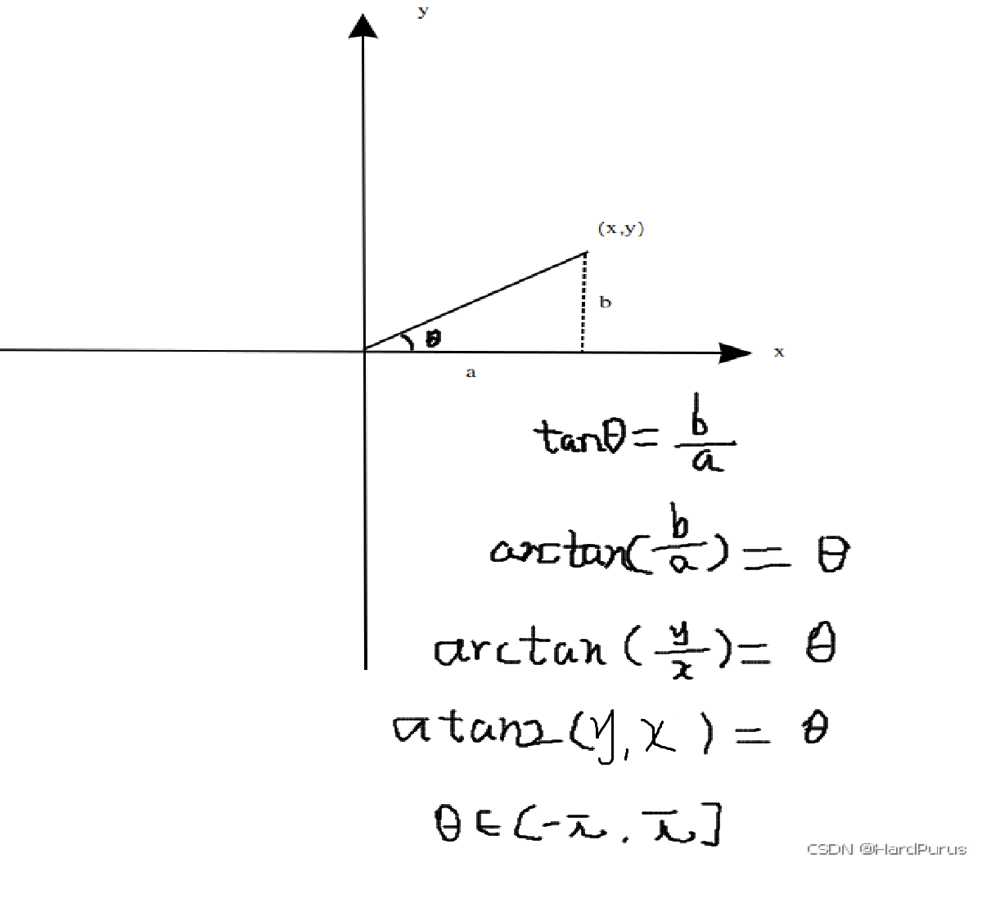
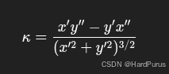
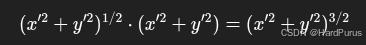

# planning模块(7)-参考线的平滑

上一篇[planning模块(6)-参考线的平滑(二次规划)](https://github.com/AELe/Apollo-PNC-algorithm-analysis/blob/main/planning%E6%A8%A1%E5%9D%97(6)-%E5%8F%82%E8%80%83%E7%BA%BF%E7%9A%84%E5%B9%B3%E6%BB%91(%E4%BA%8C%E6%AC%A1%E8%A7%84%E5%88%92).md)已经介绍了使用二次规划进行参考线平滑的方法.并且在上一篇中还提到了CSC矩阵,感兴趣的可以读一下[CSC(Compressed Sparse Column)矩阵](https://github.com/AELe/Apollo-PNC-algorithm-analysis/blob/main/CSC(Compressed%20Sparse%20Column)%E7%9F%A9%E9%98%B5.md)

接下来,继续介绍获取到平滑的参考点后的流程

**modules/planning/planning_base/reference_line/discrete_points_reference_line_smoother.cc**

```cpp
status = FemPosSmooth(raw_point2d, anchorpoints_lateralbound,
                            &smoothed_point2d);
```

所有平滑后的参考点都存在了smoothed_point2d变量中

---

## 1. 坐标反归一化处理

### 1.1 DeNormalizePoints函数

平滑前使用NormalizePoints函数对所有锚点坐标进行了归一化处理,将坐标由全局坐标转化成了局部坐标,而DeNormalizePoints函数的作用,就是将平滑后的点的坐标再重新转换为全局坐标,每个点加上起点的全局坐标就可以了.

```cpp
void DiscretePointsReferenceLineSmoother::DeNormalizePoints(
    std::vector<std::pair<double, double>>* xy_points) {
  std::for_each(xy_points->begin(), xy_points->end(),
                [this](std::pair<double, double>& point) {
                  auto curr_x = point.first;
                  auto curr_y = point.second;
                  std::pair<double, double> xy(curr_x + zero_x_,
                                               curr_y + zero_y_);
                  point = std::move(xy);
                });
}
```

---

## 2. 参考点剖面生成

### 2.1 GenerateRefPointProfile函数

#### 2.1.1 ComputePathProfile函数

```cpp
  std::size_t points_size = xy_points.size();
  for (std::size_t i = 0; i < points_size; ++i) {
    double x_delta = 0.0;
    double y_delta = 0.0;
    if (i == 0) {
      x_delta = (xy_points[i + 1].first - xy_points[i].first);
      y_delta = (xy_points[i + 1].second - xy_points[i].second);
    } else if (i == points_size - 1) {
      x_delta = (xy_points[i].first - xy_points[i - 1].first);
      y_delta = (xy_points[i].second - xy_points[i - 1].second);
    } else {
      x_delta = 0.5 * (xy_points[i + 1].first - xy_points[i - 1].first);
      y_delta = 0.5 * (xy_points[i + 1].second - xy_points[i - 1].second);
    }
    dxs.push_back(x_delta);
    dys.push_back(y_delta);
  }
```

上面主要是计算每个点切线的方向向量,也就是导数的方向
中间点使用中间差分精度更高,所以乘以了$\frac{1}{2}$

```cpp
  // Heading calculation
  for (std::size_t i = 0; i < points_size; ++i) {
    headings->push_back(std::atan2(dys[i], dxs[i]));
  }
```



上面是在计算两个点之间线段的方向角

```cpp
  double distance = 0.0;
  accumulated_s->push_back(distance);
  double fx = xy_points[0].first;
  double fy = xy_points[0].second;
  double nx = 0.0;
  double ny = 0.0;
  for (std::size_t i = 1; i < points_size; ++i) {
    nx = xy_points[i].first;
    ny = xy_points[i].second;
    double end_segment_s =
        std::sqrt((fx - nx) * (fx - nx) + (fy - ny) * (fy - ny));
    accumulated_s->push_back(end_segment_s + distance);
    distance += end_segment_s;
    fx = nx;
    fy = ny;
  }
```

accumulated_s:是在计算每个点,从起点开始的累积距离

```cpp
for (std::size_t i = 0; i < points_size; ++i) {
    double xds = 0.0;
    double yds = 0.0;
    if (i == 0) {
      xds = (xy_points[i + 1].first - xy_points[i].first) /
            (accumulated_s->at(i + 1) - accumulated_s->at(i));
      yds = (xy_points[i + 1].second - xy_points[i].second) /
            (accumulated_s->at(i + 1) - accumulated_s->at(i));
    } else if (i == points_size - 1) {
      xds = (xy_points[i].first - xy_points[i - 1].first) /
            (accumulated_s->at(i) - accumulated_s->at(i - 1));
      yds = (xy_points[i].second - xy_points[i - 1].second) /
            (accumulated_s->at(i) - accumulated_s->at(i - 1));
    } else {
      xds = (xy_points[i + 1].first - xy_points[i - 1].first) /
            (accumulated_s->at(i + 1) - accumulated_s->at(i - 1));
      yds = (xy_points[i + 1].second - xy_points[i - 1].second) /
            (accumulated_s->at(i + 1) - accumulated_s->at(i - 1));
    }
    x_over_s_first_derivatives.push_back(xds);
    y_over_s_first_derivatives.push_back(yds);
  }
```

x_over_s_first_derivatives/y_over_s_first_derivatives:是每个点的x,y的一阶导数$x^{′}, y^{′}$

```cpp
  for (std::size_t i = 0; i < points_size; ++i) {
    double xdds = 0.0;
    double ydds = 0.0;
    if (i == 0) {
      xdds =
          (x_over_s_first_derivatives[i + 1] - x_over_s_first_derivatives[i]) /
          (accumulated_s->at(i + 1) - accumulated_s->at(i));
      ydds =
          (y_over_s_first_derivatives[i + 1] - y_over_s_first_derivatives[i]) /
          (accumulated_s->at(i + 1) - accumulated_s->at(i));
    } else if (i == points_size - 1) {
      xdds =
          (x_over_s_first_derivatives[i] - x_over_s_first_derivatives[i - 1]) /
          (accumulated_s->at(i) - accumulated_s->at(i - 1));
      ydds =
          (y_over_s_first_derivatives[i] - y_over_s_first_derivatives[i - 1]) /
          (accumulated_s->at(i) - accumulated_s->at(i - 1));
    } else {
      xdds = (x_over_s_first_derivatives[i + 1] -
              x_over_s_first_derivatives[i - 1]) /
             (accumulated_s->at(i + 1) - accumulated_s->at(i - 1));
      ydds = (y_over_s_first_derivatives[i + 1] -
              y_over_s_first_derivatives[i - 1]) /
             (accumulated_s->at(i + 1) - accumulated_s->at(i - 1));
    }
    x_over_s_second_derivatives.push_back(xdds);
    y_over_s_second_derivatives.push_back(ydds);
  }
```

x_over_s_second_derivatives/y_over_s_second_derivatives:是每个点的x,y的二阶导数$x^{′′}, y^{′′}$

```cpp
  for (std::size_t i = 0; i < points_size; ++i) {
    double xds = x_over_s_first_derivatives[i];
    double yds = y_over_s_first_derivatives[i];
    double xdds = x_over_s_second_derivatives[i];
    double ydds = y_over_s_second_derivatives[i];
    double kappa =
        (xds * ydds - yds * xdds) /
        (std::sqrt(xds * xds + yds * yds) * (xds * xds + yds * yds) + 1e-6);
    kappas->push_back(kappa);
  }
```

上面逻辑是在计算曲率,曲率公式



代码中的分母



在某些离散点上，分母可能会变得非常非常接近0, 一旦除以0程序直接崩溃,所以在分母上加了$1e^{-}6$

```cpp
  for (std::size_t i = 0; i < points_size; ++i) {
    double dkappa = 0.0;
    if (i == 0) {
      dkappa = (kappas->at(i + 1) - kappas->at(i)) /
               (accumulated_s->at(i + 1) - accumulated_s->at(i));
    } else if (i == points_size - 1) {
      dkappa = (kappas->at(i) - kappas->at(i - 1)) /
               (accumulated_s->at(i) - accumulated_s->at(i - 1));
    } else {
      dkappa = (kappas->at(i + 1) - kappas->at(i - 1)) /
               (accumulated_s->at(i + 1) - accumulated_s->at(i - 1));
    }
    dkappas->push_back(dkappa);
  }
```

上面逻辑是在计算每个点曲率的导数,也就是曲率的变化率
到这ComputePathProfile函数就分析完了

```cpp
raw_reference_line.XYToSL({xy_points[i].first, xy_points[i].second},
                                   &ref_sl_point)
```

```cpp
bool ReferenceLine::XYToSL(const common::math::Vec2d& xy_point,
                           common::SLPoint* const sl_point,
                           double warm_start_s) const {
  double s = warm_start_s;
  double l = 0.0;
  if (warm_start_s < 0.0) {
    if (!map_path_.GetProjection(xy_point, &s, &l)) {
      AERROR << "Cannot get nearest point from path.";
      return false;
    }
  } else {
    if (!map_path_.GetProjectionWithWarmStartS(xy_point, &s, &l)) {
      AERROR << "Cannot get nearest point from path with warm_start_s: "
             << warm_start_s;
      return false;
    }
  }

  sl_point->set_s(s);
  sl_point->set_l(l);
  return true;
}
```

这里需要注意,这里是在根据**平滑前的参考线数据**,来计算平滑后点的横纵向距离s/l,这里warm_start_s是默认参数为-1,并且Path::GetProjection函数中的use_path_approximation_默认是0,所以计算s和l的逻辑与前面[GetProjection函数](https://blog.csdn.net/qq_23613819/article/details/155135033?spm=1001.2014.3001.5502)的计算方式相同,所以这里不再介绍

```cpp
ReferencePoint rlp = raw_reference_line.GetReferencePoint(ref_sl_point.s());
```

这里需要注意,根据平滑后点的纵向距离从**平滑之前的参考线数据中**获取ReferencePoint类型的数据,然后通过返回结果获取相关的车道信息,GetReferencePoint函数在之前介绍过[GetReferencePoint函数](https://blog.csdn.net/qq_23613819/article/details/155504404?spm=1001.2014.3001.5502).

```cpp
    reference_points->emplace_back(ReferencePoint(
        hdmap::MapPathPoint(
            common::math::Vec2d(xy_points[i].first, xy_points[i].second),
            headings[i], new_lane_waypoints),
        kappas[i], dkappas[i]));
```

然后构建平滑后点的ReferencePoint类型的完整数据,最后所有平滑后点的ReferencePoint都存入了reference_points中
这里需要思考一下,全局路线,粗糙参考线,平滑后参考线三者之间的关系.
这里GenerateRefPointProfile函数就分析完了

---

## 3. 重复点处理

### 3.1 RemoveDuplicates函数

```cpp
void ReferencePoint::RemoveDuplicates(std::vector<ReferencePoint>* points) {
  CHECK_NOTNULL(points);
  int count = 0;
  for (size_t i = 0; i < points->size(); ++i) {
    auto& last_point = (*points)[count - 1];
    const auto& this_point = (*points)[i];
    // Use manhattan distance for save computation time.
    if (count == 0 ||
        std::abs(last_point.x() - this_point.x()) > kDuplicatedPointsEpsilon ||
        std::abs(last_point.y() - this_point.y()) > kDuplicatedPointsEpsilon) {
      (*points)[count++] = this_point;
    } else {
      last_point.add_lane_waypoints(this_point.lane_waypoints());
    }
  }
  points->resize(count);
}
```

上面逻辑是判断平滑后两个点的坐标如果x或y其中一个值小于阈值认为是一个点,否则则认为是两个不同的点.如果认为是同一个点时会把当前点中所存储的车道信息放到上一个点车道信息的后面.即使是认为同一个点,但所存储的车道信息的可行驶区间不同.所以需要合并车道信息.

```cpp
*smoothed_reference_line = ReferenceLine(ref_points);
```

最后,所有参考点信息构成ReferenceLine参考线数据类型

---

## 4. 参考线平滑有效性验证

### 4.1 IsReferenceLineSmoothValid函数

会按照10m进行采样,然后判断每个点到平滑前参考线的横向距离是否符合阈值默认是5m,如果大于阈值,则认为平滑后的参考点偏离平滑前参考线距离太远,就会认为这条平滑后的参考线不符合行驶要求,认为平滑失败.

到这ReferenceLineProvider::SmoothRouteSegment函数就分析完了