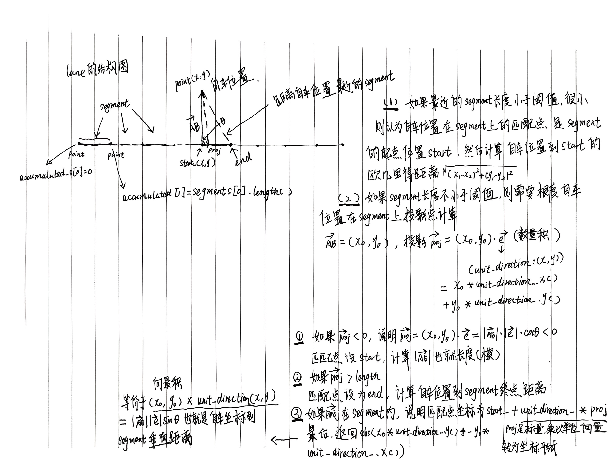

# Routing 模块 (1) - 全局路线的生成

## 1. 通过外部请求 Routing 模块进行算路

### 1.1 请求方式

一般通过以下方式发起算路请求：
- **Dreamview/Dreamview Plus** - 可视化界面
- **planning_command 脚本** - 命令行工具
- **task_manager 模块** - 系统内部模块

### 1.2 请求 Channel

请求的 channel 是：`/apollo/external_command/lane_follow`

### 1.3 消息参数

```cpp
message LaneFollowCommand {
  optional apollo.common.Header header = 1;
  
  // Unique identification for command.
  optional int64 command_id = 2 [default = -1];
  
  // If the start pose is set as the first point of "way_point".
  optional bool is_start_pose_set = 3 [default = false];
  
  // The points between "start_pose" and "end_pose".
  repeated Pose way_point = 4;
  
  // End pose of the lane follow command, must be given.
  required Pose end_pose = 5;
  
  // The lane segments which should not be passed by.
  repeated LaneSegment blacklisted_lane = 6;
  
  // The road which should not be passed by.
  repeated string blacklisted_road = 7;
  
  // Expected speed when executing this command. 
  // If "target_speed" > maximum speed of the vehicle, 
  // use maximum speed of the vehicle instead. 
  // If it is not given, the default target speed of system will be used.
  optional double target_speed = 8;
}
```

### 1.4 必要参数说明

**必须设置的参数：**
- `command_id` - 指令的唯一标识，可以设为 0
- `end_pose` - 目的地的坐标（以自车为参考系的坐标，可通过鼠标在 Dreamview 上获取）

### 1.5 算法流程图


*图1：全局路线生成算法流程图*

### 1.6 请求示例代码

通过 task_manager 模块请求消息的代码：

**文件：** `modules/task_manager/task_manager_component.cc`

```cpp
lane_follow_command_client_ =
    node_->CreateClient<LaneFollowCommand, CommandStatus>(
        task_manager_conf.topic_config().lane_follow_command_topic());

// ... 中间省略部分是在获取 LaneFollowCommand 类型的数据

lane_follow_command_client_->SendRequest(lane_follow_command);
```

**流程说明：**
1. 创建 `lane_follow_command` 的 client
2. 获取 `LaneFollowCommand` 类型的数据（一般传入目的地坐标，有时也会传入经由地坐标）
3. 通过 `SendRequest` 发送算路请求消息

> **注意：** 本专栏主要介绍 PNC 的算法部分，对于系统流程的部分不过多介绍，大家可以自己根据提供的代码文件阅读。

---

## 2. External Command 模块负责接收外部下发算路的指令

### 2.1 接收函数

**文件：** `modules/external_command/command_processor/command_processor_base/motion_command_processor_base.h`

```cpp
std::shared_ptr<cyber::Service<T, CommandStatus>> command_service_;

command_service_ = node->CreateService<T, CommandStatus>(
    config.input_command_name(),
    [this](const std::shared_ptr<T>& command,
           std::shared_ptr<CommandStatus>& status) {
      this->OnCommand(command, status);
    });
```

### 2.2 Service 通信机制

在 external_command 模块中，通过 Service 通信方式的回调函数接收算路请求指令，然后通过 `OnCommand` 函数对请求指令进行处理。

**OnCommand 函数参数：**
- `command`（输入参数）：算路请求指令
- `status`（输出参数）：请求指令处理状态

---

## 3. OnCommand 函数主要处理逻辑

### 3.1 Convert 函数 - 构建算路请求所需的数据

**文件：** `modules/external_command/command_processor/lane_follow_command_processor/lane_follow_command_processor.cc`

在 `Convert` 函数中，分两种情况：
1. **传入了起点坐标** - 使用传入的起点
2. **没有传入起点坐标** - 根据当前自车位置构建起点

#### 3.1.1 RoutingRequest 数据类型

`Convert` 函数最终输出的数据类型是 `RoutingRequest`：

```cpp
message RoutingRequest {
  optional apollo.common.Header header = 1;
  
  // at least two points. The first is start point, the end is final point.
  // The routing must go through each point in waypoint.
  repeated apollo.routing.LaneWaypoint waypoint = 2;
  
  repeated apollo.routing.LaneSegment blacklisted_lane = 3;
  
  repeated string blacklisted_road = 4;
  
  optional bool broadcast = 5 [default = true];
  
  optional apollo.routing.ParkingInfo parking_info = 6 [deprecated = true];
  
  // If the start pose is set as the first point of "way_point".
  optional bool is_start_pose_set = 7 [default = false];
}
```

**重要成员：**
- `waypoint`：repeated 类型（相当于动态数组），存储全局路线的起点、终点数据，有时还包括途径点

```cpp
message LaneWaypoint {
  optional string id = 1;
  optional double s = 2;
  optional apollo.common.PointENU pose = 3;
  
  // When the developer selects a point on the dreamview route editing
  // the direction can be specified by dragging the mouse
  // dreamview calculates the heading based on this to support 
  // construct lane way point with heading
  optional double heading = 4;
}
```

---

### 3.2 算路指令中没有设置起点坐标的情况

#### 3.2.1 构建起点逻辑

**文件：** `modules/external_command/command_processor/command_processor_base/motion_command_processor_base.h`

```cpp
bool MotionCommandProcessorBase<T>::SetStartPose(
    std::shared_ptr<apollo::routing::RoutingRequest>& routing_request) const {
  CHECK_NOTNULL(routing_request);
  
  // Get the current vehicle pose as start pose.
  auto start_pose = routing_request->add_waypoint();
  
  if (!lane_way_tool_->GetVehicleLaneWayPoint(start_pose)) {
    AERROR << "Get lane near start pose failed!";
    return false;
  }
  
  return true;
}
```

#### 3.2.2 获取自车位置最近的车道

**文件：** `modules/map/hdmap/hdmap_impl.cc`

在 `GetVehicleLaneWayPoint` 函数中：
1. 从 location 模块获取自车坐标 (x, y, heading) - 基于自车坐标系（后轴中心为原点）
2. 调用 `ConvertToLaneWayPoint` 函数转换

```cpp
bool LaneWayTool::GetVehicleLaneWayPoint(
    apollo::routing::LaneWaypoint *lane_way_point) const {
  CHECK_NOTNULL(lane_way_point);
  
  // Get the current localization pose
  auto *localization =
      message_reader_->GetMessage<apollo::localization::LocalizationEstimate>(
          FLAGS_localization_topic);
  
  if (nullptr == localization) {
    AERROR << "Cannot get vehicle location!";
    return false;
  }
  
  external_command::Pose pose;
  pose.set_x(localization->pose().position().x());
  pose.set_y(localization->pose().position().y());
  pose.set_heading(localization->pose().heading());
  
  return ConvertToLaneWayPoint(pose, lane_way_point);
}
```

---

## 4. ConvertToLaneWayPoint 函数逻辑

### 4.1 Pose 中包含 Heading 的情况

**匹配距离自车最近的车道**

**文件：** `modules/map/hdmap/hdmap_impl.cc`

#### 4.1.1 GetNearestLaneWithHeading 函数

在 `GetLanesWithHeading` 中：
1. 通过 `GetLanes` 函数，以当前自车位置为圆心，指定范围为半径
2. 从 map 模块通过 KDTree 算法检索范围内所有车道

**筛选条件：**
- **条件 1**：自车位置到投影点距离是否在半径范围内
- **条件 2**：车道朝向与车头朝向角度差是否在一定阈值范围内

```cpp
for (auto& lane : all_lanes) {
  Vec2d proj_pt(0.0, 0.0);
  double s_offset = 0.0;
  int s_offset_index = 0;
  
  double dis = lane->DistanceTo(point, &proj_pt, &s_offset, &s_offset_index);
  
  if (dis <= distance) {
    double heading_diff =
        fabs(lane->headings()[s_offset_index] - central_heading);
    
    if (fabs(apollo::common::math::NormalizeAngle(heading_diff)) <=
        max_heading_difference) {
      lanes->push_back(lane);
    }
  }
}
```

**参数说明：**
- `dis`：自车位置到车道上投影点距离
- `point`：自车坐标
- `proj_pt`：车道上自车投影点
- `s_offset`：投影点在当前车道上的累积纵向距离（从车道起点开始计算）
- `s_offset_index`：离自车位置最近的 segment 是车道上的第几个 segment 的索引

#### 4.1.2 Lane 结构说明

一根 lane 由若干 point 构成，两个点构成一段 segment：

```
Lane
├── point[0] ── segment[0] ── point[1]
├── point[1] ── segment[1] ── point[2]
└── ...
```

#### 4.1.3 DistanceTo 函数

**文件：** `modules/common/math/line_segment2d.cc`

```cpp
LineSegment2d::DistanceTo
```



*图2：DistanceTo函数示意图*

#### 4.1.4 角度归一化

确保输出角度在 [-π, π] 弧度范围内：

```cpp
double NormalizeAngle(const double angle) {
  double a = std::fmod(angle + M_PI, 2.0 * M_PI);
  if (a < 0.0) {
    a += (2.0 * M_PI);
  }
  return a - M_PI;
}
```

**角度差说明：**
- `lane->headings()[s_offset_index]`：当前 segment 段的车道朝向
- `central_heading`：当前车头朝向

#### 4.1.5 获取最近的车道段

获取到所有符合上述两个条件的 lane 后，找到距离自车位置最近的那段 segment：

```cpp
for (const auto& lane : lanes) {
  double s_offset = 0.0;
  int s_offset_index = 0;
  
  double distance =
      lane->DistanceTo(point, &map_point, &s_offset, &s_offset_index);
  
  if (distance < min_distance) {
    min_distance = distance;
    *nearest_lane = lane;
    s = s_offset;
    s_index = s_offset_index;
  }
}
```

#### 4.1.6 计算自车相对于车道的位置


*图3：向量叉积示意图*

通过最近的那段 segment 的起点指向自车位置的向量，与最近这段 segment 的单位向量的**叉积**（向量积），求出自车位置点到线段 segment 的有向距离：

```cpp
*nearest_l =
    segment_2d.unit_direction().CrossProd(point - segment_2d.start());
```

**结果判断：**
- **正值**：自车在车道左侧
- **负值**：自车在车道右侧

---

### 4.2 Pose 中不包含 Heading 的情况

**匹配距离自车最近的车道**

#### 4.2.1 GetNearestLane 函数

与 `GetNearestLaneWithHeading` 的不同：**没有半径距离和车道朝向与自车车头朝向角度差的条件限制**

**文件：** `modules/map/hdmap/hdmap_impl.cc`

```cpp
int HDMapImpl::GetNearestLane(const Vec2d& point,
                              LaneInfoConstPtr* nearest_lane, 
                              double* nearest_s,
                              double* nearest_l) const {
  CHECK_NOTNULL(nearest_lane);
  CHECK_NOTNULL(nearest_s);
  CHECK_NOTNULL(nearest_l);
  
  const auto* segment_object = lane_segment_kdtree_->GetNearestObject(point);
  
  if (segment_object == nullptr) {
    return -1;
  }
  
  const Id& lane_id = segment_object->object()->id();
  *nearest_lane = GetLaneById(lane_id);
  ACHECK(*nearest_lane);
  
  const int id = segment_object->id();
  const auto& segment = (*nearest_lane)->segments()[id];
  
  Vec2d nearest_pt;
  segment.DistanceTo(point, &nearest_pt);
  
  *nearest_s = (*nearest_lane)->accumulate_s()[id] +
               nearest_pt.DistanceTo(segment.start());
  
  *nearest_l = segment.unit_direction().CrossProd(point - segment.start());

  return 0;
}
```

---

## 5. 构建 LaneWaypoint 起点信息

因为距离自车最近的车道 `nearest_lane` 已经通过函数 `GetNearestLaneWithHeading` 找到了，投影点在当前车道的纵向距离 `nearest_s` 也求出来了：

```cpp
int HDMapImpl::GetNearestLaneWithHeading(
    const Vec2d& point, const double distance, const double central_heading,
    const double max_heading_difference, LaneInfoConstPtr* nearest_lane,
    double* nearest_s, double* nearest_l)
```

```cpp
lane_way_point->set_id(nearest_lane->id().id());
lane_way_point->set_s(nearest_s);

auto *lane_way_pose = lane_way_point->mutable_pose();
lane_way_pose->set_x(pose.x());
lane_way_pose->set_y(pose.y());
```

这样 `LaneWaypoint` 类型的起点信息就构建完成了。

> **注意：** 本专栏只考虑 `public_road` 的场景，不考虑停车场景，所以 `lane_way_tool->IsParkandgoScenario()` 内的逻辑不考虑。

---

## 6. 构建途径点和目的地

构造完起点的 `LaneWaypoint` 类型后，使用相同的方式构建途径点和目的地的 `LaneWaypoint` 类型数据：

```cpp
// 构建途径点
for (const auto& way_point : command->way_point()) {
  if (!lane_way_tool->ConvertToLaneWayPoint(
          way_point, routing_request->add_waypoint())) {
    AERROR << "Cannot convert the end pose to lane way point: "
           << way_point.DebugString();
    return false;
  }
}

// 构建目的地
if (!lane_way_tool->ConvertToLaneWayPoint(command->end_pose(),
                                          routing_request->add_waypoint())) {
  AERROR << "Cannot convert the end pose to lane way point: "
         << command->end_pose().DebugString();
  return false;
}
```

---

## 总结

本文详细介绍了 Apollo Routing 模块中全局路线生成的完整流程，包括：

1. **外部请求处理** - 如何接收和处理算路请求
2. **起点构建逻辑** - 当没有传入起点时如何自动构建
3. **车道匹配算法** - 如何找到距离自车最近的车道
4. **坐标转换** - 如何将笛卡尔坐标转换为车道坐标
5. **数据结构构建** - 如何构建 RoutingRequest 所需的数据

这些算法为后续的路径规划和轨迹生成奠定了基础。