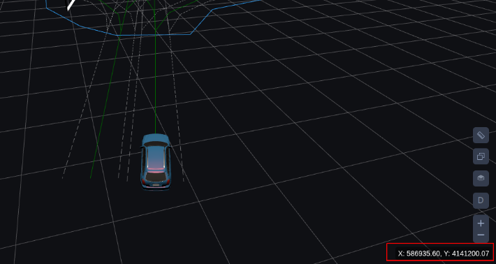

1.通过外部请求routing模块进行算路
一般通过Dreamview/Dreamview Plus或planning\_command脚本或task\_manager模块进行算路请求

请求的channel是:/apollo/external\_command/lane\_follow

参数为:

```cpp
message LaneFollowCommand {
  optional apollo.common.Header header = 1;
  // Unique identification for command.
  optional int64 command_id = 2 [default = -1];
  // If the start pose is set as the first point of "way_point".
  optional bool is_start_pose_set = 3 [default = false];
  // The points between "start_pose" and "end_pose".
  repeated Pose way_point = 4;
  // End pose of the lane follow command, must be given.
  required Pose end_pose = 5;
  // The lane segments which should not be passed by.
  repeated LaneSegment blacklisted_lane = 6;
  // The road which should not be passed by.
  repeated string blacklisted_road = 7;
  // Expected speed when executing this command. If "target_speed" > maximum
  // speed of the vehicle, use maximum speed of the vehicle instead. If it is
  // not given, the default target speed of system will be used.
  optional double target_speed = 8;
}
```

参数至少要设置command\_id, end\_pose

command\_id:指令的唯一标识,可以设为0

end\_pose:目的地的坐标,此坐标是以自车为参考系的坐标,可以通过鼠标在Dreamview上获取


