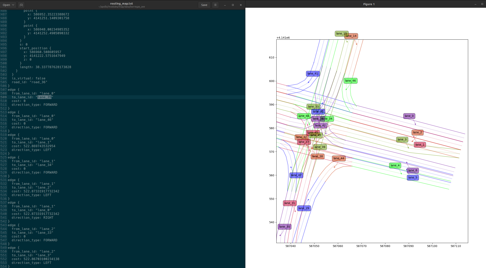
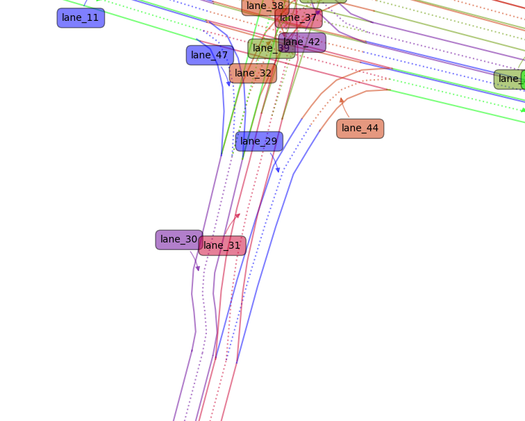
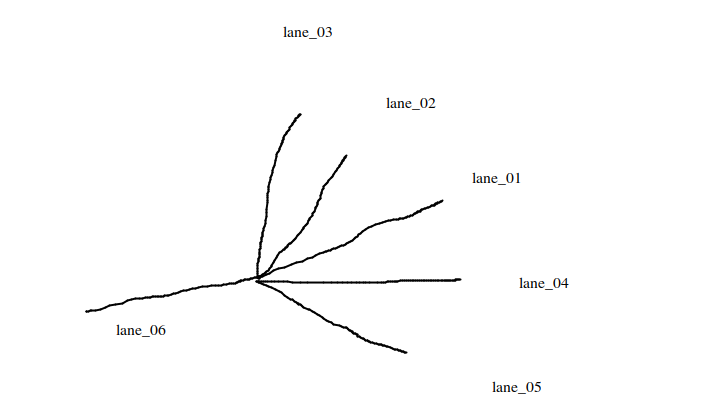
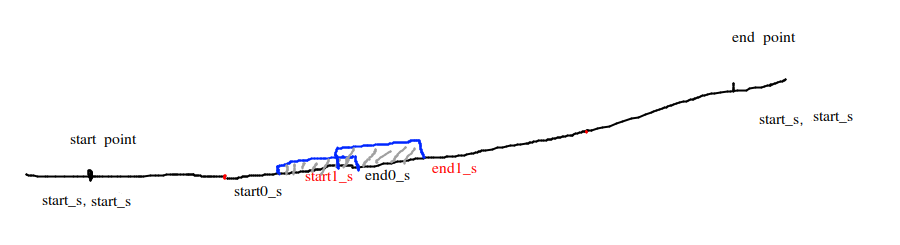
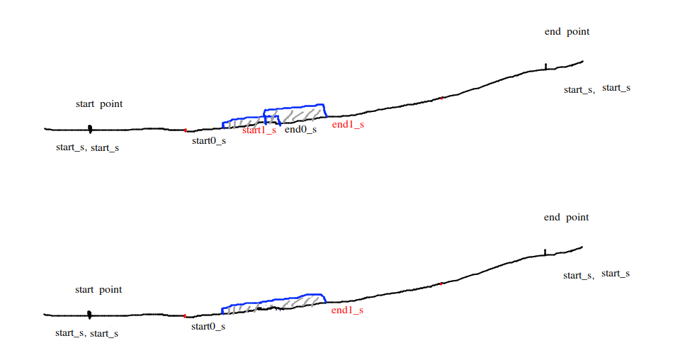
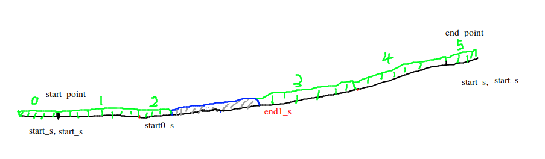
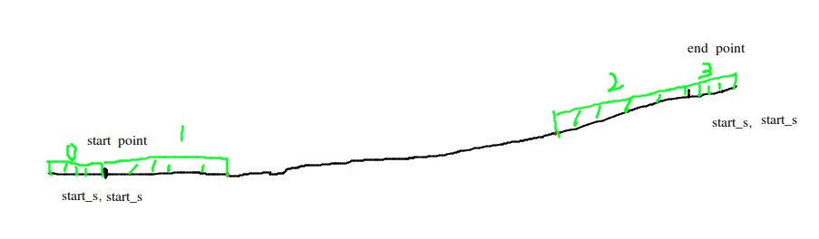

# Routing 模块 (2) - 全局路线的生成

## 1. 前言与背景

在 [Routing 模块 (1)-全局路线的生成](https://github.com/AELe/Apollo-PNC-algorithm-analysis/blob/main/routing%E6%A8%A1%E5%9D%97(1)-%E5%85%A8%E5%B1%80%E8%B7%AF%E7%BA%BF%E7%9A%84%E7%94%9F%E6%88%90.md) 上篇文章中，已经介绍了起点、途径点、终点构造成 `LaneWaypoint` 数据格式的过程，并且它们是存储在 `apollo::routing::RoutingRequest` 数据类型中的 `waypoint` 中。

```cpp
message RoutingRequest {
  optional apollo.common.Header header = 1;
  
  // at least two points. The first is start point, the end is final point.
  // The routing must go through each point in waypoint.
  repeated apollo.routing.LaneWaypoint waypoint = 2;
  
  repeated apollo.routing.LaneSegment blacklisted_lane = 3;
  
  repeated string blacklisted_road = 4;
  
  optional bool broadcast = 5 [default = true];
  
  optional apollo.routing.ParkingInfo parking_info = 6 [deprecated = true];
  
  // If the start pose is set as the first point of "way_point".
  optional bool is_start_pose_set = 7 [default = false];
}
```

第一篇也是 `Convert` 函数的处理过程：

```cpp
bool convert_result = Convert(command, routing_request);
```

接下来我们继续讲 `Convert` 函数之后的部分。

---

## 2. Process 函数处理流程

### 2.1 Process 函数调用

```cpp
routing_->Process(routing_request, routing_response.get())
```

在 `Process` 函数中，首先调用 `FillLaneInfoIfMissing` 函数：

```cpp
std::vector<routing::RoutingRequest> Routing::FillLaneInfoIfMissing(
    const routing::RoutingRequest& routing_request)
```

### 2.2 FillLaneInfoIfMissing 函数说明

这是一个特殊场景下的处理逻辑，只有当 `routing_request` 中的 `waypoint` 没有包含 `id` 数据的情况下才会走这个处理逻辑。可以先忽略掉这些细节，认为此函数返回的请求就只有一个，就是我们传入的请求。

```cpp
fixed_requests.push_back(fixed_request);
```

这个函数就直接返回 `fixed_requests`，只包含起点和终点信息的一个请求。

> **注意：** 通过 Dreamview Plus 下发算路请求时，起点和终点的 `waypoint` 数据中都是有 `id` 信息的，所以暂时不必在这个函数本身纠结，并且它里面其实也没什么复杂算法。

---

## 3. SearchRoute 函数

### 3.1 SearchRoute 函数调用

```cpp
navigator_ptr_->SearchRoute(fixed_request, &routing_response_temp)
```

在 `SearchRoute` 函数中，需要介绍一下 `Init` 函数：

```cpp
Init(request, graph_.get(), &way_nodes, &way_s)
```

**参数说明：**
- `request`：入参算路请求
- `graph_.get()`：入参路网拓扑图
- `way_nodes`：出参算路请求中 `waypoint` 在拓扑图中对应的节点 `node`
- `way_s`：`waypoint` 在离它最近的 `segment` 线段上投影点的纵向距离

### 3.2 路网拓扑图结构

我们可以把 `routing_map.txt` 文件中的 `edge` 和地图上的车道进行比对：



*图1：路网拓扑图结构*

可以看到 `lane_0` 和 `lane_1` 是相邻车道，`lane_0` 和 `lane_35`、`lane_0` 和 `lane_46` 是衔接车道。这样在 `routing_map.txt` 中：
- `lane_0` 和 `lane_1` 构成了一条边
- `lane_0` 和 `lane_35` 构成了一条边  
- `lane_0` 和 `lane_46` 构成了一条边

并且这里每条 `lane` 都会构造成 `node` 结构，每个相邻的、衔接的 `node` 之间建立 `edge` 的概念。就这样所有的车道，也就是所有的 `node` 结构和 `edge` 关系，构建了一个有向的拓扑图，也就是 `graph_.get()` 所表示的含义。

### 3.3 Init 函数作用

因为我们的 `request` 算路指令中只有起点和终点的 `waypoint` 信息，所以 `Init` 函数的作用就是在拓扑图中查找起点和终点对应的节点（其实也是 `waypoint` 所在车道在拓扑图中所在的节点），然后存到 `way_nodes` 中，起点和终点在离它最近的 `segment` 线段上投影点的纵向距离存入 `way_s`。

因为我们算路请求指令中没有设置道路或车道黑名单，所以先不考虑 `GenerateBlackMapFromRequest`。

```cpp
bool Navigator::Init(const routing::RoutingRequest& request,
                     const TopoGraph* graph,
                     std::vector<const TopoNode*>* const way_nodes,
                     std::vector<double>* const way_s) {
  Clear();
  if (!GetWayNodes(request, graph_.get(), way_nodes, way_s)) {
    AERROR << "Failed to find search terminal point in graph!";
    return false;
  }
  black_list_generator_->GenerateBlackMapFromRequest(request, graph_.get(),
                                                     &topo_range_manager_);
  return true;
}
```

---

## 4. SearchRouteByStrategy 函数

### 4.1 参数准备

`way_nodes` 是我们在上面获取到的起点和终点在拓扑图中对应的节点数据，这里我们只考虑起点和终点的 case，那么 `way_nodes.size()` 就是 2。

```cpp
for (size_t i = 1; i < way_nodes.size(); ++i) {
    const auto* way_start = way_nodes[i - 1];
    const auto* way_end = way_nodes[i];
    double way_start_s = way_s[i - 1];
    double way_end_s = way_s[i];
```

**参数说明：**
- `way_start`：起点节点
- `way_end`：终点节点
- `way_start_s`：起点在离它最近的 `segment` 线段上投影点的纵向距离
- `way_end_s`：终点在离它最近的 `segment` 线段上投影点的纵向距离

### 4.2 AddBlackMapFromTerminal 函数

```cpp
TopoRangeManager full_range_manager = topo_range_manager_;
black_list_generator_->AddBlackMapFromTerminal(
    way_start, way_end, way_start_s, way_end_s, &full_range_manager);
```

#### 4.2.1 AddBlackMapFromTerminal 函数实现

```cpp
void BlackListRangeGenerator::AddBlackMapFromTerminal(
    const TopoNode* src_node, const TopoNode* dest_node, double start_s,
    double end_s, TopoRangeManager* const range_manager) const {
  double start_length = src_node->Length();
  double end_length = dest_node->Length();

  static constexpr double kEpsilon = 1e-2;
  AINFO << "start_s: " << start_s << ", start_length: " << start_length
        << "end_s: " << end_s << ", end_length: " << end_length;
  const double start_s_adjusted =
      (start_s > start_length && start_s - start_length <= kEpsilon)
          ? start_length
          : start_s;
  const double end_s_adjusted =
      (end_s > end_length && end_s - end_length <= kEpsilon) ? end_length
                                                             : end_s;
```

**参数说明：**
- `start_length`：是起点所在车道长度
- `end_length`：是终点所在车道长度
- `start_s_adjusted` 和 `end_s_adjusted`：是在考虑精度问题

> **说明：** 因为 `start_length` 和 `end_length` 是 `routing_map.txt` 文件中定长的车道长度，而 `start_s` 和 `end_s` 是我们之前在 `Convert` 函数中计算出来的起点和终点在离它最近的 `segment` 线段上投影点的纵向距离。当设置的起点或终点正好设置到了微微超过所在车道长度的位置时，这个逻辑会起作用。现在我们就认为：
> - `start_s_adjusted = start_s`
> - `end_s_adjusted = end_s`

#### 4.2.2 MoveSBackward 和 MoveSForward 函数

`MoveSBackward` 和 `MoveSForward` 主要作用是调整起点和终点的位置，以消除浮点精度误差、避免参考线分段边界、防止逻辑判断歧义。

```cpp
double start_cut_s = MoveSBackward(start_s_adjusted, 0.0);
range_manager->Add(src_node, start_cut_s, start_cut_s);
AddBlackMapFromOutParallel(src_node, start_cut_s / start_length,
                           range_manager);

double end_cut_s = MoveSForward(end_s_adjusted, end_length);
range_manager->Add(dest_node, end_cut_s, end_cut_s);
AddBlackMapFromInParallel(dest_node, end_cut_s / end_length, range_manager);
```

#### 4.2.3 TopoRangeManager::Add 函数

```cpp
void TopoRangeManager::Add(const TopoNode* node, double start_s, double end_s) {
  NodeSRange range(start_s, end_s);
  range_map_[node].push_back(range);
}
```

```cpp
std::unordered_map<const TopoNode*, std::vector<NodeSRange>> range_map_;
```

然后，将起点的节点/终点的节点以及他们对应的在离他们最近的车道上的可通行纵向范围 `[start_cut_s, start_cut_s]` 和 `[end_cut_s, end_cut_s]`，存入 `range_map_` 中。

> **注意：** 这里你应该会感到疑惑为什么可通行范围是一个点而不是一个线段，这个后面会介绍到。

#### 4.2.4 AddBlackMapFromOutParallel 和 AddBlackMapFromInParallel 函数



*图2：平行车道示意图*



*图3：平行车道边关系*

```cpp
edge {
  from_lane_id: "lane_29"
  to_lane_id: "lane_31"
  cost: 676.48454366313979
  direction_type: LEFT
}
edge {
  from_lane_id: "lane_31"
  to_lane_id: "lane_29"
  cost: 686.48083592279852
  direction_type: RIGHT
}
```

**函数作用：**
- `AddBlackMapFromOutParallel`：是在递归获取起点节点可以变道的平行车道节点
- `AddBlackMapFromInParallel`：是在递归获取终点节点可以变道的平行车道节点

并按照起点/终点节点可通行范围的起点在车道上所占的比例，`start_cut_s / start_length` 去设置平行车道可通行范围的起点/终点纵向距离所在位置，同样存入 `range_map_` 哈希表中。

---

## 5. SortAndMerge 函数

### 5.1 SortAndMerge 函数实现

```cpp
void TopoRangeManager::SortAndMerge() {
  for (auto& iter : range_map_) {
    std::vector<NodeSRange> merged_range_vec;
    merge_block_range(iter.first, iter.second, &merged_range_vec);
    iter.second.assign(merged_range_vec.begin(), merged_range_vec.end());
  }
}
```

### 5.2 merge_block_range 函数

```cpp
void merge_block_range(const TopoNode* topo_node,
                       const std::vector<NodeSRange>& origin_range,
                       std::vector<NodeSRange>* block_range) {
  std::vector<NodeSRange> sorted_origin_range(origin_range);
  std::sort(sorted_origin_range.begin(), sorted_origin_range.end());
  size_t cur_index = 0;
  auto total_size = sorted_origin_range.size();
  while (cur_index < total_size) {
    NodeSRange range(sorted_origin_range[cur_index]);
    ++cur_index;
    while (cur_index < total_size &&
           range.MergeRangeOverlap(sorted_origin_range[cur_index])) {
      ++cur_index;
    }
    if (range.EndS() < topo_node->StartS() ||
        range.StartS() > topo_node->EndS()) {
      continue;
    }
    range.SetStartS(std::max(topo_node->StartS(), range.StartS()));
    range.SetEndS(std::min(topo_node->EndS(), range.EndS()));
    block_range->push_back(std::move(range));
  }
}
```

> **说明：** 因为我们这个专栏是假设下发请求路线的指令中是没有设置黑名单车道/黑名单道路的，所以这里的每个节点的 `range` 就只有一个，比如起点就是起点的可通行 `range`，终点就是终点的可通行 `range`，中间没有不可通行的节点，所以 `sort` 排序也就相当于什么也没有做。

### 5.3 MergeRangeOverlap 函数

`MergeRangeOverlap` 函数的作用就是当节点中存在重叠的部分就进行合并。



*图4：范围合并示意图*

比如我们在一个节点上设置了不可通行的范围1 `[start0_s, end0_s]` 和范围2 `[start1_s, end1_s]`。

首先，`[start0_s, end0_s]` 和 `[start1_s, end1_s]` 已经按照 `start_s` 进行从小到到大排序了，然后因为 `start1_s` 小于 `end0_s`，所以当前节点的不可通行范围会被重新设置为 `[start0_s, end1_s]`，也就是合并了两个不可通行范围的重叠部分，这就是 `MergeRangeOverlap` 函数所做的事情。

```cpp
bool NodeSRange::MergeRangeOverlap(const NodeSRange& other) {
  if (!IsValid() || !other.IsValid()) {
    return false;
  }
  if (other.StartS() > EndS() || other.EndS() < StartS()) {
    return false;
  }
  SetEndS(std::max(EndS(), other.EndS()));
  SetStartS(std::min(StartS(), other.StartS()));
  return true;
}
```

然后重新赋值给 `range_map_` 对应节点的 `NodeSRange` 值。因为本专栏在算路请求指令中并没有设置黑名单车道/道路，所以 `range_map_` 只有两个节点，`start/end point` 所代表的节点。

所以 `full_range_manager` 的 `range_map_` 也只有两个节点。

```cpp
class TopoRangeManager {
 public:
  TopoRangeManager() = default;
  virtual ~TopoRangeManager() = default;

  const std::unordered_map<const TopoNode*, std::vector<NodeSRange>>& RangeMap()
      const;
  const std::vector<NodeSRange>* Find(const TopoNode* node) const;
  void PrintDebugInfo() const;

  void Clear();
  void Add(const TopoNode* node, double start_s, double end_s);
  void SortAndMerge();

 private:
  std::unordered_map<const TopoNode*, std::vector<NodeSRange>> range_map_;
};
```

---

## 6. SubTopoGraph 类构建子拓扑图

### 6.1 SubTopoGraph 初始化

```cpp
SubTopoGraph sub_graph(full_range_manager.RangeMap());
```

```cpp
SubTopoGraph::SubTopoGraph(
    const std::unordered_map<const TopoNode*, std::vector<NodeSRange>>&
        black_map) {
  std::vector<NodeSRange> valid_range;
  for (const auto& map_iter : black_map) {
    valid_range.clear();
    GetSortedValidRange(map_iter.first, map_iter.second, &valid_range);
    InitSubNodeByValidRange(map_iter.first, valid_range);
  }

  for (const auto& map_iter : black_map) {
    InitSubEdge(map_iter.first);
  }

  for (const auto& map_iter : black_map) {
    AddPotentialEdge(map_iter.first);
  }
}
```

### 6.2 GetSortedValidRange 函数

```cpp
void GetSortedValidRange(const TopoNode* topo_node,
                         const std::vector<NodeSRange>& origin_range,
                         std::vector<NodeSRange>* valid_range) {
  std::vector<NodeSRange> block_range;
  MergeBlockRange(topo_node, origin_range, &block_range);
  double start_s = topo_node->StartS();
  double end_s = topo_node->EndS();
  std::vector<double> all_value;
  all_value.push_back(start_s);
  for (const auto& range : block_range) {
    all_value.push_back(range.StartS());
    all_value.push_back(range.EndS());
  }
  all_value.push_back(end_s);
  for (size_t i = 0; i < all_value.size(); i += 2) {
    NodeSRange new_range(all_value[i], all_value[i + 1]);
    valid_range->push_back(std::move(new_range));
  }
}
```



*图5：GetSortedValidRange示意图*

假如这条路上有三根 `lane`，也就是三个节点，仔细看上图 `lane` 与 `lane` 之间用红点进行了分割。假设我们在算路指令中设置了黑名单 `lane` 不可通行范围，经过上面的 `MergeRangeOverlap` 函数调整后不可通行区域是 `node1 [start0, end1_s]` 范围，则 `GetSortedValidRange` 加上 `for` 循环整体的作用是：

```cpp
for (const auto& map_iter : black_map) {
  valid_range.clear();
  GetSortedValidRange(map_iter.first, map_iter.second, &valid_range);
  InitSubNodeByValidRange(map_iter.first, valid_range);
}
```

**参数说明：**
- `start_s`：当前车道的起点固定为 0
- `end_s`：当前车道的终点节点长度（从 `routing_map.txt` 获取到的）

上图一共三根车道分别为 `node0`、`node1`、`node2`，使用红点分割。

首先将：
- `node0` 的 `start_s`
- `start point` 的可通行范围起点 `start_s`
- `start point` 的可通行范围终点 `start_s`
- `node0` 的 `end_s`
- `node1` 的 `start_s`
- `node1` 的不可通行范围起点 `start0_s`
- `node1` 的不可通行范围终点 `end1_s`
- `node1` 的 `end_s`
- `node2` 的 `start_s`
- `end point` 可通行范围起点 `start_s`
- `end point` 可通行范围终点 `start_s`
- `node2` 的 `end_s`

存入 `all_value`。

然后开始构建 `valid_range`：

```cpp
for (size_t i = 0; i < all_value.size(); i += 2) {
  NodeSRange new_range(all_value[i], all_value[i + 1]);
  valid_range->push_back(std::move(new_range));
}
```

上面循环的作用就是将：
- `[node0的start_s, start point的可通行范围起点start_s]`
- `[start point的可通行范围终点start_s, node0的end_s]`
- `[node1的start_s, node1的不可通行范围起点start0_s]`
- `[node1的不可通行范围终点end1_s, node1的end_s]`
- `[node2的start_s, end point可通行范围起点start_s]`
- `[end point可通行范围终点start_s, node2的end_s]`

构建为 `valid_range`。

其实，就是将下面绿色的可通行区域存入了 `valid_range` 中。



*图6：可通行区域示意图*

如果请求算路指令中没有传入黑名单车道，那就是将下面绿色的可通行区域存入了 `valid_range` 中，因为只有起点/终点节点，没有黑名单车道节点。



*图7：无黑名单可通行区域*

### 6.3 InitSubNodeByValidRange 函数

如果如上面图所示，只考虑起点/终点节点，不考虑黑名单车道的情况，那么下面通过 `GetSortedValidRange` 获取到的 `valid_range` 的 `size` 是 2。

`InitSubNodeByValidRange` 主要是建立一些数据关系，供后面使用。

### 6.4 InitSubEdge 函数

```cpp
for (const auto& map_iter : black_map) {
  InitSubEdge(map_iter.first);
}
```

### 6.5 GetSubNodes 函数

```cpp
bool SubTopoGraph::GetSubNodes(
    const TopoNode* node,
    std::unordered_set<TopoNode*>* const sub_nodes) const {
  const auto& iter = sub_node_map_.find(node);
  if (iter == sub_node_map_.end()) {
    return false;
  }
  sub_nodes->clear();
  sub_nodes->insert(iter->second.begin(), iter->second.end());
  return true;
}
```

`sub_node_map_` 是在 `InitSubNodeByValidRange` 函数中构建的：

```cpp
std::unordered_map<const TopoNode*, std::unordered_set<TopoNode*>> sub_node_map_;
auto& sub_node_set = sub_node_map_[topo_node];

for (const auto& range : valid_range) {
  std::shared_ptr<TopoNode> sub_topo_node_ptr;
  sub_topo_node_ptr.reset(new TopoNode(topo_node, range));
  sub_node_set.insert(sub_topo_node_ptr.get());
}
```

起点节点调用 `InitSubEdge` 通过 `GetSubNodes` 函数获取到的就是下面范围 0 和 1 所代表的新的子节点，节点还是所在车道所表示的节点，只是范围不同，终点节点也是一样。


*图8：子节点范围示意图*

---

## 7. 总结

本文详细介绍了 Routing 模块中全局路线生成的第二部分，包括：

1. **Process 函数处理流程** - 如何处理路由请求
2. **SearchRoute 函数** - 搜索路由的核心函数
3. **路网拓扑图结构** - 车道节点和边的构建
4. **AddBlackMapFromTerminal 函数** - 处理起点和终点的黑名单
5. **SortAndMerge 函数** - 合并重叠的范围
6. **SubTopoGraph 类** - 构建子拓扑图的关键算法

这些算法为后续的 A* 搜索算法和最终路径生成奠定了基础。