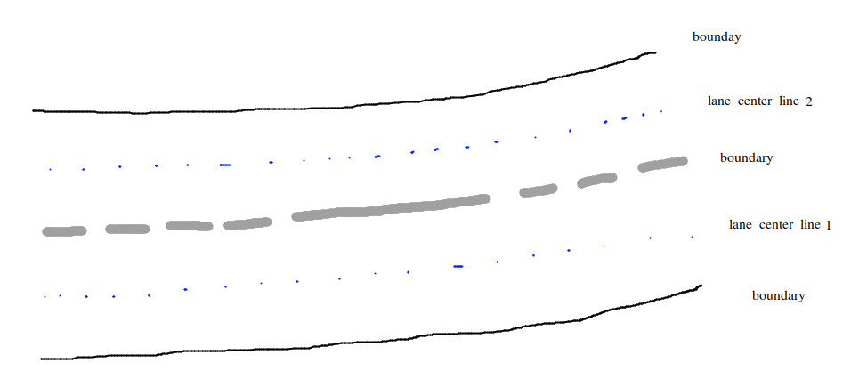
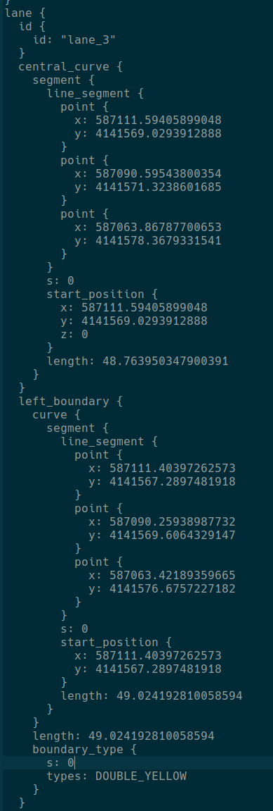
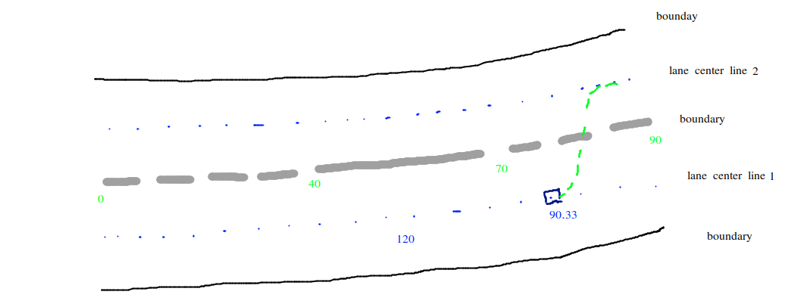
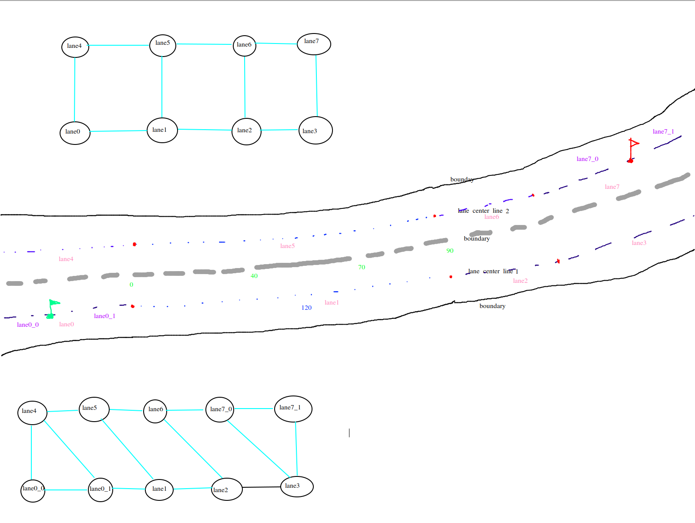

# Routing 模块 (3) - 全局路线的生成

## 1. 前言与背景

现在接着 [Routing 模块 (2)-全局路线的生成](https://github.com/AELe/Apollo-PNC-algorithm-analysis/blob/main/routing%E6%A8%A1%E5%9D%97\(2\)-%E5%85%A8%E5%B1%80%E8%B7%AF%E7%BA%BF%E7%9A%84%E7%94%9F%E6%88%90.md) 上一篇继续分析。

在上一篇中，我们介绍了 `InitInSubNodeSubEdge` 函数的调用：

```cpp
for (auto* sub_node : sub_nodes) {
  InitInSubNodeSubEdge(sub_node, topo_node->InFromAllEdge());
  InitOutSubNodeSubEdge(sub_node, topo_node->OutToAllEdge());
}
```

`InitInSubNodeSubEdge` 函数里包含了其它一些函数，我们一个一个的讲。

---

## 2. IsOverlapEnough 函数分析

### 2.1 IsOverlapEnough 函数实现

在 `InitInSubNodeSubEdge` 中调用了 `IsOverlapEnough` 函数：

```cpp
bool TopoNode::IsOverlapEnough(const TopoNode* sub_node,
                               const TopoEdge* edge_for_type) const {
  if (edge_for_type->Type() == TET_LEFT) {
    return (is_left_range_enough_ &&
            IsOutRangeEnough(left_out_sorted_range_, sub_node->StartS(),
                             sub_node->EndS()));
  }
  if (edge_for_type->Type() == TET_RIGHT) {
    return (is_right_range_enough_ &&
            IsOutRangeEnough(right_out_sorted_range_, sub_node->StartS(),
                             sub_node->EndS()));
  }
  if (edge_for_type->Type() == TET_FORWARD) {
    return IsOutToSucEdgeValid() && sub_node->IsInFromPreEdgeValid();
  }
  return true;
}
```

### 2.2 Edge 类型说明

在 `IsOverlapEnough` 函数中，`edge_for_type->Type()`：`edge` 的 `direction_type` 表示拓扑图中节点间 `edge` 的左/右/直关系。你可以在 `routing_map.txt` 中看到，比如下面就表示从 `lane_17` 到 `lane_16` 存在一条 `edge`：

```cpp
edge {
  from_lane_id: "lane_17"
  to_lane_id: "lane_16"
  cost: 1415.6025095862331
  direction_type: LEFT
}
```

而传入 `IsOutRangeEnough` 函数的参数是在 `ConvertOutRange` 函数中获取到的。

---

## 3. ConvertOutRange 函数分析

### 3.1 ConvertOutRange 函数调用

```cpp
ConvertOutRange(pb_node_.left_out(), start_s_, end_s_,
                &left_out_sorted_range_, &left_prefer_range_index_);
```

### 3.2 ConvertOutRange 函数实现

```cpp
void ConvertOutRange(const RepeatedPtrField<CurveRange>& range_vec,
                     double start_s, double end_s,
                     std::vector<NodeSRange>* out_range, int* prefer_index) {
  out_range->clear();
  for (const auto& c_range : range_vec) {
    double s_s = c_range.start().s();
    double e_s = c_range.end().s();
    if (e_s < start_s || s_s > end_s || e_s < s_s) {
      continue;
    }
    s_s = std::max(start_s, s_s);
    e_s = std::min(end_s, e_s);
    NodeSRange s_range(s_s, e_s);
    out_range->push_back(std::move(s_range));
  }
  sort(out_range->begin(), out_range->end());
  int max_index = -1;
  double max_diff = 0.0;
  for (size_t i = 0; i < out_range->size(); ++i) {
    if (out_range->at(i).Length() > max_diff) {
      max_index = static_cast<int>(i);
      max_diff = out_range->at(i).Length();
    }
  }
  *prefer_index = max_index;
}
```

所以需要先看一下 `ConvertOutRange` 函数，它是在一个 `TopoNode` 节点初始化的时候被调用的。

### 3.3 pb_node_.left_out() 参数说明

`pb_node_.left_out()`：`ConvertOutRange` 函数所需的第一个参数。

`pb_node_.left_out()`：是通过 `AddOutBoundary` 函数获取到的，表示的是可换道的纵向范围。

```cpp
void AddOutBoundary(const LaneBoundary& bound, double lane_length,
                    RepeatedPtrField<CurveRange>* const out_range) {
  for (int i = 0; i < bound.boundary_type_size(); ++i) {
    if (!IsAllowedOut(bound.boundary_type(i))) {
      continue;
    }
    CurveRange* range = out_range->Add();
    range->mutable_start()->set_s(GetLengthbyRate(bound.boundary_type(i).s(),
                                                  bound.length(), lane_length));
    if (i != bound.boundary_type_size() - 1) {
      range->mutable_end()->set_s(GetLengthbyRate(
          bound.boundary_type(i + 1).s(), bound.length(), lane_length));
    } else {
      range->mutable_end()->set_s(lane_length);
    }
  }
}
```

---

## 4. 车道边界与换道区间

### 4.1 车道边界结构

比如下面是同向双车道，蓝色虚线是车道中心线，然后两条车道中心线间的 `boundary` 其实就是 `bound.boundary_type`，它是从 `base_map.txt` 中获取到的。每一条 `lane` 结构下面都会包含这条 `lane` 的 `left_boundary` 和 `right_boundary`。



*图1：车道边界示意图*

比如下面 `lane center line 1` 这条车道它的 `left_boundary` 的 `boundary_type` 有三个分别是 `DOTTED_WHITE`、`SOLID_WHITE`、`DOTTED_WHITE`，也就是白色虚线、白色实线、白色虚线，并且虚线表示可以换道。

你能在 `base_map.txt` 文件中找到 `lane` 的结构，并能看到它的内部包含 `left_boundary` 和 `right_boundary`。



*图2：lane结构示意图*

### 4.2 AddOutBoundary 函数作用

`AddOutBoundary` 的作用就是获取 `out_range`，`out_range` 是 `RepeatedPtrField<CurveRange>*` 类型。

`out_range` 它表示的是车在当前车道上行驶时可换道的区间范围。

```cpp
message CurvePoint {
  optional double s = 1;
}

message CurveRange {
  optional CurvePoint start = 1;
  optional CurvePoint end = 2;
}
```

```cpp
void AddOutBoundary(const LaneBoundary& bound, double lane_length,
                    RepeatedPtrField<CurveRange>* const out_range) {
  for (int i = 0; i < bound.boundary_type_size(); ++i) {
    if (!IsAllowedOut(bound.boundary_type(i))) {
      continue;
    }
    AINFO << "boundary_type_s:" << bound.boundary_type(i).s();
    CurveRange* range = out_range->Add();
    range->mutable_start()->set_s(GetLengthbyRate(bound.boundary_type(i).s(),
                                                  bound.length(), lane_length));
    if (i != bound.boundary_type_size() - 1) {
      range->mutable_end()->set_s(GetLengthbyRate(
          bound.boundary_type(i + 1).s(), bound.length(), lane_length));
    } else {
      range->mutable_end()->set_s(lane_length);
    }
  }
}
```

### 4.3 换道区间计算示例

举例说明：下面图示中间的 `boundary` 已经标明每一个 `boundary_type` 的纵向距离，比如第一段虚线是从 `boundary` 纵向距离 0-40m 是虚线，40-70m 是实线，70-90 是虚线。也就意味着这个 `boundary` 总长 90m，现在假设 `lane center line1` 总长 120m（因为 `boundary` 和 `lane center line1` 弧度不同所以长度也会不同的）。



*图3：换道区间计算示意图*

```cpp
double new_length = cur_s / cur_total_length * target_length;
```

`70 / 90 * 120 = 90.33m`，这也意味着当车在 `lane center line1` 车道上行驶时，行驶到 90.33m 是可以切换到 `lane center line 2` 这根车道上的。

所以 `AddOutBoundary` 函数的作用就是在 `boundary` 存在换道 `boundary_type` 时获取当前车辆正在行驶的车道的可换道区间，也就是 `pb_node_.left_out()`，也是 `ConvertOutRange` 函数第一个参数的含义。

---

## 5. ConvertOutRange 函数参数详解

### 5.1 参数说明

**ConvertOutRange 函数参数：**
- 第二个参数 `start_s`：当前车道所表示节点的开始位置（一般是 0）
- 第三个参数 `end_s`：当前车道所表示节点的结束位置
- 第四个参数 `left_out_sorted_range_`：保证当前车辆正在行驶的车道的可换道区间在节点范围内
- 第五个参数 `left_prefer_range_index_`：表示可换道区间范围最大的区间索引

> **注意：** 虽然 `pb_node_.left_out()` 已经是按照 `boundary` 的区间比例转换为 `lane` 的可换道区间，但是要注意转换的时候是按照 `lane` 的长度，而不是按照 `node` 的长度。而 `node` 的长度有可能不是整条 `lane`，比如你设置的终点设置在了 `lane` 的中间某一点，那 `node` 的长度就不是 `lane` 的长度，所以这里要保证可换道区间在节点范围内。

### 5.2 TopoNode::Init 函数

回到 `Init` 函数中：

```cpp
void TopoNode::Init() {
  if (!FindAnchorPoint()) {
    AWARN << "Be attention!!! Find anchor point failed for lane: " << LaneId();
  }
  ConvertOutRange(pb_node_.left_out(), start_s_, end_s_,
                  &left_out_sorted_range_, &left_prefer_range_index_);

  is_left_range_enough_ =
      (left_prefer_range_index_ >= 0) &&
      left_out_sorted_range_[left_prefer_range_index_].IsEnoughForChangeLane();

  ConvertOutRange(pb_node_.right_out(), start_s_, end_s_,
                  &right_out_sorted_range_, &right_prefer_range_index_);
  is_right_range_enough_ = (right_prefer_range_index_ >= 0) &&
                           right_out_sorted_range_[right_prefer_range_index_]
                               .IsEnoughForChangeLane();
}
```

**参数说明：**
- `is_left_range_enough_`：表示当向左可换道最大区间 > 5m 时，认为可以换道为 `true`
- `is_right_range_enough_`：表示当向右可换道最大区间 > 5m 时，认为可以换道为 `true`

---

## 6. IsOutRangeEnough 函数分析

### 6.1 IsOverlapEnough 函数回顾

现在我们再回到 `IsOverlapEnough` 函数：

```cpp
bool TopoNode::IsOverlapEnough(const TopoNode* sub_node,
                               const TopoEdge* edge_for_type) const {
  if (edge_for_type->Type() == TET_LEFT) {
    return (is_left_range_enough_ &&
            IsOutRangeEnough(left_out_sorted_range_, sub_node->StartS(),
                             sub_node->EndS()));
  }
  if (edge_for_type->Type() == TET_RIGHT) {
    return (is_right_range_enough_ &&
            IsOutRangeEnough(right_out_sorted_range_, sub_node->StartS(),
                             sub_node->EndS()));
  }
  if (edge_for_type->Type() == TET_FORWARD) {
    return IsOutToSucEdgeValid() && sub_node->IsInFromPreEdgeValid();
  }
  return true;
}
```

### 6.2 IsOutRangeEnough 函数实现

`IsOutRangeEnough` 函数主要是判断当前子节点可行驶区间是否与向左/向右换道区间范围重叠并且符合最低换道纵向距离。

```cpp
bool TopoNode::IsOutRangeEnough(const std::vector<NodeSRange>& range_vec,
                                double start_s, double end_s) {
  if (!NodeSRange::IsEnoughForChangeLane(start_s, end_s)) {
    return false;
  }
  int start_index = BinarySearchForSLarger(range_vec, start_s);
  int end_index = BinarySearchForSSmaller(range_vec, end_s);

  int index_diff = end_index - start_index;
  if (start_index < 0 || end_index < 0) {
    return false;
  }
  if (index_diff > 1) {
    return true;
  }

  double pre_s_s = std::max(start_s, range_vec[start_index].StartS());
  double suc_e_s = std::min(end_s, range_vec[end_index].EndS());

  if (index_diff == 1) {
    double dlt = range_vec[start_index].EndS() - pre_s_s;
    dlt += suc_e_s - range_vec[end_index].StartS();
    return NodeSRange::IsEnoughForChangeLane(dlt);
  }
  if (index_diff == 0) {
    return NodeSRange::IsEnoughForChangeLane(pre_s_s, suc_e_s);
  }
  return false;
}
```

### 6.3 直行判断逻辑

直行时判断当前子节点是否与前一个节点或子节点可以建立连接：

```cpp
if (edge_for_type->Type() == TET_FORWARD) {
  return IsOutToSucEdgeValid() && sub_node->IsInFromPreEdgeValid();
}
```

### 6.4 InitOutSubNodeSubEdge 函数

同理，`InitOutSubNodeSubEdge` 函数也有类似的逻辑。

---

## 7. 子图构建总结

### 7.1 子图构建示意图

现在按照下方图示总结一下 `InitInSubNodeSubEdge`/`InitOutSubNodeSubEdge` 函数：



*图4：子图构建示意图*

可以看中间实际的车道示意图，粉色 `lane` 是最开始的 `node` 划分，最开始根据粉色节点构建的拓扑图是最上面的图。在上一篇 [Routing 模块 (2)-全局路线的生成](https://github.com/AELe/Apollo-PNC-algorithm-analysis/blob/main/routing%E6%A8%A1%E5%9D%97\(2\)-%E5%85%A8%E5%B1%80%E8%B7%AF%E7%BA%BF%E7%9A%84%E7%94%9F%E6%88%90.md) 中介绍了在构建子图的过程中会创造子节点。因为我们的例子中，只有两个 `waypoint`，一个是起点，一个是终点，所以就将起点分成了两个子节点 `lane0_0` 和 `lane0_1`，将终点分成了 `lane7_0` 和 `lane7_1` 两个子节点。

### 7.2 子图连接过程

```cpp
for (const auto& map_iter : black_map) {
  InitSubEdge(map_iter.first);
}

for (const auto& map_iter : black_map) {
  AddPotentialEdge(map_iter.first);
}
```

上面的过程就是将子图连接到最开始的拓扑图中的过程，如上面最后的拓扑图：
- `InitSubEdge` 是在找每个子节点前后的连接关系
- `AddPotentialEdge` 是在找子节点左右的连接关系

整个子图以及合并子图到原始拓扑图就介绍完了，这部分没有复杂的逻辑，所以想要熟悉只有反复的详细从头到尾多看几遍。

---

## 8. 总结

本文详细介绍了 Routing 模块中全局路线生成的第三部分，包括：

1. **IsOverlapEnough 函数** - 判断子节点与边是否足够重叠
2. **ConvertOutRange 函数** - 转换可换道区间范围
3. **车道边界与换道区间** - 车道边界类型与换道区间计算
4. **AddOutBoundary 函数** - 获取可换道区间
5. **IsOutRangeEnough 函数** - 判断换道区间是否足够
6. **子图构建过程** - 子节点的创建和连接

这些算法为后续的 A* 搜索算法和最终路径生成提供了基础的数据结构和连接关系。