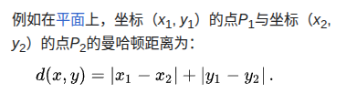
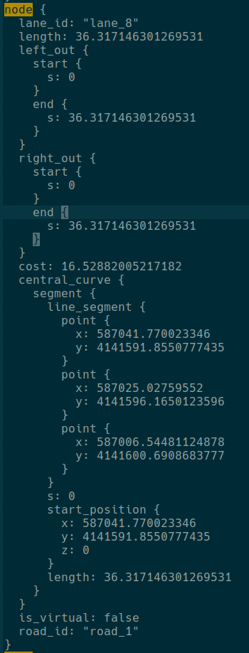

# Routing 模块 (4) - 全局路线的生成

## 1. 前言与背景

现在子图和原始拓扑图已经进行关联，相当于把子图通过 `edge` 结构关联到了原始的拓扑图中。

```cpp
const auto* start = sub_graph.GetSubNodeWithS(way_start, way_start_s);
const auto* end = sub_graph.GetSubNodeWithS(way_end, way_end_s);
```

这样就可以在完整的拓扑图中使用 A* 算法计算全局路线。

---

## 2. A* 算法概述

### 2.1 Search 函数调用

```cpp
strategy_ptr->Search(graph, &sub_graph, start, end, &cur_result_nodes)
```

**参数说明：**
- `graph`：拓扑图，使用 `routing_map.bin` 文件生成
- `sub_graph`：在上一篇 [Routing 模块 (3)-全局路线的生成](https://github.com/AELe/Apollo-PNC-algorithm-analysis/blob/main/routing%E6%A8%A1%E5%9D%97\(3\)-%E5%85%A8%E5%B1%80%E8%B7%AF%E7%BA%BF%E7%9A%84%E7%94%9F%E6%88%90.md) 中构建的子图
- `start`：算路的起点节点
- `end`：算路的终点节点
- `cur_result_nodes`：输出的算路结果，类型 `std::vector<NodeWithRange>`，包含节点与在节点上（也就是车道上）可行驶的区间

### 2.2 A* 算法基本原理

A* 算法用 `f` 来在 `open` 集中排序，优先搜索 `f` 小的节点：

```
f(n) = g(n) + h(n)
```

**参数说明：**
- `g(n)`：从起点（`start`）沿着当前已选路径走到节点 `n` 的代价
- `h(n)`：从节点 `n` 到终点的启发式估计代价（一般使用曼哈顿距离）



*图1：A*算法示意图*

---

## 3. A* 算法初始化

### 3.1 初始状态

初始时：`g(start)`（你在起点还没走路）= 0

```cpp
g_score_[src_node] = 0.0;               // g(start)=0
src_search_node.f = HeuristicCost(src_node, dest_node); // f = h
open_set_detail.push(src_search_node);
```

### 3.2 HeuristicCost 函数

```cpp
double AStarStrategy::HeuristicCost(const TopoNode* src_node,
                                    const TopoNode* dest_node) {
  const auto& src_point = src_node->AnchorPoint();
  const auto& dest_point = dest_node->AnchorPoint();
  double distance = std::fabs(src_point.x() - dest_point.x()) +
                    std::fabs(src_point.y() - dest_point.y());
  return distance;
}
```

### 3.3 FindAnchorPoint 函数

这里需要介绍一下 `AnchorPoint()`，它是在 `TopoNode::Init()` 函数中调用 `FindAnchorPoint` 函数时通过 `SetAnchorPoint` 函数设置的。

```cpp
bool TopoNode::FindAnchorPoint() {
  double total_size = 0;
  for (const auto& seg : CentralCurve().segment()) {
    total_size += seg.line_segment().point_size();
  }
  double rate = (StartS() + EndS()) / 2.0 / Length();
  int anchor_index = static_cast<int>(total_size * rate);
  for (const auto& seg : CentralCurve().segment()) {
    if (anchor_index < seg.line_segment().point_size()) {
      SetAnchorPoint(seg.line_segment().point(anchor_index));
      return true;
    }
    anchor_index -= seg.line_segment().point_size();
  }
  return false;
}
```

### 3.4 AnchorPoint 计算过程

下面逻辑是在统计中心曲线所有点的数量：

```cpp
double total_size = 0;
for (const auto& seg : CentralCurve().segment()) {
  total_size += seg.line_segment().point_size();
}
```

可以看一下 `routing_map.txt` 文件中 `node` 的结构，你能看到 `node` 结构里面的 `central_curve/segment/line_segement/point` 这些可以跟代码对上。`CentralCurve().segment()` 有很多个 `segment`，每个 `segment` 有很多点，这里把所有 `segment` 中的点数相加。后续会根据比例 `rate` 去选某个点为锚点，这个过程可以理解为采样过程。



*图2：lane结构示意图*

```cpp
double rate = (StartS() + EndS()) / 2.0 / Length();
```

`(StartS() + EndS()) / 2.0` 这个是 `node` 中点的在这条车道上的 `s` 值，除以 `node` 长度得到到 `node` 可行驶区间中点在整个 `node` 长度上的比例。

```cpp
int anchor_index = static_cast<int>(total_size * rate);
```

按照 `rate` 比例乘以这个 `node` 总的 `point` 数，得到一个索引 `anchor_index`。

如果 `anchor_index < seg.line_segment().point_size()` 说明目标点就在这个 `segment` 里，否则减去当前 `segment` 的点数，继续在下一个 `segment` 中找目标点，直到找到位置。如果找到了设置 `AnchorPoint`，这个 `AnchorPoint` 就代表了这个整体 `node`。

```cpp
void TopoNode::SetAnchorPoint(const common::PointENU& anchor_point) {
  anchor_point_ = anchor_point;
}
```

### 3.5 FindAnchorPoint 总结

**FindAnchorPoint 步骤：**
1. 数一数整条中央曲线有多少个点
2. 找出这个 `TopoNode` 的中点在整个曲线上的比例位置
3. 按比例计算出该点对应的 `index`
4. 在 `CentralCurve` 的多个 `segment` 中找到这个点
5. 把该点设置为 `AnchorPoint`

### 3.6 回到 HeuristicCost 函数

```cpp
double AStarStrategy::HeuristicCost(const TopoNode* src_node,
                                    const TopoNode* dest_node) {
  const auto& src_point = src_node->AnchorPoint();
  const auto& dest_point = dest_node->AnchorPoint();
  double distance = std::fabs(src_point.x() - dest_point.x()) +
                    std::fabs(src_point.y() - dest_point.y());
  return distance;
}
```

我们已经知道，每个节点会用我们设置的 `AnchorPoint` 来表示，所以在 `HeuristicCost` 函数中，我们计算 `h(n)` 的值的时候，计算的是从节点 `n` 到终点的曼哈顿距离，并且使用的是 `AnchorPoint` 坐标。

```cpp
std::priority_queue<SearchNode> open_set_detail;

SearchNode src_search_node(src_node);
src_search_node.f = HeuristicCost(src_node, dest_node);
open_set_detail.push(src_search_node);

open_set_.insert(src_node);
g_score_[src_node] = 0.0;
enter_s_[src_node] = src_node->StartS();
```

这样起点的 `h` 就是起点锚点到终点锚点的曼哈顿距离，因为起点的 `g` 值为 0 所以 `f = h`。

**初始化说明：**
- `open_set_detail.push(src_search_node)`：用于选取最小 `f` 值节点的优先队列，队顶为最小，首先存入起点
- `g_score_[src_node] = 0.0`：将起点的 `g` 值设为 0（表示从起点到自身的已知代价）
- `enter_s_[src_node] = src_node->StartS()`：
  - 正常直行：`enter_s = StartS`（从节点起点进入）
  - 变道进入：`enter_s =` 一个比 `StartS` 更靠后的位置

---

## 4. A* 算法主循环

### 4.1 主循环结构

```cpp
SearchNode current_node;
std::unordered_set<const TopoEdge*> next_edge_set;
std::unordered_set<const TopoEdge*> sub_edge_set;
while (!open_set_detail.empty()) {
  current_node = open_set_detail.top();
  const auto* from_node = current_node.topo_node;
  if (current_node.topo_node == dest_node) {
    if (!Reconstruct(came_from_, from_node, result_nodes)) {
      AERROR << "Failed to reconstruct route.";
      return false;
    }
    return true;
  }
  open_set_.erase(from_node);
  open_set_detail.pop();
```

**循环逻辑：**
- `current_node = open_set_detail.top()`：取优先队列中 `f` 最小的节点，记为 `current_node`
- `from_node`：指向当前搜索的拓扑节点
- `current_node.topo_node == dest_node`：表示找到了到目标的路径，然后调用 `Reconstruct` 将 `came_from_` 回溯得到路径并填充 `result_nodes`
- `open_set_detail.pop()`：从优先队列中删除当前节点

### 4.2 节点状态检查

```cpp
if (closed_set_.count(from_node) != 0) {
  // if showed before, just skip...
  continue;
}
closed_set_.emplace(from_node);
```

检查 `closed_set_` 是否包含 `from_node`，如果已存在则跳过，如果不包含将 `from_node` 加入 `closed_set_`，表示已经搜索过该节点。

### 4.3 获取邻接边

```cpp
// if residual_s is less than FLAGS_min_length_for_lane_change, only move forward
const auto& neighbor_edges =
    (GetResidualS(from_node) > FLAGS_min_length_for_lane_change &&
     change_lane_enabled_)
        ? from_node->OutToAllEdge()
        : from_node->OutToSucEdge();
double tentative_g_score = 0.0;
next_edge_set.clear();
for (const auto* edge : neighbor_edges) {
  sub_edge_set.clear();
  sub_graph->GetSubInEdgesIntoSubGraph(edge, &sub_edge_set);
  next_edge_set.insert(sub_edge_set.begin(), sub_edge_set.end());
}
```

### 4.4 GetResidualS 函数

```cpp
double start_s = node->StartS();  // 默认进入点是 node->StartS()

const auto iter = enter_s_.find(node);
if (iter != enter_s_.end()) {
  if (iter->second > node->EndS()) {
    return 0.0;
  }
  start_s = iter->second;
} else {
  AWARN << "lane " << node->LaneId() << "(" << node->StartS() << ", "
        << node->EndS() << "not found in enter_s map";
}
```

上面逻辑是如果 `enter_s_` 中有记录，则使用 `enter_s_` 中的 `start_s`，因为如果发生过变道那么 `start_s` 是比 `node` 的 `StartS()` 更靠后的位置。

```cpp
double end_s = node->EndS();  // 默认为 node 的结束位置

const TopoNode* succ_node = nullptr;
for (const auto* edge : node->OutToAllEdge()) {
  if (edge->ToNode()->LaneId() == node->LaneId()) {
    succ_node = edge->ToNode();
    break;
  }
}
```

上面逻辑搜索与本条 `lane` 相同 `laneId` 的 `succ_node`（同一车道的下一段）。

```cpp
if (succ_node != nullptr) {
  end_s = succ_node->EndS();
}
```

如果能找到当前节点相同 `laneid` 的连接 `node`，那么设置 `end_s` 为连接 `node` 的结束位置。

最后得到 `residual_s = end_s - start_s`。

`residual_s` 主要用于判断是否有足够空间进行变道。所以 `neighbor_edges` 的值会根据是否符合变道的条件来进行赋值，如果满足变道条件就赋值为所有出边包括变道的 `edge`，否则只赋值为直行的出边。

### 4.5 GetSubInEdgesIntoSubGraph 函数

如果 `to_node` 产生了多个 `sub_node`，那么原始 `edge->to_node` 的边不再适用，需要替换成 `edge->sub_node` 的边。如果不能替换，就使用原始 `edge`。

```cpp
void SubTopoGraph::GetSubInEdgesIntoSubGraph(
    const TopoEdge* edge,
    std::unordered_set<const TopoEdge*>* const sub_edges) const {
  edge:原始拓扑图的一条边
  sub_edges:要输出的子图中的边集合

  const auto* from_node = edge->FromNode();
  const auto* to_node = edge->ToNode();
  提取此边 edge 的起点和终点

  std::unordered_set<TopoNode*> sub_nodes;
  if (from_node->IsSubNode() || to_node->IsSubNode() ||
      !GetSubNodes(to_node, &sub_nodes)) {
    sub_edges->insert(edge);
    return;
  }
  如果 from_node 是子节点/to_node 是子节点/to_node 没有对应的子节点，这三种情况说明 edge 不需要替换，直接使用原始边

  for (const auto* sub_node : sub_nodes) {
    for (const auto* in_edge : sub_node->InFromAllEdge()) {
      if (in_edge->FromNode() == from_node) {
        sub_edges->insert(in_edge);
      }
    }
  }
  如果 from_node 不是子节点/to_node 不是子节点，但 to_node 上有子节点，此时要将原始 edge 替换成 edge->sub_node 的边
}
```

这样 `next_edge_set` 存的就是当前节点的邻接边的集合是 `sub_node` 级别。

---

## 5. 邻接节点处理

### 5.1 遍历邻接边

```cpp
for (const auto* edge : next_edge_set) {
  const auto* to_node = edge->ToNode();
  if (closed_set_.count(to_node) == 1) continue;

  if (GetResidualS(edge, to_node) < FLAGS_min_length_for_lane_change) {
    continue;
  }
```

遍历当前节点的连接边，如果已经在 `closed_set_` 中就跳过，说明已经搜索过。然后再次判断连接子节点之后如果存在变道的情况是否有足够空间进行变道。

### 5.2 计算代价

```cpp
tentative_g_score =
    g_score_[current_node.topo_node] + GetCostToNeighbor(edge);
```

计算到当前节点邻接节点的 `g` 值，到当前节点的 `g` 值 `g_score_[current_node.topo_node]`，当前节点到邻接节点的 `g` 值，使用两个节点间边的 `cost` 加上邻接节点的 `cost`。

```
g[邻接节点] = g[当前节点] + 当前节点到邻接节点的 cost 值
```

```cpp
double GetCostToNeighbor(const TopoEdge* edge) {
  return (edge->Cost() + edge->ToNode()->Cost());
}
```

`edge->Cost()` 和 `edge->ToNode()->Cost()` 的值，都是从 `routing_map.bin` 文件中的 `node` 结构和 `edge` 结构中读取出来的。

```cpp
if (edge->Type() != TopoEdgeType::TET_FORWARD) {
  tentative_g_score -=
      (edge->FromNode()->Cost() + edge->ToNode()->Cost()) / 2;
}
```

如果是左/右换道 `g` 值会相应减小，这也意味着换道的优先级更高。

### 5.3 计算 f 值

```cpp
double f = tentative_g_score + HeuristicCost(to_node, dest_node);
```

计算 `f` 值，邻接节点的 `g` 值 + 邻接节点到终点的曼哈顿距离。

```cpp
if (open_set_.count(to_node) != 0 && f >= g_score_[to_node]) {
  continue;
}
```

如果当前节点已经搜索过，或者已经有更小 `f` 值路径了，则跳过。

### 5.4 进入位置计算

```cpp
// 前向边处理
if (edge->Type() == TopoEdgeType::TET_FORWARD) {
  enter_s_[to_node] = to_node->StartS();
} 
// 非前向边（变道）处理
else {
  double to_node_enter_s =
      (enter_s_[from_node] + FLAGS_min_length_for_lane_change) /
      from_node->Length() * to_node->Length();
  // 边界检查
  to_node_enter_s = std::min(to_node_enter_s, to_node->Length());
  // 特殊目标车道检查
  if (to_node_enter_s > to_node->EndS() && to_node == dest_node) {
    continue;
  }
  enter_s_[to_node] = to_node_enter_s;
}
```

上面是进入位置 `enter_s` 精确计算：

**前向边**：简单情况，从车道起点进入

**变道边**：复杂情况需要计算合适的进入点

```cpp
double to_node_enter_s =
    (enter_s_[from_node] + FLAGS_min_length_for_lane_change) /
    from_node->Length() * to_node->Length();
```

如果原车道已行驶 60%，则在新车道也应该从 60% 位置进入，`FLAGS_min_length_for_lane_change` 确保变道有足够空间。

### 5.5 节点更新与路径记录

```cpp
g_score_[to_node] = f;  // 注意：这里应该是 tentative_g_score，可能是代码 bug
SearchNode next_node(to_node);
next_node.f = f;
open_set_detail.push(next_node);  // 加入优先队列
came_from_[to_node] = from_node;   // 记录路径来源

// 确保节点在 open_set_ 哈希表中
if (open_set_.count(to_node) == 0) {
  open_set_.insert(to_node);
}
```

**更新逻辑：**
- `g_score_[to_node] = f`：当前实现将 `f` 值（`g+h`）存储为 `g_score`
- `SearchNode next_node(to_node)`：创建新的搜索节点
- `open_set_detail.push(next_node)`：更新当前节点
- `came_from_[to_node] = from_node`：路径记录

就这样循环，直到当前节点为终点时，表示找到了最优路径。上面逻辑就是 A* 的整体流程。

---

## 6. 路径回溯与调整

### 6.1 Reconstruct 函数

```cpp
bool Reconstruct(
    const std::unordered_map<const TopoNode*, const TopoNode*>& came_from,
    const TopoNode* dest_node, std::vector<NodeWithRange>* result_nodes) {
  std::vector<const TopoNode*> result_node_vec;
  result_node_vec.push_back(dest_node);

  auto iter = came_from.find(dest_node);
  while (iter != came_from.end()) {
    result_node_vec.push_back(iter->second);
    iter = came_from.find(iter->second);
  }
  std::reverse(result_node_vec.begin(), result_node_vec.end());
  if (!AdjustLaneChange(&result_node_vec)) {
    AERROR << "Failed to adjust lane change";
    return false;
  }
  result_nodes->clear();
  for (const auto* node : result_node_vec) {
    result_nodes->emplace_back(node->OriginNode(), node->StartS(),
                               node->EndS());
  }
  return true;
}
```

从入参 `came_from` 进行回溯，因为 `came_from` 键是 `to_node`，值是 `from_node`。首先知道终点的 `from_node`，然后循环查找终点 `from_node` 的 `from_node` 直到找到起点，将找到的所有节点存入 `result_node_vec`。此时 `result_node_vec` 中的顺序还是从终点节点、终点节点前一个节点、终点节点前一个节点的前一个节点，这样反着的一直到终点节点。

```cpp
std::reverse(result_node_vec.begin(), result_node_vec.end());
```

上面是将 `result_node_vec` 进行反转，也就是从起点到终点节点的存储。

### 6.2 AdjustLaneChange 函数

```cpp
bool AdjustLaneChange(std::vector<const TopoNode*>* const result_node_vec) {
  if (result_node_vec->size() < 3) {
    return true;
  }
  if (!AdjustLaneChangeBackward(result_node_vec)) {
    AERROR << "Failed to adjust lane change backward";
    return false;
  }
  if (!AdjustLaneChangeForward(result_node_vec)) {
    AERROR << "Failed to adjust lane change backward";
    return false;
  }
  return true;
}
```

### 6.3 AdjustLaneChangeBackward 函数

在路径中遇到"变道"（非 `TET_FORWARD` 边）时，看看能不能把中间那个车道节点（`from_node`）换成一个更长、更优的车道段，前提是：这个新车道也能从 `base_node` 变道过来，并且还能继续走到 `to_node`。

```cpp
bool AdjustLaneChangeBackward(
    std::vector<const TopoNode*>* const result_node_vec) {
  for (int i = static_cast<int>(result_node_vec->size()) - 2; i > 0; --i) {
    const auto* from_node = result_node_vec->at(i);
    const auto* to_node = result_node_vec->at(i + 1);
    const auto* base_node = result_node_vec->at(i - 1);
    const auto* from_to_edge = from_node->GetOutEdgeTo(to_node);
    if (from_to_edge == nullptr) {
      // may need to recalculate edge,
      // because only edge from origin node to subnode is saved
      from_to_edge = to_node->GetInEdgeFrom(from_node);
    }
```

首先 `result_node_vec` 需要包含三个及三个以上存在变道边，从后向前遍历 `result_node_vec`。

**开始时：**
- `from_node`：倒数第二个节点
- `to_node`：终点节点
- `base_node`：倒数第三个节点

首先，获得 `from_node` 与 `to_node` 之间的 `edge` 信息，因为有时候 `edge` 信息没保存在 `from_node` 出边，而是保存在了 `to_node` 的入边，所以当从 `from_node` 出边没获取到 `edge` 信息的时候，又调用了一次。

```cpp
if (from_to_edge == nullptr) {
  // may need to recalculate edge,
  // because only edge from origin node to subnode is saved
  from_to_edge = to_node->GetInEdgeFrom(from_node);
}
```

从 `to_node` 的入边获取 `edge` 信息，需要注意获取的 `edge` 信息，即有可能是直行边，也有可能是左右变道边。

```cpp
if (from_to_edge->Type() != TopoEdgeType::TET_FORWARD) {
  if (base_node->EndS() - base_node->StartS() <
      from_node->EndS() - from_node->StartS()) {
    continue;
  }
  std::vector<const TopoNode*> candidate_set;
  candidate_set.push_back(from_node);
  const auto& out_edges = base_node->OutToLeftOrRightEdge();
  for (const auto* edge : out_edges) {
    const auto* candidate_node = edge->ToNode();
    if (candidate_node == from_node) {
      continue;
    }
    if (candidate_node->GetOutEdgeTo(to_node) != nullptr) {
      candidate_set.push_back(candidate_node);
    }
  }
  const auto* largest_node = GetLargestNode(candidate_set);
  if (largest_node == nullptr) {
    return false;
  }
  if (largest_node != from_node) {
    result_node_vec->at(i) = largest_node;
  }
}
```

获取到 `edge` 信息之后，要判断是否是变道类型，只有存在变道边的情况下才需要调整变道起点，并且要保证 `base_node` 长度大于等于 `from_node`。

**算法策略：**
- **当 `base_node` 较短时**：说明当前处于特殊的道路区域（如汇入区），此时应该保持原路径，不进行车道变更优化
- **当 `base_node` 较长时**：说明当前在主要车道上行驶，有足够的距离和条件来考虑优化车道选择

```cpp
std::vector<const TopoNode*> candidate_set;
candidate_set.push_back(from_node);
const auto& out_edges = base_node->OutToLeftOrRightEdge();
for (const auto* edge : out_edges) {
  const auto* candidate_node = edge->ToNode();
  if (candidate_node == from_node) {
    continue;
  }
  if (candidate_node->GetOutEdgeTo(to_node) != nullptr) {
    candidate_set.push_back(candidate_node);
  }
}
```

首先将 `from_node` 存入 `candidate_set`，然后获取 `base_node` 所有左/右出边。如果出边的 `to_node` 节点和当前 `to_node` 节点存在 `edge`，说明出边的 `from_node` 可以作为当前 `from_node` 的候补，也就意味着可以通过出边的 `from_node` 所表示的车道到达当前 `to_node` 所表示的车道。

```cpp
const auto* largest_node = GetLargestNode(candidate_set);
if (largest_node == nullptr) {
  return false;
}
if (largest_node != from_node) {
  result_node_vec->at(i) = largest_node;
}
```

然后获取 `candidate_set` 中所有候补节点长度最大的候补节点，替换原有的 `from_node`，这样就达到了在一段比较长的车道上进行变道的效果。

### 6.4 AdjustLaneChangeForward 函数

相似逻辑。

### 6.5 调整函数作用

**AdjustLaneChangeBackward 函数**：因为 `from_node` 替换成了更长的可行驶区域 `node`，所以可以从新的 `from_node` 更早的位置变道到达 `to_node`。

**AdjustLaneChangeForward 函数**：因为 `to_node` 替换成了更长的可行驶区域 `node`，所以从 `from_node` 变道到新的 `to_node` 后可以行驶更长时间。

最后得到调整后的 `result_node_vec`。

```cpp
for (const auto* node : result_node_vec) {
  result_nodes->emplace_back(node->OriginNode(), node->StartS(),
                             node->EndS());
}
```

然后把 `result_node_vec` 中节点存储到输出参数 `result_nodes` 中，`result_nodes` 类型是 `std::vector<NodeWithRange>`：`node` 与（可行驶区间）。

```cpp
class NodeWithRange : public NodeSRange {
 public:
  NodeWithRange(const NodeWithRange& other) = default;
  NodeWithRange(const TopoNode* node, double start_s, double end_s);
  NodeWithRange(const TopoNode* node, const NodeSRange& range);
  virtual ~NodeWithRange();
  bool operator<(const NodeWithRange& other) const;

  const TopoNode* GetTopoNode() const;
  bool IsVirtual() const;
  const std::string& RoadId() const;
  const std::string& LaneId() const;
  double FullLength() const;

 private:
  const TopoNode* topo_node_ = nullptr;
};
```

---

## 7. 路径合并与最终处理

### 7.1 SearchRouteByStrategy 调用

```cpp
std::vector<NodeWithRange> cur_result_nodes;
if (!strategy_ptr->Search(graph, &sub_graph, start, end,
                          &cur_result_nodes)) {
  AERROR << "Failed to search route with waypoint from " << start->LaneId()
         << " to " << end->LaneId();
  return false;
}

node_vec.insert(node_vec.end(), cur_result_nodes.begin(),
                cur_result_nodes.end());
```

### 7.2 MergeRoute 函数

```cpp
if (!MergeRoute(node_vec, result_nodes)) {
  AERROR << "Failed to merge route.";
  return false;
}
```

通过 `Search` 函数获取到路径节点以及相应的可行驶区间后，还要执行 `MergeRoute(node_vec, result_nodes)`。

```cpp
bool Navigator::MergeRoute(
    const std::vector<NodeWithRange>& node_vec,
    std::vector<NodeWithRange>* const result_node_vec) const {
  for (const auto& node : node_vec) {
    if (result_node_vec->empty() ||
        result_node_vec->back().GetTopoNode() != node.GetTopoNode()) {
      result_node_vec->push_back(node);
    } else {
      if (result_node_vec->back().EndS() < node.StartS()) {
        AERROR << "Result route is not continuous.";
        return false;
      }
      result_node_vec->back().SetEndS(node.EndS());
    }
  }
  return true;
}
```

主要是判断计算出来的全局路线是否连续，然后如果同一个节点有重叠可行驶区间进行区间合并。

这样 `SearchRouteByStrategy` 函数就分析完了。`SearchRouteByStrategy` 函数的输出参数是 `result_nodes`，我们继续分析。

### 7.3 最终结果处理

```cpp
if (!SearchRouteByStrategy(graph_.get(), way_nodes, way_s, &result_nodes)) {
  SetErrorCode(ErrorCode::ROUTING_ERROR_RESPONSE,
               "Failed to find route with request!",
               response->mutable_status());
  return false;
}
if (result_nodes.empty()) {
  SetErrorCode(ErrorCode::ROUTING_ERROR_RESPONSE, "Failed to result nodes!",
               response->mutable_status());
  return false;
}
result_nodes.front().SetStartS(request.waypoint().begin()->s());
result_nodes.back().SetEndS(request.waypoint().rbegin()->s());
```

我们看到获取到 `result_nodes` 后，又重新设置了起点可行驶区间的开始位置、终点可行驶区间的结束位置。因为在 `Reconstruct` 函数中所有的节点用的都是节点的可行驶区间，所以最终起点终点要更新为我们想要从哪个位置出发、在哪个位置停下来的区间起终位置。

---

## 8. 总结

本文详细介绍了 Routing 模块中全局路线生成的第四部分，包括：

1. **A* 算法概述** - A* 算法的基本原理和参数
2. **A* 算法初始化** - 锚点计算和启发函数
3. **A* 算法主循环** - 节点搜索和代价计算
4. **邻接节点处理** - 变道判断和进入位置计算
5. **路径回溯与调整** - 路径重构和车道变更优化
6. **路径合并与最终处理** - 路径连续性和最终结果处理

这些算法完成了从起点到终点的全局路线搜索和优化，为后续的路径规划和轨迹生成提供了完整的路线基础。