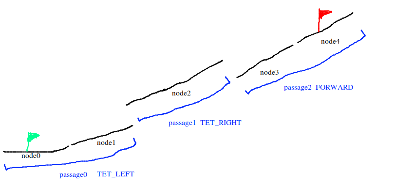
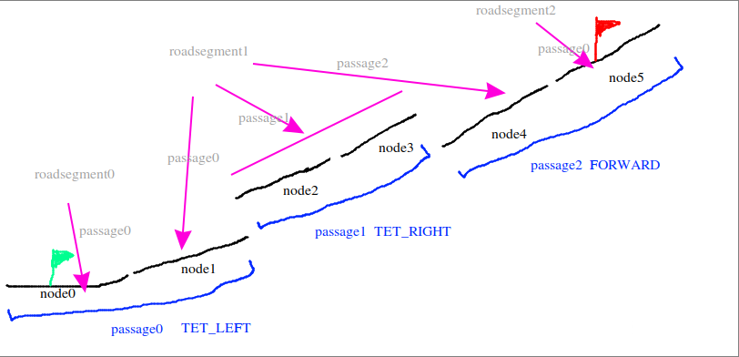
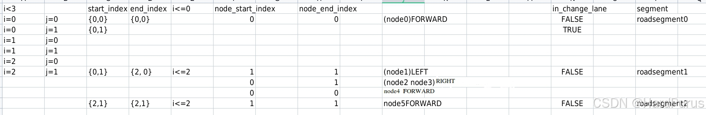

# Routing 模块 (5) - 全局路线的生成

## 1. 前言与背景

A* 算法我们在上一篇 [Routing 模块 (4)-全局路线的生成](https://github.com/AELe/Apollo-PNC-algorithm-analysis/blob/main/routing%E6%A8%A1%E5%9D%97\(4\)-%E5%85%A8%E5%B1%80%E8%B7%AF%E7%BA%BF%E7%9A%84%E7%94%9F%E6%88%90.md) 已经介绍了，接下来就是全局路线的生成最后一部分了。最后一部分就是 `GeneratePassageRegion` 函数。

---

## 2. GeneratePassageRegion 函数

### 2.1 函数定义

```cpp
bool ResultGenerator::GeneratePassageRegion(
    const std::vector<NodeWithRange>& nodes,
    const TopoRangeManager& range_manager,
    routing::RoutingResponse* const result) {
  std::vector<PassageInfo> passages;
  if (!ExtractBasicPassages(nodes, &passages)) {
    return false;
  }
  ExtendPassages(range_manager, &passages);

  CreateRoadSegments(passages, result);

  return true;
}
```

### 2.2 参数说明

**输入参数：**

- `nodes`：通过上一篇 `SearchRouteByStrategy` 函数获取到的 `result_nodes`
- `range_manager`：主要成员是 `range_map_`，这是在 [Routing 模块 (2)-全局路线的生成](https://github.com/AELe/Apollo-PNC-algorithm-analysis/blob/main/routing%E6%A8%A1%E5%9D%97\(2\)-%E5%85%A8%E5%B1%80%E8%B7%AF%E7%BA%BF%E7%9A%84%E7%94%9F%E6%88%90.md) 中介绍的，在 `topo_range_manager_` 中 `range_map_` 主要是表示黑名单 lane/road 节点及不可行驶区间
- `result`：需要返回的输出参数

### 2.3 函数流程

1. **提取基本通道**：调用 `ExtractBasicPassages` 函数
2. **扩展通道**：调用 `ExtendPassages` 函数
3. **创建道路段**：调用 `CreateRoadSegments` 函数
4. **返回结果**：将最终结果存储在 `result` 参数中

---

## 3. ExtractBasicPassages 函数

### 3.1 函数实现

```cpp
bool ResultGenerator::ExtractBasicPassages(
    const std::vector<NodeWithRange>& nodes,
    std::vector<PassageInfo>* const passages) {
  ACHECK(!nodes.empty());
  passages->clear();
  std::vector<NodeWithRange> nodes_of_passage;
  nodes_of_passage.push_back(nodes.at(0));
  for (size_t i = 1; i < nodes.size(); ++i) {
    auto edge =
        nodes.at(i - 1).GetTopoNode()->GetOutEdgeTo(nodes.at(i).GetTopoNode());
    if (edge == nullptr) {
      AERROR << "Get null pointer to edge from " << nodes.at(i - 1).LaneId()
             << " to " << nodes.at(i).LaneId();
      return false;
    }
    if (edge->Type() == TET_LEFT || edge->Type() == TET_RIGHT) {
      auto change_lane_type = LEFT;
      if (edge->Type() == TET_RIGHT) {
        change_lane_type = RIGHT;
      }
      passages->emplace_back(nodes_of_passage, change_lane_type);
      nodes_of_passage.clear();
    }
    nodes_of_passage.push_back(nodes.at(i));
  }
  passages->emplace_back(nodes_of_passage, FORWARD);
  return true;
}
```

### 3.2 算法逻辑

**遍历 `nodes` 的过程：**

1. **初始化**：先将第一个 `node` 存入 `nodes_of_passage`
2. **遍历处理**：对于每个后续节点：
   - 获取当前节点与前一个节点之间的边
   - 如果边为变道边（`TET_LEFT` 或 `TET_RIGHT`）：
     - 用当前 `nodes_of_passage` 和变道类型构建一个 `passage`
     - 清空 `nodes_of_passage` 准备收集下一个通道
   - 将当前节点添加到 `nodes_of_passage`
3. **最终处理**：循环结束后，用剩余的 `nodes_of_passage` 构建一个直行 `passage`

### 3.3 可视化说明



*图1：lane结构示意图 - 展示lane之间的连接关系和变道边*

---

## 4. ExtendPassages 函数

### 4.1 函数作用

向前扩展当前 Passage 的最后一个节点，使其"可行驶区间"尽可能对齐下一 Passage 的可行驶区间。换句话说，它负责连接两个 Passage，确保：

- 当前 passage 的末尾可行驶区间
- 下一 passage 的开始可行驶区间
- 之间是平滑连接、长度一致、没有断层的

### 4.2 函数实现

```cpp
void ResultGenerator::ExtendPassages(const TopoRangeManager& range_manager,
                                     std::vector<PassageInfo>* const passages) {
  int passage_num = static_cast<int>(passages->size());
  for (int i = 0; i < passage_num; ++i) {
    if (i < passage_num - 1) {
      ExtendForward(range_manager, passages->at(i + 1), &(passages->at(i)));
    }
    if (i > 0) {
      ExtendBackward(range_manager, passages->at(i - 1), &(passages->at(i)));
    }
  }
  for (int i = passage_num - 1; i >= 0; --i) {
    if (i < passage_num - 1) {
      ExtendForward(range_manager, passages->at(i + 1), &(passages->at(i)));
    }
    if (i > 0) {
      ExtendBackward(range_manager, passages->at(i - 1), &(passages->at(i)));
    }
  }
}
```

### 4.3 扩展策略

**双向扩展：**

1. **正向扩展**：从前往后遍历，对每个通道进行向前和向后扩展
2. **反向扩展**：从后往前遍历，再次进行向前和向后扩展

**目的：** 确保所有通道之间的连接都经过充分扩展和优化

---

## 5. ExtendForward 函数

### 5.1 基本逻辑

```cpp
auto& back_node = curr_passage->nodes.back();
```

取当前 Passage 的最后一个 `NodeWithRange`。如果 `curr_passage` 最后的 node 的可行驶区间未覆盖整个节点（也就是 `EndS < FullLength`）那它需要扩展。但是否能扩展，要看是否在黑名单里，若在黑名单中，那 `EndS` 必须保持不动。

如果当前节点不存在黑名单 lane/road，说明可以扩展可行驶区域。

### 5.2 扩展判断逻辑

```cpp
if (!IsCloseEnough(back_node.EndS(), back_node.FullLength())) {
  if (!range_manager.Find(back_node.GetTopoNode())) {
    if (IsCloseEnough(next_passage.nodes.back().EndS(),
                      next_passage.nodes.back().FullLength())) {
      back_node.SetEndS(back_node.FullLength());
    } else {
      double adjusted_end_s = next_passage.nodes.back().EndS() /
                              next_passage.nodes.back().FullLength() *
                              back_node.FullLength();
      if (adjusted_end_s > back_node.StartS()) {
        adjusted_end_s = std::min(adjusted_end_s, back_node.FullLength());
        back_node.SetEndS(adjusted_end_s);
        ADEBUG << "ExtendForward: orig_end_s[" << back_node.EndS()
               << "] adjusted_end_s[" << adjusted_end_s << "]";
      }
    }
  } else {
    return;
  }
}
```

### 5.3 逻辑说明

**情况 1：`next_passage` 的最后一个节点完全可用**

- 说明该 passage 能完整使用到底
- 因此 `curr_passage` 的最后一个节点也可以放心地扩展到其全长
- 从而在车道末端提供完整的衔接能力（例如支持在末端变道或直行）

**情况 2：`next_passage` 的最后一个节点仅部分可用**

- 说明该 passage 在末端受限（可能因静态禁行区、道路截断等）
- 此时若将 `curr_passage` 的末端也推到车道尽头，可能导致无法有效连接到 `next_passage`
- 因此，按相同比例缩短 `curr_passage` 的末端范围，使得两段 passage 在拓扑进度上对齐，提高后续路径优化的成功率

### 5.4 向前探索逻辑

```cpp
bool allowed_to_explore = true;
while (allowed_to_explore) {
  std::vector<NodeWithRange> succ_set;
  for (const auto& edge :
       curr_passage->nodes.back().GetTopoNode()->OutToSucEdge()) {
    const auto& succ_node = edge->ToNode();
    // if succ node has been inserted
    if (ContainsKey(node_set_of_curr_passage, succ_node)) {
      continue;
    }
    // if next passage is reachable from succ node
    NodeWithRange reachable_node(succ_node, 0, 1.0);
    if (IsReachableFromWithChangeLane(succ_node, next_passage,
                                      &reachable_node)) {
      const auto* succ_range = range_manager.Find(succ_node);
      if (succ_range != nullptr && !succ_range->empty()) {
        double black_s_start = succ_range->front().StartS();
        if (!IsCloseEnough(black_s_start, 0.0)) {
          succ_set.emplace_back(succ_node, 0.0, black_s_start);
        }
      } else {
        if (IsCloseEnough(reachable_node.EndS(),
                          reachable_node.FullLength())) {
          succ_set.emplace_back(succ_node, 0.0, succ_node->Length());
        } else {
          double push_end_s = reachable_node.EndS() /
                              reachable_node.FullLength() *
                              succ_node->Length();
          succ_set.emplace_back(succ_node, 0.0, push_end_s);
        }
      }
    }
  }
  if (succ_set.empty()) {
    allowed_to_explore = false;
  } else {
    allowed_to_explore = true;
    const auto& node_to_insert = GetLargestRange(succ_set);
    curr_passage->nodes.push_back(node_to_insert);
    node_set_of_curr_passage.emplace(node_to_insert.GetTopoNode());
  }
}
```

### 5.5 探索逻辑说明

这段代码的逻辑是：如果 `curr_passage` 最后的 node 直行出边可以到达 `next_passage` 中的某个节点，那么就继续扩展 `curr_passage` 中的节点。

**黑名单处理：**

```cpp
const auto* succ_range = range_manager.Find(succ_node);
if (succ_range != nullptr && !succ_range->empty()) {
  double black_s_start = succ_range->front().StartS();
  if (!IsCloseEnough(black_s_start, 0.0)) {
    succ_set.emplace_back(succ_node, 0.0, black_s_start);
  }
}
```

如果出边所到节点在黑名单中则做如下操作：如果某个 successor node（后继节点）最前面一段是"可行驶区域"，但后面遇到黑名单 lane/road（不可用区域），那么先把前面"可用的部分"记录下来。

**非黑名单处理：**

```cpp
else {
  if (IsCloseEnough(reachable_node.EndS(),
                    reachable_node.FullLength())) {
    succ_set.emplace_back(succ_node, 0.0, succ_node->Length());
  } else {
    double push_end_s = reachable_node.EndS() /
                        reachable_node.FullLength() *
                        succ_node->Length();
    succ_set.emplace_back(succ_node, 0.0, push_end_s);
  }
}
```

否则，按照出边 `succ_node` 节点与 `next_passage` 中可到达的节点 `reachable_node` 的可行驶区间范围比例进行修改 `succ_node` 可行驶区间范围，存入扩展的 `succ_node` 及可行驶区间到 `succ_set`。

**节点选择：**

```cpp
if (succ_set.empty()) {
  allowed_to_explore = false;
} else {
  allowed_to_explore = true;
  const auto& node_to_insert = GetLargestRange(succ_set);
  curr_passage->nodes.push_back(node_to_insert);
  node_set_of_curr_passage.emplace(node_to_insert.GetTopoNode());
}
```

当 `succ_set` 不为空时，获取 `succ_set` 中可行驶区间最大的节点，扩展到 `curr_passage` 节点中，然后继续循环，直到找不到符合条件的 `succ_node` 为止。

---

## 6. ExtendBackward 函数

### 6.1 基本逻辑

```cpp
auto& front_node = curr_passage->nodes.front();
// if front node starts at middle
if (!IsCloseEnough(front_node.StartS(), 0.0)) {
  if (!range_manager.Find(front_node.GetTopoNode())) {
    if (IsCloseEnough(prev_passage.nodes.front().StartS(), 0.0)) {
      front_node.SetStartS(0.0);
    } else {
      double temp_s = prev_passage.nodes.front().StartS() /
                      prev_passage.nodes.front().FullLength() *
                      front_node.FullLength();
      front_node.SetStartS(temp_s);
    }
  } else {
    return;
  }
}
```

### 6.2 逻辑说明

首先是获取 `curr_passage` 中的第一个节点 `front_node`，首先会判断 `front_node` 可行驶区间的起点是否接近 0，并且 `front_node` 节点不在黑名单中。

**处理逻辑：**

- 如果 `prev_passage` 的第一个节点的可行驶区间起点为 0，则 `curr_passage` 中的第一个节点 `front_node` 可行驶区间起点也设为 0
- 否则按照 `prev_passage` 的第一个节点的可行驶区间起点占整个节点的比例进行设置

**目的：** 保证换道后车进入的位置，与车在换道前行驶过的比例衔接上。

### 6.3 向后探索逻辑

```cpp
bool allowed_to_explore = true;
while (allowed_to_explore) {
  std::vector<NodeWithRange> pred_set;
  for (const auto& edge :
       curr_passage->nodes.front().GetTopoNode()->InFromPreEdge()) {
    const auto& pred_node = edge->FromNode();

    // if pred node has been inserted
    if (ContainsKey(node_set_of_curr_passage, pred_node)) {
      continue;
    }
    // if pred node is reachable from prev passage
    NodeWithRange reachable_node(pred_node, 0, 1);
    if (IsReachableToWithChangeLane(pred_node, prev_passage,
                                    &reachable_node)) {
      const auto* pred_range = range_manager.Find(pred_node);
      if (pred_range != nullptr && !pred_range->empty()) {
        double black_s_end = pred_range->back().EndS();
        if (!IsCloseEnough(black_s_end, pred_node->Length())) {
          pred_set.emplace_back(pred_node, black_s_end, pred_node->Length());
        }
      } else {
        pred_set.emplace_back(pred_node, 0.0, pred_node->Length());
      }
    }
  }
  if (pred_set.empty()) {
    allowed_to_explore = false;
  } else {
    allowed_to_explore = true;
    const auto& node_to_insert = GetLargestRange(pred_set);
    curr_passage->nodes.insert(curr_passage->nodes.begin(), node_to_insert);
    node_set_of_curr_passage.emplace(node_to_insert.GetTopoNode());
  }
}
```

### 6.4 探索逻辑说明

首先获取 `curr_passage` 中的第一个节点，然后获取到所有的入边，再通过入边获取到 `pred_node`，然后去在 `prev_passage` 中查找可以到达 `pred_node` 的节点。

**处理逻辑：**

1. **判断可达性**：检查 `pred_node` 是否可以从 `prev_passage` 到达
2. **黑名单处理**：
   - 如果在黑名单中，就把最后可用的部分先存到 `pred_set` 中
   - 如果不在黑名单中，就把新找到的节点加入到 `pred_set` 中
3. **节点选择**：获取 `pred_set` 中的可行驶区间最大的节点插入到 `curr_passage` 中
4. **循环继续**：继续循环，直到找不到符合条件的 `pred_node` 为止

---

## 7. CreateRoadSegments 函数

### 7.1 函数作用

`CreateRoadSegments` 函数的作用就是将换道部分构成一个 `roadsegment`，不同 `passage` 中的节点构成 `roadsegment` 中的一个 `passage`，直行单独构成一个 `roadsegment`。

### 7.2 可视化说明



*图2：lane结构示意图1 - 展示roadsegment的构成方式*



*图3：lane结构示意图2 - 展示不同passage在roadsegment中的组织*

### 7.3 处理流程

这部分没有复杂的算法，仔细地按照图示和图表认真地过一遍就了解了。然后所有的 `roadsegment` 都存储在 `CreateRoadSegments` 函数的出参 `result` 中，然后传回给 `GeneratePassageRegion` 的出参 `response` 中。

```cpp
result_generator_->GeneratePassageRegion(
      graph_->MapVersion(), request, result_nodes, topo_range_manager_,
      response)
```

---

## 8. 最终结果传递

### 8.1 返回给外部模块

最最后就是返回给了：

**文件：** `modules/external_command/command_processor/command_processor_base/motion_command_processor_base.h`

```cpp
routing_->Process(routing_request, routing_response.get())
planning_command->mutable_lane_follow_command()->CopyFrom(
        *routing_response);
planning_command_writer_->Write(planning_command);
```

### 8.2 通过 Channel 发送

然后通过下面 channel 发出去：

```
"/apollo/planning/command"
```

### 8.3 Planning 模块接收

然后在 planning 模块接收：

**文件：** `modules/planning/planning_component/planning_component.cc`

```cpp
planning_command_reader_ = node_->CreateReader<PlanningCommand>(
    config_.topic_config().planning_command_topic(),
    [this](const std::shared_ptr<PlanningCommand>& planning_command) {
      AINFO << "Received planning data: run planning callback."
            << planning_command->header().DebugString();
      std::lock_guard<std::mutex> lock(mutex_);
      planning_command_.CopyFrom(*planning_command);
    });
```

### 8.4 数据流总结

1. **Routing 模块生成** → `RoutingResponse`
2. **External Command 模块** → 转换为 `PlanningCommand`
3. **Channel 发送** → `/apollo/planning/command`
4. **Planning 模块接收** → 用于后续的局部路径规划

---

## 9. 总结

本文详细介绍了 Routing 模块中全局路线生成的第五部分，也是最后一部分，包括：

### 9.1 核心函数回顾

1. **GeneratePassageRegion 函数** - 生成通道区域的核心函数
2. **ExtractBasicPassages 函数** - 提取基本通道，根据变道边划分通道
3. **ExtendPassages 函数** - 扩展通道，确保通道间的平滑连接
4. **ExtendForward 函数** - 向前扩展通道，处理通道末端的衔接
5. **ExtendBackward 函数** - 向后扩展通道，处理通道起点的衔接
6. **CreateRoadSegments 函数** - 创建道路段，组织最终的路线结构

### 9.2 技术要点

- **通道划分**：基于变道边（`TET_LEFT`/`TET_RIGHT`）自动划分通道
- **通道扩展**：双向扩展确保通道间的平滑连接
- **黑名单处理**：考虑不可行驶区域对通道扩展的影响
- **比例对齐**：按照比例调整可行驶区间，确保拓扑进度一致

### 9.3 完整流程

至此，Routing 模块的全局路线生成完整流程已经全部介绍完毕。从外部请求接收、起点终点构建、拓扑图搜索、A*算法路径规划，到最终的通道区域生成和结果传递，形成了一个完整的全局路线生成系统。

**完整流程链：**
外部请求 → 起点终点构建 → 拓扑图搜索 → A*路径规划 → 通道区域生成 → 结果传递 → Planning模块

这个系统为自动驾驶车辆提供了可靠、高效的全局路线规划能力，是 Apollo 自动驾驶平台的重要组成部分。